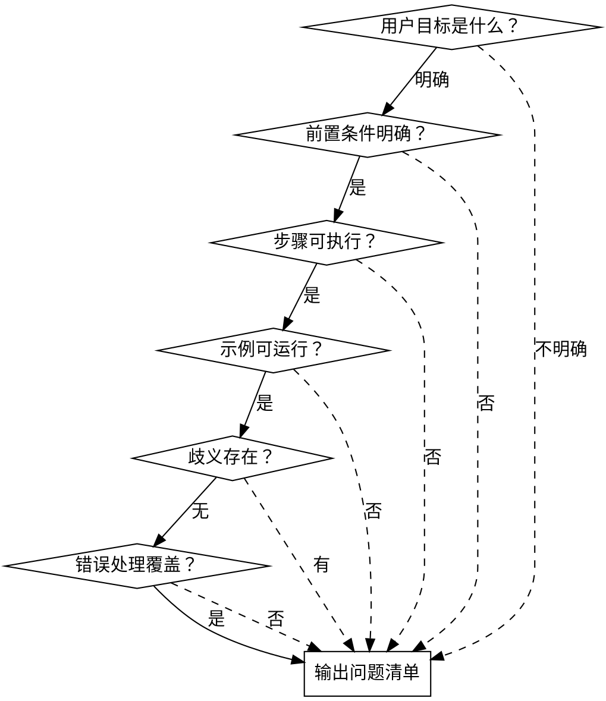

# 文档用户视角审查

## 概述

从**用户视角**系统性审查文档，而非开发者视角。核心问题：**用户读完能否顺利完成目标？**

**关键区别：**
- 开发者视角：参数类型完整吗？API 签名正确吗？
- 用户视角：我需要什么前置条件？第一步该做什么？出错怎么办？

## 审查维度

| 维度 | 检查项 | 用户典型困惑 |
|------|--------|--------------|
| **前置条件** | 环境要求、依赖、权限、版本 | "我可以用吗？" |
| **目标明确** | 这份文档解决什么问题？达成什么目标？ | "读完我能做什么？" |
| **步骤完整** | 每步有具体操作、预期结果、验证方法 | "做完这步算成功吗？" |
| **信息具体** | 避免"设置你的参数"、"见其他文档"等模糊表述 | "具体是什么？" |
| **示例可运行** | 完整代码、真实路径、实际值（非占位符） | "可以直接复制用吗？" |
| **歧义识别** | 同一术语含义不一、指代不明、假设隐含 | "这是指什么？" |
| **错误处理** | 常见错误、失败症状、解决路径 | "出错了怎么办？" |
| **导航清晰** | 相关文档链接、下一步指引、返回路径 | "接下来去哪？" |

## 审查流程



## 问题分级

| 级别 | 定义 | 用户影响 | 处理优先级 |
|------|------|----------|------------|
| **阻断级** | 用户无法完成核心任务 | 停滞、放弃 | 必须修复 |
| **阻碍级** | 用户可能走错路径或反复尝试 | 时间浪费、困惑 | 应该修复 |
| **干扰级** | 用户需要额外搜索或推断 | 效率降低 | 建议修复 |
| **优化级** | 改善体验但不影响完成 | 小不便 | 可选修复 |

## 输出格式

```markdown
## 用户视角审查报告

### 用户目标
用户读完期望达成：[明确陈述]

### 发现问题

| 级别 | 维度 | 问题描述 | 用户实际困惑 |
|------|------|----------|--------------|
| [级别] | [维度] | [具体问题] | [用户会问什么] |

### 问题总数统计
阻断级：X | 阻碍级：X | 干扰级：X | 优化级：X

### 修复建议优先级
1. [阻断级问题修复方案]
2. [阻碍级问题修复方案]
...
```

## 常见问题模式

### 模糊指引型
```
❌ "设置你的参数"
✅ "设置 server.port（默认 8080）和 db.host（必需）"
```

### 占位符陷阱型
```
❌ "运行 app.start()"
✅ "运行 myapp.start() 或替换为你的包名"
```

### 隐含假设型
```
❌ "编辑配置文件"（用户不知道在哪、叫什么）
✅ "编辑项目根目录的 config.yaml"
```

### 链接黑洞型
```
❌ "详见 API 文档"
✅ "详见 [API 文档](./api-reference.md#配置选项)"
```

### 验证缺失型
```
❌ 只有安装命令
✅ 安装命令 + "运行 flexconfig --version 验证，应输出 v2.x"
```

## 红旗警示

审查时发现以下表述，立即标记为问题：

| 表述 | 问题 | 用户困惑 |
|------|------|----------|
| "设置你的..." | 信息不具体 | "设置什么值？" |
| "见其他文档" | 无链接/无具体位置 | "在哪？" |
| "简单" / "只需" | 低估复杂度 | "为什么我做不到？" |
| "等等" | 列表不完整 | "还有什么？" |
| "例如：..." | 仅一个示例 | "其他情况呢？" |
| 代码中的 `...` | 省略关键内容 | "这里该写什么？" |

## 审查心态

**代入用户身份：**
- 我第一次接触这个项目
- 我不知道作者的设计意图
- 我没有项目背景知识
- 我在时间压力下尝试完成任务

**不要代入开发者身份：**
- "这技术上是正确的"
- "用户应该理解"
- "显而易见"

## 反模式

| 反模式 | 正确做法 |
|--------|----------|
| 列出所有语法错误 | 聚焦阻断用户的问题 |
| "参数类型未标注"（开发者视角） | "我不知道该传什么值"（用户视角） |
| 按文档顺序检查 | 按用户实际操作流程检查 |
| 只找问题不分级 | 区分阻断级和优化级 |
| 用术语描述问题 | 用用户实际困惑描述 |