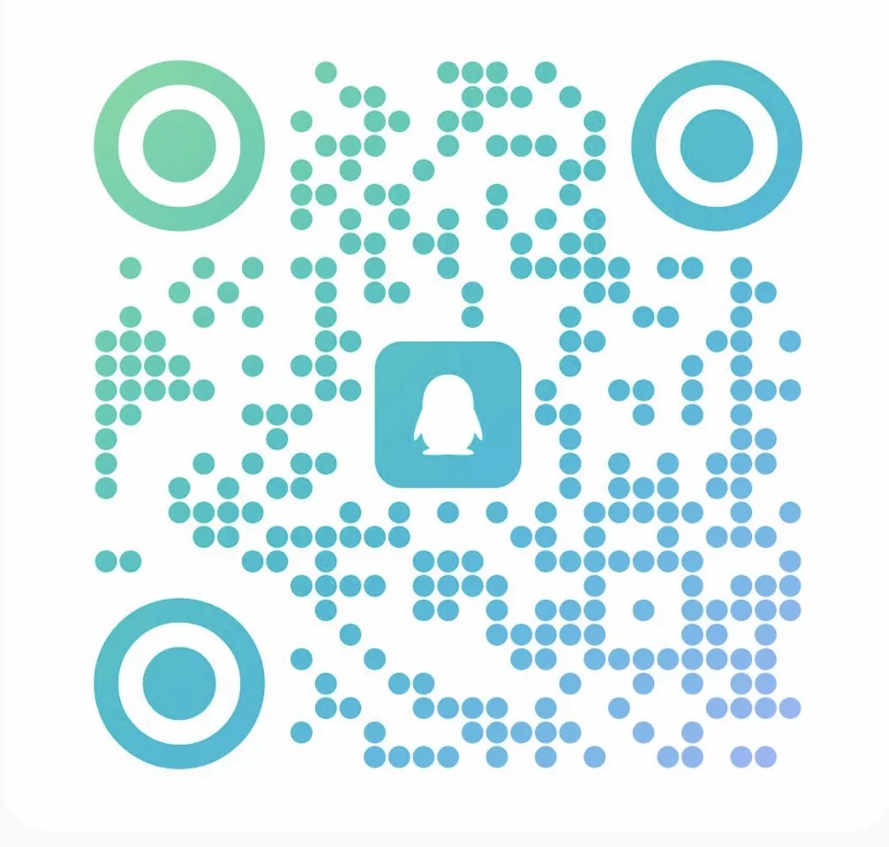

# Community

Join the FlexKVM user community to share experiences, tips, and get the latest news.

---

## QQ Group

Best for users in China — get fast responses and real-time communication.

Group number: <a href="https://qm.qq.com/q/R5cNG8ARmW" target="_blank">789603489</a>

---

## Telegram Group

Best for international users — no special network configuration needed.

Group: <a href="https://t.me/flexkvm" target="_blank">t.me/flexkvm</a>

---

## WeChat Official Account

Get the latest product news, tutorial updates, and WeChat group QR codes.

Scan the QR code above to follow the WeChat Official Account. Then go to the menu: "User Community" → "WeChat Group" to get the latest group QR code.
