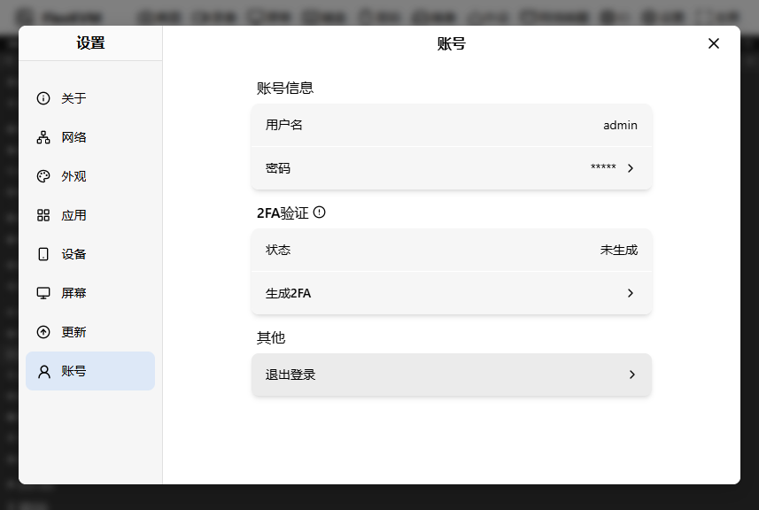
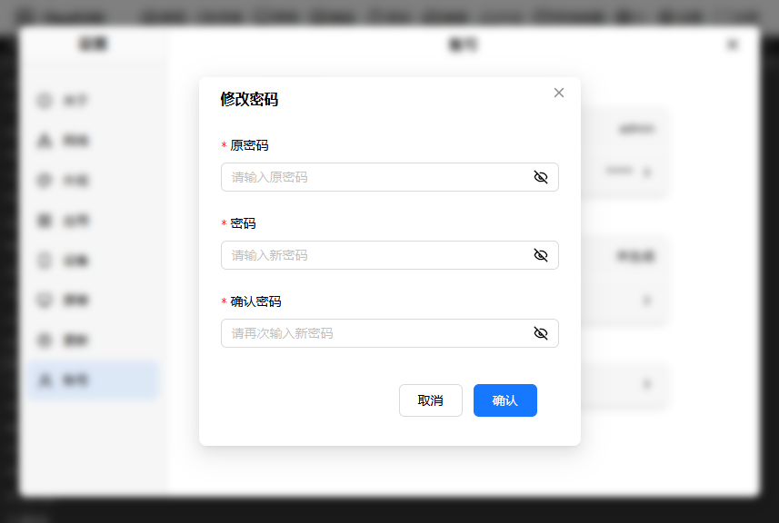
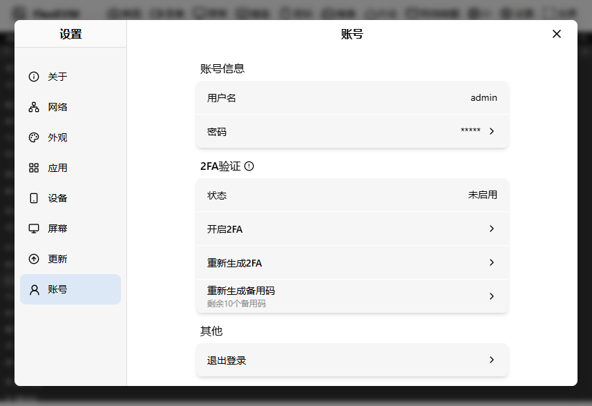
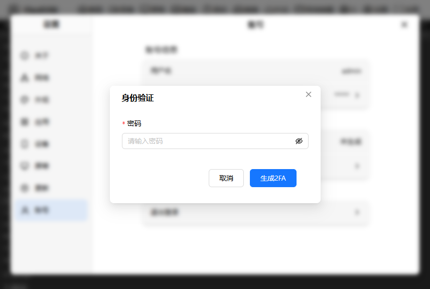
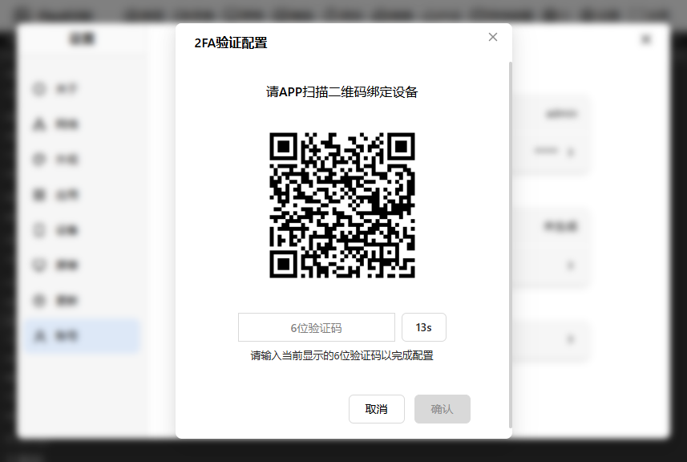
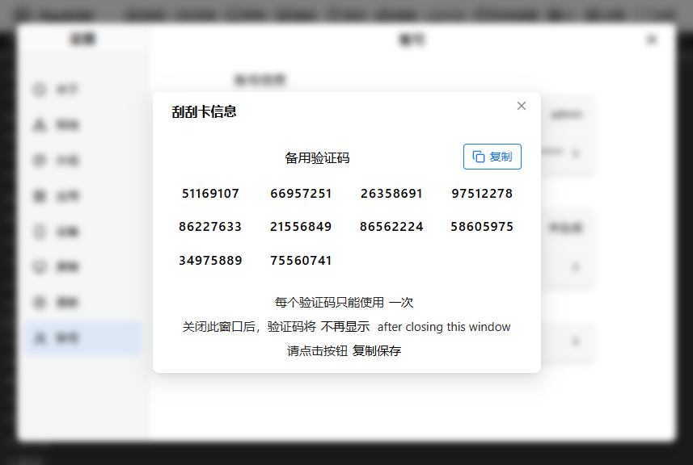
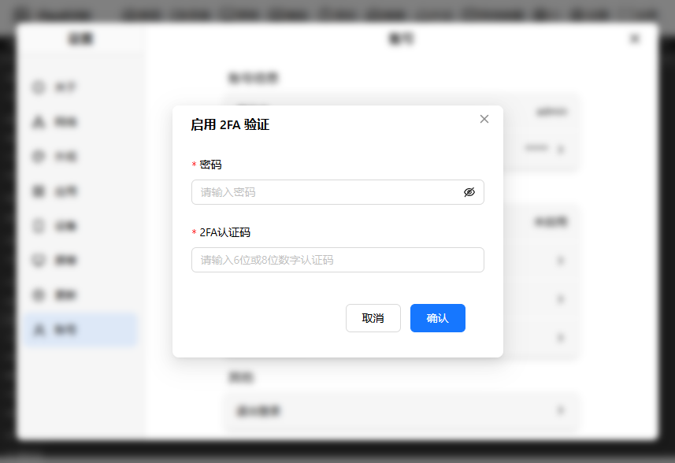

# 账号管理

点击"设置"按钮，进入设置界面，点击"账号"按钮，进入账号界面。如下图所示

可以看到有三个区块：

- 账号信息
- 2FA验证
- 其他

## 账号信息

这个组会有两个卡片：

- 用户名信息
- 密码

用户名信息是当前登录flexkvm的账号，如图所示，登录的账号为`admin`。

密码是可以点击进入密码修改界面的，点击后，会弹出密码修改界面，如下图所示：

修改密码需要输入原密码，新密码，确认新密码，然后点击"确认"按钮，即可修改密码。

> 注意：密码必须大于8位，只能使用字母、数字和特殊字符。
> 如果开启了2FA验证，除了输入上面的信息外，还需要输入2FA验证码。

## 2FA验证

2FA验证是一种双因素认证，即需要输入账号密码外，还需要输入一个动态的验证码,这样可以增强系统的安全性。

如果没有生成2FA密钥的情况下，你可以看到两个卡片：

- 状态
- 生成2FA

如果在已经生成了2FA密钥的情况下，你可以看到三个卡片：

- 状态
- 开启/关闭2FA
- 重新生成2FA
- 生成备用码

### 状态

状态卡片会显示当前2FA的状态，如果已经开启了2FA，会显示"已开启"，否则会显示"未开启"。

### 生成2FA（重新生成2FA）

点击之后会让你输入密码和2FA码（如果没启用2FA不需要填写），如下图所示:

输入密码后，点击"生成2FA"按钮，就会进入2fa配置页面，如下图所示:

可以看到，弹窗的中间弹出了一个二维码

1. 你可以使用手机上的2fa应用（例如：**Authenticator**）来扫描这个验证码
2. 扫描这个验证码后会生成一个6位数字的密钥
3. 将这个密钥输入到弹窗的输入框中，然后点击"确认"按钮，即可开启2FA验证。

如果验证成功之后，会弹出一个新弹窗，如下所示:

可以看到弹窗显示了10个8位的备用码，你可以点击右上角的复制按钮，复制这些备用码

备用码：当你开启了2FA之后，如果忘记了2FA密钥，你可以使用这些备用码来替代2FA密钥。备用码用了之后就不能再用了，所以请妥善保管。

点击右上角的关闭按钮，即可关闭弹窗。

### 开启/关闭2FA

点击之后，会弹出验证窗口，如下图所示:

需要输入密码和2FA码，点击确认即可开启/关闭2FA验证。

### 生成备用码

点击之后，会弹出验证窗口，如下图所示:

需要输入密码和2FA码，点击确认即可生成备用码。
