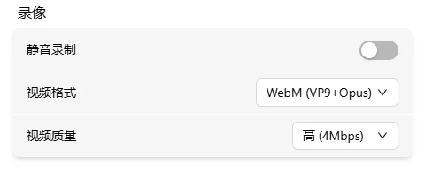

# 录像

将远程画面录制为视频文件，适合记录操作过程或留存证据。

## 操作方法

点击菜单栏中的录像按钮来开始和停止录制。

| 图标                            | 含义             |
| --------------------------------- | ------------------ |
|   | 待录制，点击开始 |
|  | 录制中，点击停止 |

**开始录制：**

1. 点击录像按钮开始录制
   - 开始成功：页面顶部弹出"录制开始"提示
   - 开始失败：页面顶部弹出错误提示（通常是视频流未就绪）
2. 按钮变为计时器（如 `05:23`），表示正在录制
3. 点击计时器停止录制
   - 停止成功：页面顶部弹出"录制成功"提示
4. 视频文件自动保存到浏览器的下载目录

> 录制不会自动停止，需要手动点击停止。关闭浏览器或刷新页面也会停止录制。视频流意外断开时录制会自动停止（无提示）。

## 文件命名

文件名格式：`flexkvm-recording-YYYY-MM-DDTHH-MM-SS.{扩展名}`

例如：`flexkvm-recording-2026-05-12T21-44-20.mp4`

## 录制参数设置

在 FlexKVM 桌面的 **设置 → 系统 → 录像设置** 中调整录制参数。

### 静音录制

开启后录制的视频不包含声音。

### 视频格式

| 格式            | 适用场景                       |
| ----------------- | -------------------------------- |
| WebM (VP9+Opus) | 默认格式，画质好               |
| WebM (VP8+Opus) | 兼容旧设备                     |
| MP4 (H.264)     | 兼容性最好，大多数播放器可播放 |

### 视频画质

| 画质 | 码率   | 适用场景     |
| ------ | -------- | -------------- |
| 低   | 1 Mbps | 文件尽量小   |
| 中   | 2 Mbps | 日常录制     |
| 高   | 4 Mbps | 画面细节多   |
| 极高 | 8 Mbps | 需要最佳画质 |

## 注意事项

- 被控主机休眠或 HDMI 断开时，录制不会停止，画面会显示相应提示
- 视频流意外断开时录制会自动停止
- 录制过程中避免切换画质或 EDID，否则可能导致录制异常
- 录像文件保存在浏览器默认下载目录

## 常见问题

**录制的视频没有声音？**
→ 检查是否开启了"静音录制"，以及被控主机是否有音频输出。

**录制文件无法播放？**
→ 尝试切换视频格式为 MP4 (H.264)，兼容性最好。

**录制画面卡顿或掉帧？**
→ 在 [远程画面](screen.md) 中降低分辨率或画质可减轻编码压力。

---

[:octicons-arrow-left-24: 返回用户指南](../index.md)
