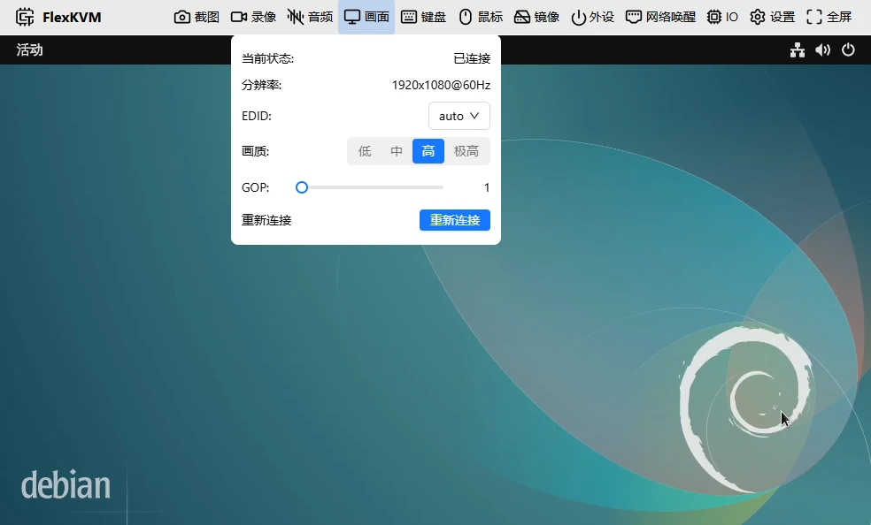
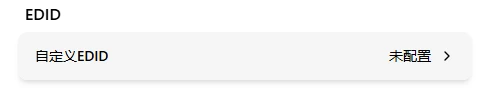
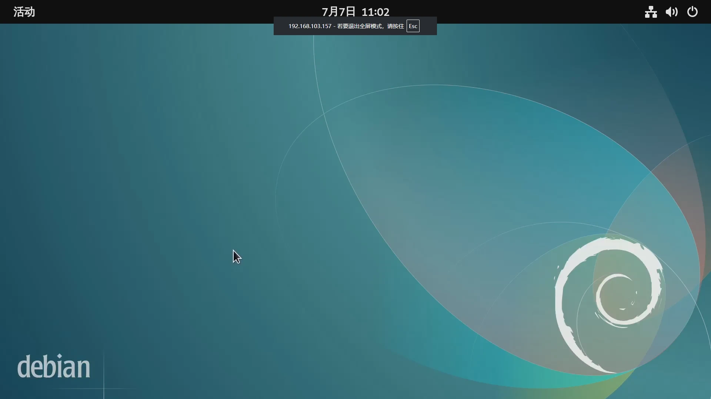

# 远程画面

查看被控主机的画面，调整画质、分辨率和 EDID 等显示参数。

## 画面按键

菜单栏中的"画面"按键图标反映当前显示状态：

| 图标 | 含义 |
|------|------|
|  | 画面已连接，正常显示 |
|  | 主机休眠 / 信号丢失 |
|  | 画面未连接

> HDMI 未接入或远程主机进入休眠时，显示为未连接。

## 远程画面

菜单栏下方即为远程画面

- 远程画面会随窗口大小自动缩放。当画面比例与窗口比例不一致时，画面两侧或上下会出现黑边（空白区域），这些区域无法进行鼠标操作。
- 画面异常时，会显示下面提示：

| 画面提示 | 原因 |
|----------|------|
| "远程画面未连接" | HDMI 线未插入或者被控主机关机 |
| "主机休眠中" | 被控主机进入休眠或 HDMI 信号中断 |

## 屏幕菜单



点击屏幕按键弹出菜单，包含以下选项：

- 当前状态 
- 分辨率
- EDID
- 画质
- GOP
- 重新连接

### 当前状态与分辨率

| 状态 | 含义 |
|------|------|
| 已连接 | 画面正常 |
| 信号丢失 | 被控主机休眠或 HDMI 断开 |
| 未连接 | 从未建立过连接 |

分辨率显示格式为 `宽度x高度@刷新率Hz`，如 `1920x1080@60Hz`。显示 `0x0@0Hz` 表示当前无法获取分辨率。

### EDID

EDID 相当于告诉被控主机"我是一台什么样的显示器"——支持什么分辨率、刷新率。被控主机根据 EDID 来决定输出什么画面。

下拉列表列出所有可用配置：


**auto（多分辨率）**：默认配置，告诉被控主机"我可以支持多种分辨率"。被控主机可以从支持的分辨率中自由选择，灵活性最好。支持最高 1920x1200@60Hz。

**固定分辨率**：锁定单一分辨率，被控主机只能输出这一种：

| EDID | 说明 |
|------|------|
| 1920x1200@60Hz | 1920×1200，60Hz |
| 1920x1080@60Hz | 1920×1080，60Hz |
| 1920x1080@30Hz | 1920×1080，30Hz |
| 1280x720@120Hz | 1280×720，120Hz |
| 1280x720@60Hz | 1280×720，60Hz |
| 1280x720@30Hz | 1280×720，30Hz |

> 什么时候用固定分辨率？如果被控主机在 auto 模式下选了不理想的分辨率，或者需要强制某个特定分辨率时使用。

**自定义 EDID**：上传自定义 EDID 后，列表会额外出现 **custom** 选项，详见下方。

> 切换 EDID 后视频流会自动重新连接，无需手动操作。

---

## 自定义 EDID

除了内置的 EDID 预设，FlexKVM 支持上传自定义 EDID 数据。在设备设置中选择 **系统** 标签页，找到 EDID 配置区块。



### 上传自定义 EDID

点击"自定义 EDID"按钮，弹出 EDID 编辑框：


在编辑框中输入 EDID 原始数据（十六进制 HEX 格式），点击确认即可提交。

**格式要求**：

| 规则 | 说明 |
|------|------|
| 编码 | 十六进制（HEX），每两个字符表示一个字节 |
| 大小 | 128 字节的整数倍（1~6 个 block） |
| 上限 | 不超过 768 字节 |
| 文件头 | 必须以 `00 FF FF FF FF FF FF 00` 开头 |
| 校验 | 每个 128 字节 block 的校验和必须为 0 |

提交成功后，EDID 下拉列表中会出现 **custom** 选项，选择即可应用。

```
示例格式:
00 FF FF FF FF FF FF 00 0E 94 66 66 88 88 88 88
...
```

> 在 Linux 上可以用 `cat /sys/class/drm/card0-HDMI-A-1/edid | xxd -p` 获取当前显示器的 EDID 数据。

### 画质

四档画质，越高画面越清晰，消耗的网络带宽也越大：

| 画质 | 适用场景 |
|------|----------|
| 低 | 网络较慢时使用 |
| 中 | 日常操作 |
| 高 | 需要看清细节 |
| 极高 | 需要最佳画质 |

> 如果画面卡顿，可以尝试降低画质。

### GOP

控制画面刷新响应速度与带宽消耗的平衡。范围 1 ~ 10。

| 设置 | 效果 |
|------|------|
| 较小（1~3） | 画面响应快，带宽消耗大 |
| 较大（7~10） | 带宽消耗小，画面响应慢，画面丢失恢复时间慢 |

> 不确定时保持默认值 1 即可。

### 重新连接

会断开当前视频连接并重新建立。如果画面卡顿或花屏，可以尝试此操作。

## 全屏

点击菜单栏最右侧的全屏按键（或按 `F11`）进入全屏模式，远程画面铺满整个屏幕，隐藏浏览器标签栏和地址栏。

| 图标 | 操作 |
|------|------|
|  | 进入全屏 |

- **进入全屏**：点击全屏按键（最大化图标）或 短按 `F11`
- **退出全屏**：长按 `Esc` 或 短按 `F11`



## 常见问题

**画面卡顿或延迟大？**
→ 尝试降低画质，或点击"重新连接"。

**画面显示"信号丢失"？**
→ 检查被控主机是否进入休眠，HDMI 线是否松动。

**分辨率不对？**
→ 尝试切换 EDID 配置，或在被控主机上手动调整分辨率。
