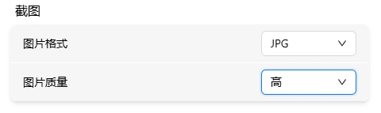

# 截图

将当前远程画面保存为图片文件，适合保存关键画面留档。

## 操作方法

点击顶部菜单栏中的**截图**图标(📷)即可截取当前远程画面。

| 图标                              | 含义             |
| ----------------------------------- | ------------------ |
|  | 点击截取当前画面 |

截图成功时，页面顶部弹出"截图成功"提示，文件自动保存到浏览器的下载目录。截图失败（如当前无视频画面）时会弹出错误提示。

## 文件命名

文件名格式：`flexkvm-screenshot-YYYY-MM-DDTHH-MM-SS.{扩展名}`

例如：`flexkvm-screenshot-2026-05-12T21-44-20.png`

## 格式与画质设置

在 FlexKVM 桌面的 **设置 → 系统 → 截图设置** 中调整截图参数。

### 格式

| 选项 | 说明 |
|------|------|
| PNG | 无损压缩，画质最好，文件较大 |
| JPG | 有损压缩，文件较小 |

### 画质

仅对 JPG 格式生效：

| 选项 | 说明 |
|------|------|
| 低 | 文件最小 |
| 中 | 日常使用 |
| 高 | 画面细节较多 |
| 最佳 | 最高画质 |

> PNG 格式始终为最高画质，不受画质设置影响。

## 常见问题

**点击截图没反应？**
→ 检查浏览器是否拦截了下载。查看浏览器下载列表或下载设置。

**截图画面模糊？**
→ 截图画面分辨率与远程画面一致。如需更高清，先在 [远程画面](screen.md) 中调高分辨率或画质。

---

[:octicons-arrow-left-24: 返回用户指南](../index.md)
