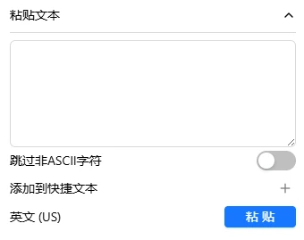
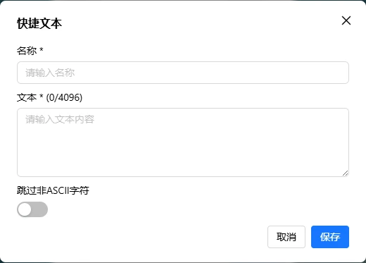
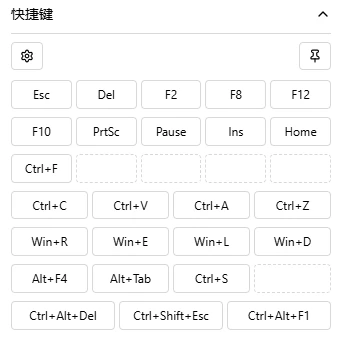
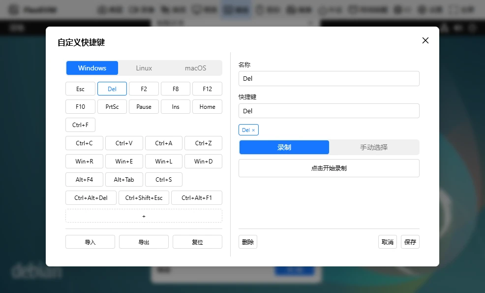
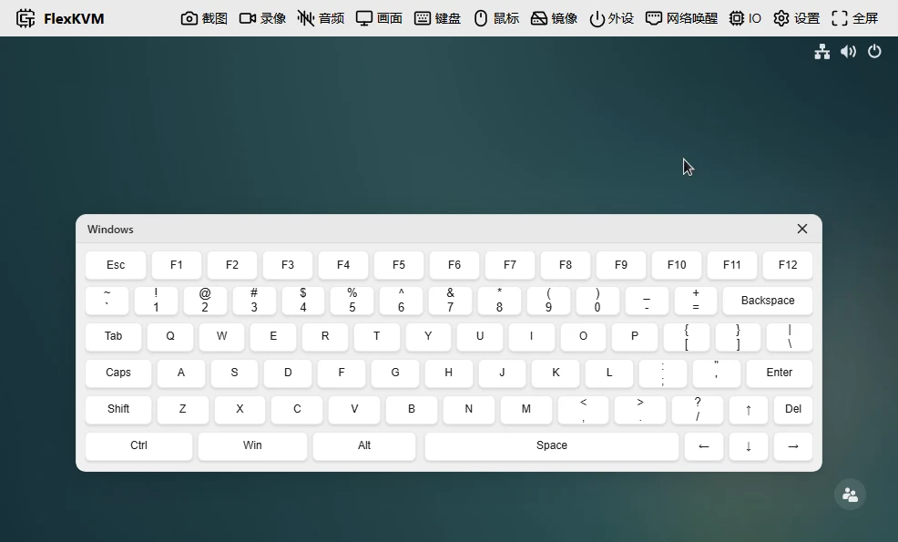

# 键盘

向被控主机输入文字、快捷键和组合键。FlexKVM 模拟标准 USB 键盘，兼容所有操作系统。

## 键盘状态

顶栏键盘图标反映状态：

| 图标 | 含义 |
|------|------|
|  | 已连接 |
|  | 未连接或被关闭 |

## 键盘菜单

点键盘图标弹出菜单。

### 状态

| 状态 | 说明 |
|------|------|
| 已连接 | 正常输入 |
| 未连接 | 没连上，重新插拔 USB 或刷新页面 |
| 未使能 | 手动关了，点开启恢复 |

### 被控系统

告诉 FlexKVM 被控主机是什么系统——快捷键和虚拟键盘布局会相应调整。默认 **Windows**，可选 Linux 或 macOS。

### 粘贴文本

展开后输入或粘贴文字，点发送到被控主机。正在发送时可以再点取消。

> 只支持英文字符（字母、数字、符号），不支持中文。最长 4096 字符。粘贴速度约 20 字符/秒。

- **跳过非英文字符**：开启后自动过滤中文等非 ASCII 字符。关闭则遇到会报错。
- **添加到快速文本**：把当前文字存起来，下次一键发送。

### 快速文本

把常用文字（密码、命令、模板）存起来，一键发送。

**添加**：点 **+** → 填名称（最长 32 字符）和内容（最长 4096 字符）。最多 10 条。

**使用**：每条可预览（眼睛图标）、编辑（铅笔）、发送、取消。拖拽排序。点图钉按钮变悬浮窗，可以拖到顺手位置。

### 快捷键

常用快捷键一键发送，布局跟"被控系统"设置自动切换。

- **齿轮图标**：自定义快捷键
- **图钉图标**：开/关悬浮窗

**自定义快捷键**：点齿轮 → 弹窗分三部分——顶部选系统、中部快捷键列表（点 **+** 添加）、底部导入/导出/重置。

点列表中某条快捷键可修改：

- **名称**：最长 32 字符，不填默认显示快捷键内容
- **快捷键**：两种添加方式——**录制**（点开始录制，按键盘）或**手动**（选按键添加/删除）

### 虚拟键盘

点开后画面中弹出虚拟键盘，用鼠标点击输入。布局跟"被控系统"自动切换，窗口窄时换紧凑布局。拖标题栏移动。

**修饰键**（Ctrl、Alt、Shift、Win）是切换式——点一下按住（变深色），再点一下松开（变浅色）。可同时按住多个。

例如：点 **Ctrl**（深色）→ 点 **A** → 发送 Ctrl+A → Ctrl 仍然按住，可继续组合 → 再点 **Ctrl**（浅色，松开）。

**普通键**：按下持续按住，松手释放。

> 关虚拟键盘或切页面时所有按键自动释放，不会卡键。

### Esc 映射

全屏或鼠标相对模式下，`Esc` 被浏览器占用。Esc 映射让你用另一个键代替：

| 你的系统 | 映射到 |
|----------|--------|
| Windows / Linux | Right Ctrl |
| macOS | Right Option |

可选：Right Ctrl、Right Option、Pause，或禁用。

### 关闭与开启

状态为已连接时点"关闭"→ 变为未使能。点"开启"恢复。

> 开关键盘时 USB 短暂断开重连，鼠标、磁盘挂载和音频也会短暂失效后恢复。

---

## 常见问题

**粘贴文字没反应？** → 检查是否包含中文。粘贴文本只支持英文。

**快捷键没效果？** → 检查"被控系统"选对了吗。

---

[:octicons-arrow-left-24: 返回用户指南](../index.md)
