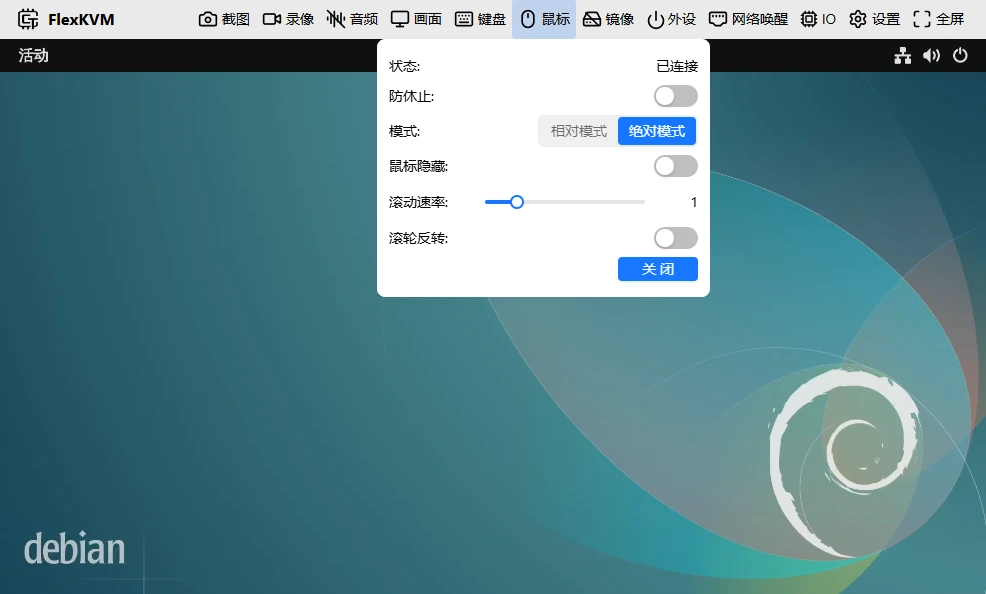

# 鼠标

控制被控主机的鼠标指针。支持绝对和相对两种模式，可调灵敏度和滚轮方向。

## 鼠标状态

顶栏鼠标图标反映状态：

| 图标 | 含义 |
|------|------|
|  | 已连接 |
|  | 未连接或被关闭 |

## 鼠标菜单

点鼠标图标弹出菜单。

### 状态

| 状态 | 说明 |
|------|------|
| 已连接 | 正常控制 |
| 未连接 | 没连上，重新插拔 USB 或刷新页面 |
| 未使能 | 手动关了，点开启恢复 |

### 防休止

开启后鼠标每隔一段时间自动微移，防止主机因检测不到鼠标活动而休眠。网页开着或关了都会执行。不需要就关。

### 模式

**绝对模式（默认）**：画面点到哪里，主机鼠标就在哪里。

- ✅ 移动精准，无需点击画面即可控制
- ✅ 不受鼠标 DPI 影响
- ❌ 仅适合单屏幕
- ❌ 部分游戏可能不兼容

**鼠标隐藏**：开启后鼠标移入画面自动隐藏，避免出现两个指针。

**相对模式**：像操作本地电脑一样移动主机鼠标。

- ✅ 支持多屏幕
- ✅ 兼容游戏等需要原始鼠标输入的应用
- ❌ 需要先点击画面进入控制
- ❌ 精准度受鼠标 DPI 影响

操作：点远程画面进入控制（浏览器请求锁定鼠标指针）→ 移动鼠标 → 按 `Esc` 退出。

> 非全屏相对模式下 `Esc` 被占用。需要发送 `Esc` 给主机？→ [Esc 映射](./keyboard.md#esc-映射)。
> 全屏相对模式下 `Esc` 正常工作，长按后会退出全屏。重新全屏按 `F11`。

**灵敏度**（仅相对模式）：调节范围 0.2~3.0，步进 0.2。1.0 正常速度。

**滚动速率**：调节范围 0.5~3.0，步进 0.5。1.0 正常速度。

**滚动反转**：开启后滚轮方向反转。

### 关闭与开启

点"关闭"→ 状态变为未使能。点"开启"恢复。

> 开关鼠标时 USB 短暂断开重连，键盘、磁盘挂载和音频也会短暂失效后恢复。

---

## 常见问题

**相对模式下鼠标出不来？** → 按 `Esc` 退出。

**绝对模式下位置不准？** → 检查主机是不是多屏幕。绝对模式只适合单屏。

---

[:octicons-arrow-left-24: 返回用户指南](../index.md)
