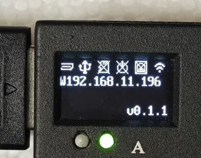
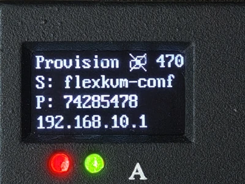
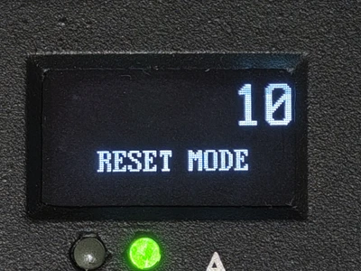

# OLED Screen

FlexKVM has a 128×64 monochrome OLED display on the front that shows device status, network info, and system version.

After powering on, the OLED cycles through: boot logo → device status screen → auto-sleep (after 60 seconds of inactivity). Press Button A or B to wake. Auto-sleep is disabled in provisioning mode.

## OLED Settings

Go to Settings → System → OLED Display Settings.


### Brightness

Brightness slider (range 1–10), changes take effect instantly.

### Sleep Timeout

Time before auto-sleep after inactivity. Options: 10s / 30s / 60s / 120s / 300s / 600s.

## OLED Display

### Main Screen



Four lines, three sections:

**Status bar** (first line): 6 icons, left to right —

| Icon | Meaning |
|:----:|---------|
| HDMI | HDMI connected? |
| USB | USB signal normal? |
| TF card | TF card inserted? |
| ATX | ATX module connected? |
| Ethernet | Wired connection status (normal / Direct Mode — two icons) |
| WiFi | WiFi disconnected / connected / hotspot active (three states) |

Icon normal = connected. Icon with X overlaid = not connected.

**IP address** (middle two lines): IP prefix indicates interface type and IP assignment method —

| Display | Interface | IP method |
|---------|:---------:|:---------:|
| **E**xxx.xxx.xxx.xxx | Ethernet | DHCP |
| <strong><u>E</u></strong>xxx.xxx.xxx.xxx | Ethernet | Static IP (inverse) |
| **S**xxx.xxx.xxx.xxx | Ethernet | Direct Mode (DHCP Server) |
| **W**xxx.xxx.xxx.xxx | WiFi | DHCP |
| <strong><u>W</u></strong>xxx.xxx.xxx.xxx | WiFi | Static IP (inverse) |
| **A**xxx.xxx.xxx.xxx | AP hotspot | — |

While acquiring an IP address, the display shows **E Loading...** or **W Loading...**.

> **E** = DHCP, normal display; <strong><u>E</u></strong> = Static IP, inverse display (white on black). Direct Mode shows **S**.

If the IP hasn't been acquired after 10 seconds, check whether your current network supports dynamic IP assignment.

**System version** (bottom line): e.g., `v0.1.2` or `v0.1.3-Beta.1`.

### Info Sub-pages

On the main screen, **short-press Button A** to cycle through 7 sub-pages: `Home → HDMI Info → System Info → ETH Info → ETH IPv6 → WiFi Info → WiFi IPv6 → AP Info → Home`. **Short-press Button B** to return to the main screen at any time. The screen automatically resets to the main page after sleep.

Sub-pages use a full-screen 4-line layout (no status bar), with content starting from line 1.

#### HDMI Info

Video input parameters:

| Line | Content |
|:-----|---------|
| Line 1 | `HDMI` (left) + quality level (right-aligned: LOW / MED / HIGH / ULTRA) |
| Line 2 | Resolution@refresh rate (e.g. `1920x1080@60Hz`, `--x--` when no signal) |
| Line 3 | Stream state (Streaming / IDLE / OFFLINE) |
| Line 4 | Link status (LINK / No Signal / NOT LINK) |

Stream states: **Streaming** — user online + HDMI linked, encoder actively streaming; **IDLE** — HDMI linked but no user connected, encoder on standby; **OFFLINE** — HDMI not detected or link not established.

```
 HDMI          HIGH
 1920x1080@60Hz
 Streaming
 LINK
```

#### System Info

Device identification:

| Line | Content |
|:-----|---------|
| Line 1 | `SYSTEM` title |
| Line 2 | Product name (e.g. `FlexKVM`) |
| Line 3 | Hostname |
| Line 4 | Serial number (SN) |

```
 SYSTEM
 FlexKVM
 flexkvm
 FS10251810001CN5
```

#### ETH Info

Ethernet interface details:

| Line | Content |
|:-----|---------|
| Line 1 | `ETH` (left) + mode label (right: DHCP / STATIC / DIRECT) |
| Line 2 | IP address (or DISABLE / NOT CONNECT / Loading) |
| Line 3 | MAC address |
| Line 4 | Gateway (prefix `G`, e.g. `G192.168.1.1`) |

Mode labels: DHCP (dynamic), STATIC (manual configuration), DIRECT (DHCP Server mode).

```
 ETH              DHCP
 192.168.1.100
 AA:BB:CC:DD:EE:FF
 G192.168.1.1
```

#### ETH IPv6

Ethernet IPv6 address (shows `NO IPV6` when absent):

| Line | Content |
|:-----|---------|
| Line 1 | `ETH IPV6` title |
| Lines 2–4 | IPv6 address, split across 3 lines (max 16 chars per line) |

```
 ETH IPV6
 240e:390:8b7
 8:1a3c:1234:56
 78:90ab
```

#### WiFi Info

WiFi interface details:

| Line | Content |
|:-----|---------|
| Line 1 | `WiFi` + signal strength (e.g. `WiFi -45`) + mode label (right) |
| Line 2 | IP address (or DISABLE / NOT CONNECT / Loading) |
| Line 3 | SSID (prefix `S:`, e.g. `S:MyWiFi`) |
| Line 4 | MAC address |

```
 WiFi -55        STATIC
 10.0.0.55
 S:MyOfficeWiFi
 AA:BB:CC:DD:EE:FF
```

#### WiFi IPv6

WiFi IPv6 address (shows `NO IPV6` when absent):

| Line | Content |
|:-----|---------|
| Line 1 | `WIFI IPV6` title |
| Lines 2–4 | IPv6 address, split across 3 lines (max 16 chars per line) |

```
 WIFI IPV6
 240e:390:8b7
 8:1a3c:1234:56
 78:90ab
```

#### AP Info

Hotspot configuration:

| Line | Content |
|:-----|---------|
| Line 1 | `AP` + WiFi6 indicator + band (2.4G / 5G) |
| Line 2 | SSID (prefix `S:`, e.g. `S:FlexKVM-AP`) |
| Line 3 | Password (prefix `P:`) |
| Line 4 | IP address (or DISABLE) |

```
 AP  WIFI6      5G
 S:FlexKVM-AP
 P:12345678
 192.168.10.1
```

### Provisioning Screen



When entering provisioning mode (long-press Button A), the OLED shows the hotspot name, random password, and IP `192.168.10.1`. See [Provisioning Mode](../network/provision.md) for details.

### Factory Reset Screen



After holding the factory reset button for 1 second, the OLED displays a factory reset countdown. Release the button when the countdown reaches 0 to restore factory settings. See [Factory Reset](../maintenance/factory-reset.md).

---

[:octicons-arrow-left-24: Back to User Guide](../index.md)
