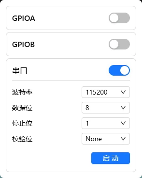

# UART 串口终端

通过串口与被控设备（如路由器、嵌入式开发板、交换机）进行命令行交互。

> 此功能面向嵌入式调试、工业控制等专业场景。普通用户通常不需要使用。

---

## 前置条件


| 物品                     | 说明                                                         |
| -------------------------- | -------------------------------------------------------------- |
| FlexKVM 设备             | 已按[快速开始](../../quick_start/index.md)完成接线和网络配置 |
| 2.54 mm 杜邦线（带母口） | 连接 UART 引脚，至少需要 3 根                                |
| 被控设备                 | 支持串口通信的设备（路由器、开发板等）                       |

> 被控设备的串口参数（波特率、数据位、校验位、停止位）需要提前确认，否则无法正常通信。

---

## 引脚说明

FlexKVM 的 UART 接口为 3 pin 排针，引脚旁印有对应字母标识：


| 丝印 | 引脚 | 说明                           |
| :----: | :----- | -------------------------------- |
|  T  | TXD  | 数据发送端，接被控设备的**RX** |
|  R  | RXD  | 数据接收端，接被控设备的**TX** |
|  G  | GND  | 地线，与被控设备共地           |

> UART 接线需要**交叉连接**：FlexKVM 的 TXD 接被控设备的 RXD，RXD 接被控设备的 TXD，GND 互连。

---

## 接线示例

以连接一台串口路由器为例：

```
FlexKVM                 被控设备
  TXD ───────────────→ RXD
  RXD ←─────────────── TXD
  GND ──────────────── GND
```

> 只需要连接 TXD、RXD 和 GND 三根线即可通信，其它引脚不需要连接。

---

## 软件配置

在 FlexKVM Web 界面中，点击菜单栏的芯片图标，进入 IO 菜单后选择 **UART 串口终端**。


|          图标          | 含义                            |
| :-----------------------: | --------------------------------- |
|  | IO 功能，包含 GPIO 和 UART 串口 |



### 通信参数

启用 UART 后，需要设置通信参数。**参数必须与被控设备完全一致**，否则会乱码或无法通信：


| 参数   | 默认值 | 说明                                      |
| :------- | :------: | ------------------------------------------- |
| 波特率 | 115200 | 常见值：9600、19200、38400、57600、115200 |
| 数据位 |   8   | 可选 5 / 6 / 7 / 8，通常为 8              |
| 停止位 |   1   | 可选 1 / 2，通常为 1                      |
| 校验位 |   无   | 可选 无 / 奇校验 / 偶校验，通常为无       |

> 默认配置 **115200 8N1**（波特率 115200、8 数据位、无校验、1 停止位）是串口设备最常用的参数组合。

### 启动与断开

配置好参数后点击"启动"打开终端窗口，可直接与设备交互。


终端窗口的布局说明：

- **左上角**：显示当前串口配置，如 `115200 8N1`
- **波特率旁指示灯**：🟢 绿色 = 已连接，🔴 红色 = 断开
- **右上角按钮**：导出日志 / 清空屏幕 / 断开连接

> 点击"断开"关闭连接。**连接期间不能修改参数**，如需修改请先断开。

---

## 使用提示

以下提示可以帮助你更顺利地使用串口终端：

- **流式传输**：键盘输入会实时发到被控设备
- **忘记被控设备的参数**：常见设备默认参数为 115200 8N1，如果不确定可以逐个尝试常见组合
- **连接后无输出**：检查接线是否交叉（TXD ↔ RXD）、波特率是否匹配、被控设备串口是否已启用

---

## 常见问题

**串口终端显示乱码？**
→ 参数与被控设备不一致，最常见的原因是波特率不匹配。核对设备参数后重新配置。

**无法连接？**
→ 确认被控设备的串口已启用、接线正确（TXD 接 RXD、RXD 接 TXD、GND 互连）。

**输入命令后没反应？**
→ 确认被控设备处于可接收命令的状态（如已进入系统或引导加载程序）。部分设备在特定阶段才会响应串口输入。

---

## 相关文档

- [GPIO 引脚控制](./gpio.md) —— 通过 GPIO 控制外部硬件

---

[:octicons-arrow-left-24: 返回用户指南](../index.md)
