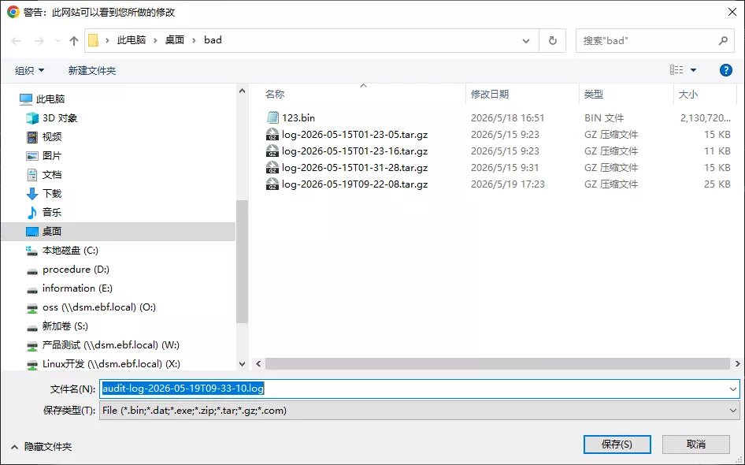
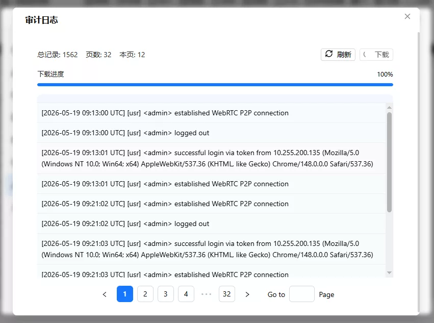

# 审计日志

> 提示: 审计日志记录系统中重要的操作事件，包括系统事件和用户操作事件，主要用于管理员排查系统问题和追溯操作历史。

点击"设置"按钮，进入设置界面，点击"维护"按钮，进入维护界面，如图所示：

可以看到"审计"在第一个组中,在审计组中点击"审计日志"按钮，会弹出审计日志窗口，如图所示：

## 功能说明

审计日志分为两类：

- **系统事件** (`[sys]`)：记录系统级别的重要事件，包括网络配置变更、OTA 升级、恢复出厂设置、SSH 认证失败等
- **用户事件** (`[usr]`)：记录用户级别的操作用户，包括登录/登出、账号管理、USB 设备控制、视频设置、网络配置、系统重启等

每条日志的格式为：`[YYYY-MM-DD HH:MM:SS UTC] [sys|usr] 日志内容`

## 查看日志

审计日志默认每页显示 50 条，支持分页浏览。窗口顶部显示总记录数、总页数和当前页条数。

点击"刷新"按钮可以重新获取最新的审计日志数据。

## 下载日志

点击"下载"按钮可后，会弹出一个文件管理的窗口，你需要选择一个目录，将日志文件下载到该目录中，如图所示：

然后就会看到下载的按钮下面出现进度条，进度条会显示当前的进度，如图所示：

当进度条到达100%且校验通过后，表示文件下载完成，你可以在刚刚选择的目录中找到该文件,下载的文件名为 `audit-log-{ISO时间戳}.log` 格式。例如："audit-log-2026-05-19T09-33-10.log"
