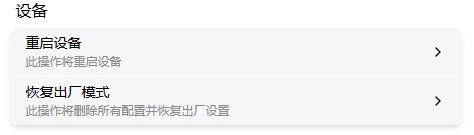
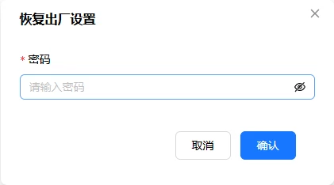

# 恢复出厂设置

把 FlexKVM 恢复到出厂状态。

**会清除**：账户、密码、2FA 密钥、WiFi 配置、自定义设置。

**不会清除**：审计日志（硬件和软件重置都保留）、固件版本（不会降级）。

> 需要连日志一起清？用 SSH 的 `reset all` 命令。

重置完成后设备**自动重启**。过程中 OLED 显示恢复图标，🟢 状态灯和 🔴 警告灯同时快闪。

## 硬件重置

进不了 Web 界面时用。用卡针按住**恢复出厂按键**（RST 孔），OLED 显示倒计时，约 15 秒归零后松开 → 设备自动重启。

> 需物理接触设备，无法远程操作。详见[物理按键](../interaction/button.md)。

## 软件重置

进设置 → 维护 → 点"恢复出厂设置"卡片 → 输入密码确认 → 设备自动重启。

## SSH 重置

SSH 登录后执行：

| 命令 | 效果 |
|------|------|
| `reset` | 恢复出厂，**保留**审计日志（推荐） |
| `reset all` | 深度恢复，**清除全部**（含审计日志） |

确认操作后设备自动重启。

---

[:octicons-arrow-left-24: 返回用户指南](../index.md)
