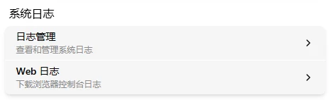

# System Logs

System logs are for vendor troubleshooting of system anomalies. You don't need them for daily use — only when something goes wrong.

Go to Settings → Maintenance.

## Log Management

Click the "Log Management" card:

The log list shows each log's start time, end time, status, and download button. Each system startup (reboot, power loss, crash, etc.) generates a new log entry. Maximum 20 entries retained.

Three status types:

- **Recording** (blue): Currently recording
- **Normal** (green): Recording complete, no anomalies
- **Abnormal** (red): Recording complete, system has crashed

Click download → choose directory → wait for progress bar to reach 100% and verification to pass. Filename: `log-YYYY-MM-DDTHH-MM-SS.tar.gz`, e.g., `log-2026-05-19T09-22-08.tar.gz`. If verification fails, re-download.

## WEB Logs

Click the "WEB Log" card → the current browser log auto-downloads to your browser's download directory. Filename: `flexkvm-web-xxxxxxxxx.log` (`xxxxxxxxx` is a timestamp). Intended for vendor debugging.

---

[:octicons-arrow-left-24: Back to User Guide](../index.md)
