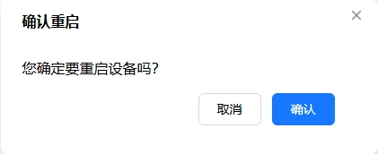

# 重启设备

重启 FlexKVM 设备

## 硬件复位按键

如果系统无响应或无法通过软件方式重启，可以使用设备上的**复位按键**。

| 操作 | 功能 | 适用场景 |
|:----:|:----|---------|
| 短按复位按键 | 强制重启系统 | 系统卡死、网络配置异常导致无法访问 |

> 复位按键短按立即生效，不会清除任何配置。详见[物理按键](../interaction/button.md)。

## 软件重启

进入"设置" → "维护"：

在"重启与重置"组中点击"重启设备"卡片，弹出确认对话框：

确认后设备重启，约 20~30 秒后恢复。

---

[:octicons-arrow-left-24: 返回用户指南](../index.md)
