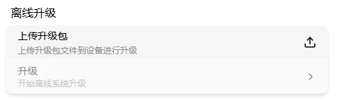
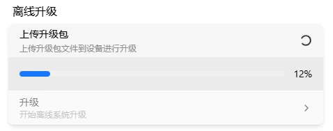
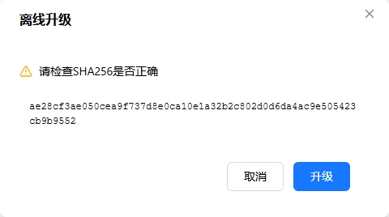

# 离线升级

设备没联网也能升级固件——在电脑上下载固件包放 TF 卡，插进设备后上传升级。

进设置 → 升级。

## 下载固件包

在电脑上从以下任一地址下载 OTA 镜像文件（`.tar` 格式）：

| 下载源 | 地址 | 适合 |
|--------|------|------|
| GitHub | [github.com/chutuotek/flexkvm/releases](https://github.com/chutuotek/flexkvm/releases) | 海外用户 |
| Gitee | [gitee.com/chutuotek/flexkvm/releases](https://gitee.com/chutuotek/flexkvm/releases) | 国内用户，速度更快 |
| Gitcode | [gitcode.com/chutuotek/flexkvm/releases](https://gitcode.com/chutuotek/flexkvm/releases) | 国内用户，速度更快 |

在发布页找到目标版本，下载 `.tar` 固件包（如 `flexkvm-v0.1.2.tar`）。

## 上传镜像

进设置 → 升级 → 点**上传** → 在 TF 卡中选中固件包。

> **验证**：上传完成后校验通过，升级卡片从灰色变可用。

## 升级

点升级 → 弹窗显示镜像 SHA-256 校验值。确认无误后点升级 → 输入密码（开了 2FA 还要验证码）：

验证通过后开始升级：

> **验证**：升级中 OLED 显示升级图标，🔴 警告灯快速闪烁。完成后设备自动重启，OLED 重新显示 IP。

升级成功：

> OTA 只能升到更高版本，不支持降级和同级覆盖。⚠️ 升级期间保持电源稳定，断电可能导致升级失败。

---

[:octicons-arrow-left-24: 返回用户指南](../index.md)
