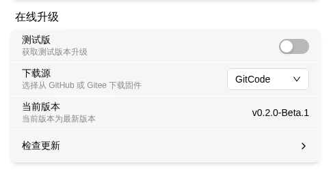
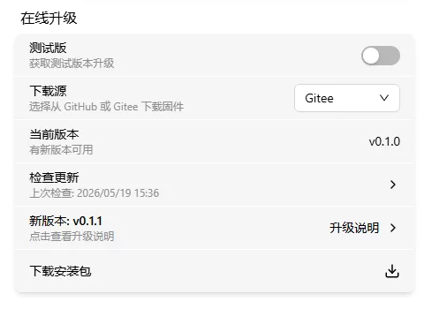
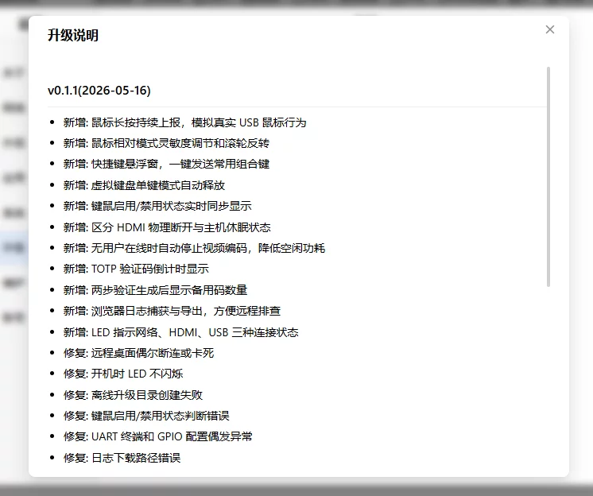

# Online Upgrade

If the device has internet access, you can upgrade firmware online. New versions bring security fixes and new features — check monthly; it takes about 5 minutes.

---

## Before You Upgrade

| Item | Requirement |
|------|-------------|
| Stable power | ⚠️ **Use a dedicated power adapter.** Power loss during upgrade may brick the device. |
| Network connectivity | Download interruption only causes failure — won't damage the device. |
| Device idle | The device will reboot during upgrade — don't perform other operations. |

---

Go to Web interface → Settings → **Upgrade**.

## Beta

Want early access to new features? Enable the beta option to receive beta updates.

> Beta versions may be unstable — don't use in production.

## Download Source

Choose the firmware download location:

- [GitHub](https://github.com/chutuotek/flexkvm/releases) — International users
- [Gitee](https://gitee.com/chutuotek/flexkvm/releases) — Users in China, faster
- [Gitcode](https://gitcode.com/chutuotek/flexkvm/releases) — Users in China, faster

## Current Version

Shows the current firmware version (e.g., `v0.1.0`).

Stable release: `v0.x.x`
Beta release: `v0.x.x-Beta.x`

## Check for Updates

Click **Check for Updates**. The system does not check automatically — we recommend checking manually once a month.

> **Verify**: New version available → a "New Version" card and "Download Package" button appear. No update → you're on the latest.

## New Version

Shows the new version number (e.g., `v0.1.1`). Click to view the changelog:

On poor network connections, the changelog appears as a link — click to open in your browser.

## Download & Upgrade

Click **Download Package** and wait for the progress bar to complete:

After download, the firmware is auto-verified. Verification passes → button changes to **Upgrade Now**:

Click **Upgrade Now** → enter password to confirm (with 2FA enabled, also enter verification code):

After verification, upgrade begins:

> **Verify**: During upgrade, the OLED shows an upgrade icon and 🔴 Warning LED fast-blinks. When complete, the device auto-reboots and OLED shows the IP again.

Upgrade success:

---

## Upgrade Failed?

| Symptom | Likely cause | Try this first |
|---------|-------------|----------------|
| Download failed | Unstable network | Switch download source (GitHub ↔ Gitee), or use [Offline Upgrade](upgrade-offline.md) |
| Verification failed | Corrupted download | Delete and re-download |
| Stuck during upgrade | — | Be patient, don't power off. If unresponsive for 10+ minutes, then troubleshoot |
| Won't boot after upgrade | Power loss during upgrade | See [Flash Firmware](flash.md) for recovery |

---

[:octicons-arrow-left-24: Back to User Guide](../index.md)
