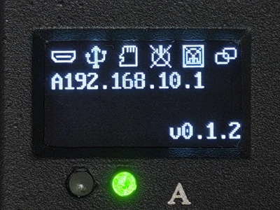
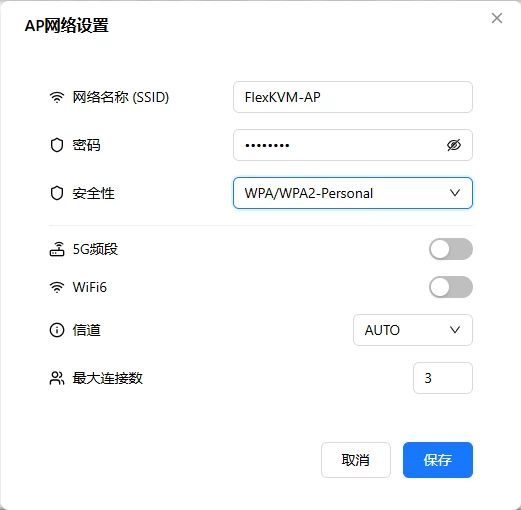
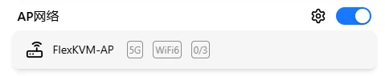

# AP Mode

FlexKVM creates its own WiFi hotspot — your phone or computer connects directly to access the management interface. No router needed, no dependency on on-site network. Long-press Button B for ~3 seconds to toggle on/off.

- Default SSID: `FlexKVM-AP`
- Default password: `12345678`

> The hotspot and WiFi share the same wireless module — running both simultaneously impacts performance. Turn off the hotspot when you're done.

## Specifications

| Item | Details |
|:----:|---------|
| Wireless protocol | 802.11 a/b/g/n/ac/ax |
| Band | 2.4GHz / 5GHz |
| Antenna | SMA female (shared with WiFi) |
| Default state | Off |

## OLED Display

When the hotspot is active, the OLED status bar shows the hotspot icon and the IP prefix is **A** (e.g., `A192.168.4.1`), A = Access Point.

## Button Toggle

Long-press **Button B** for ~3 seconds to toggle between hotspot and [WiFi](./wifi.md):

| Current mode | Action | Result | OLED icon | Wait time |
|:-----------:|--------|--------|:---------:|:---------:|
| WiFi | Hold Button B ~3s, release when OLED shows hotspot icon | WiFi off, hotspot on | { width="80" } | ~10s |
| Hotspot | Hold Button B ~3s, release when OLED shows WiFi icon | Hotspot off, WiFi restored | { width="80" } | 3–4s |

> Button B toggles between AP Mode and WiFi Mode. [Provisioning Mode](./provision.md) (Button A) creates a **temporary** hotspot for first-time setup or recovery.

## Software Configuration

Go to Web interface → Settings → **Network**.

### Enable / Disable

Click the toggle on the right side of the card. The hotspot activates immediately when enabled — other devices can discover and connect to it.

> While the hotspot is active, you can access the management interface via the hotspot-assigned IP.

### AP Configuration

Click the gear icon on the left side of the card:

| Setting | Description | Default | Options |
|---------|-------------|:-------:|---------|
| SSID | Hotspot name | FlexKVM-AP | Custom |
| Password | Connection password | 12345678 | 8–63 chars |
| Encryption | Security protocol | WPA_WPA2 | WPA / WPA2 / WPA3 / Open |
| Band | Operating frequency | 2.4GHz | 2.4GHz / 5GHz |
| WiFi 6 | 802.11ax | Off | On / Off |
| Channel | Wireless channel | Auto | 2.4G: 0–11, 5G: 36–165 |
| Max clients | Simultaneous connection limit | 2 | 1–64 |

> Configuration changes take effect immediately. In provisioning mode, AP config changes are staged and applied when you save and exit.

### Connection Status

When enabled, the card shows: hotspot SSID, band label, connected clients / max (e.g., `1/2` = 1 connected, max 2).

### Verification

| Check | How |
|-------|-----|
| OLED | Is the hotspot icon visible? |
| Web interface | AP card shows "Enabled" + connection count |
| Client | Search for the hotspot SSID on a phone or computer and connect |

---

## Troubleshooting

| Symptom | Likely cause | Try this first |
|---------|-------------|----------------|
| Hotspot won't start | WiFi is currently on | Turn off WiFi first, then enable hotspot — or use Button B to toggle |
| Client can't connect | Wrong password, special characters in SSID | Verify password, check SSID |
| Connected but management page won't load | Client IP issue | Confirm client is using DHCP (the hotspot auto-assigns) |
| Poor performance | WiFi and hotspot both on | Turn off WiFi |
| Not enough client slots | Limit set too low | Increase max clients in configuration |

---

[:octicons-arrow-left-24: Back to User Guide](../index.md)
