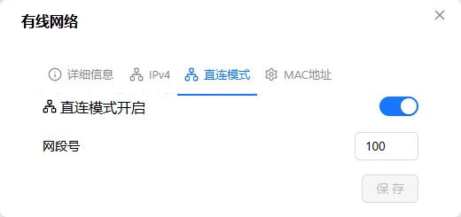

# 以太网直连模式

FlexKVM 变身一台 DHCP 服务器——用一根网线直连电脑，电脑自动获取 IP 就能访问管理界面。不需要路由器、不依赖现场网络。长按按键 B 约 1~3 秒后释放即可开启。

> 直连模式下，设备会给连接的电脑分配 `192.168.x.2 ~ 192.168.x.254` 的 IP 地址（`x` 默认为 100，即默认网段 `192.168.100.x`）。
> 直连模式支持修改配置项中网段号 `x`，默认为 100。

## 规格

| 项目 | 说明 |
|:----:|------|
| 工作模式 | DHCP 服务器（设备端） |
| 接口 | RJ-45 以太网口 |
| 默认网段 | 192.168.100.x |
| 设备 IP | 192.168.x.1（网关 + DHCP 服务器） |
| 客户端 IP 范围 | 192.168.x.2 ~ 192.168.x.254 |
| 客户端数量 | 1（直连单台电脑） |
| 默认状态 | 关闭 |

> 直连模式与普通以太网模式互斥——开启直连模式会自动关闭 DHCP 客户端模式。

## 典型场景

### 🖥️ 直连笔记本电脑

现场没有路由器、没有网络？一根网线直连笔记本，照样能远程管理服务器：

```
┌──────────┐   网线直连    ┌──────────────┐
│ FlexKVM  │ ←─────────→ │   笔记本电脑   │
│ DHCP 服务器│             │ 自动获取 IP   │
│192.168.100.1│           │ 192.168.100.x │
└──────────┘              └──────────────┘
```

## OLED 显示

直连模式开启后，OLED 网络图标切换为直连专用图标，IP 前缀为 **S**（如 `S192.168.100.1`），S = Server。


> 直连模式与普通以太网模式共用网口，OLED 图标不同以区分当前模式。

## 按键切换

长按**按键 B** 分三阶段释放，第一阶段（1~3秒）切换直连模式：

| 当前模式 | 操作 | 切换结果 | OLED 预览 | 等待时间 |
|:--------:|:----:|:--------:|:--------:|:--------:|
| 以太网客户端 | 长按 B 1~3 秒，OLED 显示 "ETH SERVER" 后松开 | 关 DHCP 客户端，开直连模式 | ETH SERVER 文字 | 约 5 秒 |
| 直连模式 | 长按 B 1~3 秒，OLED 显示 "ETH CLIENT" 后松开 | 关直连模式，恢复 DHCP 客户端 | ETH CLIENT 文字 | 约 5 秒 |

> 继续长按不松手：3~5 秒进入 WiFi/热点切换预览，5 秒后进入返回首页预览。详见[物理按键](../interaction/button.md)。

## 软件配置

进 Web 界面 → 设置 → **网络** → 点击以太网卡片齿轮图标 → **直连模式**标签。



### 启用与禁用

打开「直连模式」开关，设置网段号（0~254），点保存即可生效。

| 配置项 | 说明 | 默认值 | 范围 |
|------|------|:---:|:---:|
| 直连模式 | 开关 | 关闭 | — |
| 网段号 | 第三段 IP（`192.168.x.1` 中的 `x`）| 100 | 0 ~ 254 |

> 如果无法连接，使用[配网模式](./provision.md)（长按按键 A 1~3 秒）恢复。

### 配置验证

| 验证项 | 方法 |
|--------|------|
| OLED | 看 IP 是否显示为 S 开头 |
| Web 界面 | 以太网卡片状态显示「直连模式：IP」 |
| 客户端 | 电脑网口设为 DHCP 自动获取，看是否拿到 `192.168.x.x` IP |

---

## 故障排查

| 现象 | 可能原因 | 先试这个 |
|------|----------|---------|
| 电脑拿不到 IP | 网线没插好、电脑网口未设为 DHCP | 重新插拔网线，检查电脑网络设置 |
| 拿到的 IP 不是 192.168.x.x | 电脑可能连着其他网络 | 关掉电脑 WiFi，只保留有线 |
| 能 ping 通但页面打不开 | 浏览器缓存或代理设置 | 清缓存、关代理，用无痕窗口试 |
| 改网段号后连不上 | 电脑还拿着旧 IP | 电脑端禁用再启用以太网，或 `ipconfig /release && /renew` |
| 直连模式和普通以太网反复切换失败 | 路由表残留 | 等待约 10 秒自动恢复，或重启设备 |

---

[:octicons-arrow-left-24: 返回用户指南](../index.md)
