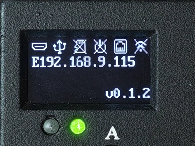
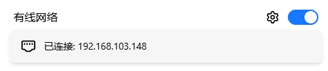
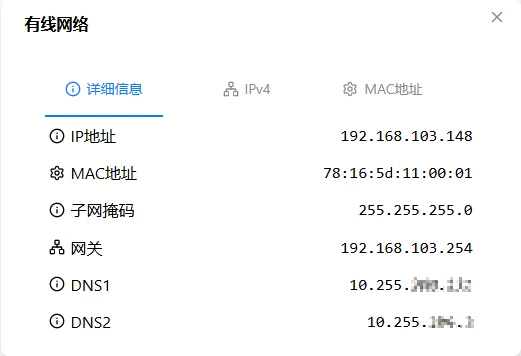
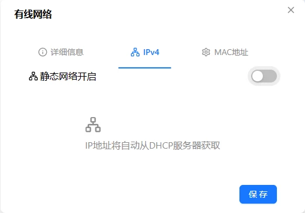
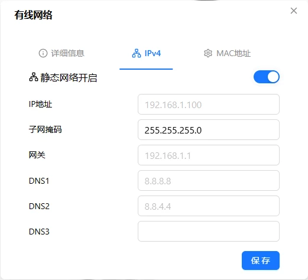
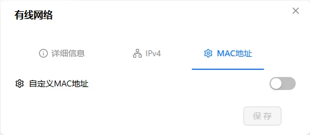
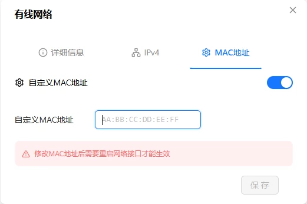

# Ethernet

Plug in an Ethernet cable and the device gets a stable wired connection. The 100M Ethernet port and [WiFi](./wifi.md) provide mutual backup — each link has its own IP, either one can reach the management interface, and if one drops the other keeps working. Supports DHCP (auto) and static IP. No router? Try [Ethernet Direct Mode](./eth-server.md) — one cable to your computer, the device becomes a DHCP server.

> When using Ethernet and WiFi together, place them on different subnets to avoid routing conflicts. For example, Ethernet on `192.168.1.x`, WiFi on `192.168.2.x`.

## Specifications

| Item | Details |
|:----:|---------|
| Interface | RJ-45 |
| Speed | 10M/100Mbps, auto-negotiation (100M port — negotiating to 100Mbps with a gigabit router is normal) |
| Default state | Enabled |
| MAC address | See packaging box label: ETH: xx:xx:xx:xx:xx:xx |
| PoE | Not supported — requires external PoE splitter module |

> Need PoE? → [Accessories & Expansion](../product/extensibility.md).

## OLED Display

After plugging in Ethernet, the "X" on the OLED network icon disappears and the second line shows the IP address. IP prefix is **E** (e.g., `E192.168.1.100`), E = Ethernet.

While acquiring IP, the display shows **E Loading...**. If it takes more than 20s → check that the cable is firmly plugged in and the router has DHCP enabled.

> When no Ethernet cable is plugged in, the "X" stays on the network icon. More OLED info → [OLED Screen](../interaction/oled.md).

## Software Configuration

Go to Web interface → Settings → **Network**.

### Enable / Disable

Click the toggle on the right side of the card. Disabling turns off the Ethernet interface. Saved configuration is preserved.

> Turning off both Ethernet and WiFi means you can't access the device. Keep at least one enabled.

### Network Status

The card shows the current status:

| Status | Meaning |
|--------|---------|
| Connected, IP: x.x.x.x | Normal |
| Cable not connected | Interface enabled but no cable plugged in |
| Disabled | Interface is turned off |

### Network Configuration

Click the gear icon on the left side of the card to open the configuration dialog (three tabs):

**Details**

Read-only display of current parameters: IP address, MAC address, subnet mask, gateway, DNS1–3.

**IPv4 Configuration**

**DHCP (default)**: Router assigns automatically.

**Static IP**: Manually set fixed parameters.

| Field | Description | Required |
|-------|-------------|:--------:|
| IP address | e.g., `192.168.1.100` | Yes |
| Subnet mask | e.g., `255.255.255.0` | Yes |
| Gateway | e.g., `192.168.1.1` | Yes |
| DNS1 | Primary DNS | No |
| DNS2 | Secondary DNS | No |
| DNS3 | Tertiary DNS | No |

> When switching to static IP, make sure the parameters are compatible with the current network — otherwise you'll lose connectivity.

Click save — takes effect immediately.

**MAC Address**

Default uses the factory MAC (printed on the packaging box). You can also set a custom one:

Format: `AA:BB:CC:DD:EE:FF` (six groups of hex, colon-separated).

> ⚠️ Changing the MAC takes effect immediately and may cause disconnection. Some routers refuse to recognize a new MAC. If you can't reconnect after changing it, use [Provisioning Mode](./provision.md) (long-press Button A 3–6s) to recover.

### Verification

| Check | How |
|-------|-----|
| OLED | Does the IP start with E? |
| Web interface | Does the Ethernet card show an IP address? |
| Network test | Can another device ping that IP? |

---

## Troubleshooting

| Symptom | Likely cause | Try this first |
|---------|-------------|----------------|
| Ethernet light off | Cable loose or bad | Re-seat both ends, or try another cable |
| Light on but not blinking | Router port issue or DHCP disabled | Try a different router port, check DHCP |
| OLED shows "E Loading..." >20s | DHCP not responding, IP pool exhausted | Verify DHCP is working and has free IPs, or use static IP |
| Only 100Mbps with gigabit router | The device is a 100M port | Normal — not a defect |
| Static IP set but can't connect | Parameters incompatible with network | Use [Provisioning Mode](./provision.md) to re-configure |
| Changed MAC and can't connect | Router rejects the new MAC | Use [Provisioning Mode](./provision.md) to re-configure |

---

[:octicons-arrow-left-24: Back to User Guide](../index.md)
