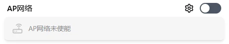

# Provisioning Mode

Provisioning mode creates a **temporary** WiFi hotspot — when the device has no network or a misconfiguration prevents access, long-press Button A for 3–6s to enter. Configure the network, save, and exit. Unlike [AP Mode](./ap.md): provisioning mode auto-closes after configuration; AP mode stays on continuously.

## When to Use

| Scenario | Description |
|----------|-------------|
| First-time setup | Device has no network — use provisioning mode to configure WiFi |
| Recovery | Changed IP or MAC and can't connect — re-enter provisioning mode to fix |
| Network switch | Moved to a different router or network — old config is invalid |

## Difference from Button B

| Feature | Button A (3–6s) | Button B (3s) |
|---------|:---:|:---:|
| Mode triggered | Provisioning mode (temporary) | AP hotspot (persistent) |
| Purpose | First setup / recovery | Daily hotspot toggle |
| Exit method | Click Save in provisioning page | Long-press Button B again |

## Enter Provisioning Mode

1. Make sure the device is powered on and the OLED is lit
2. Long-press **Button A** for 3–6 seconds
3. Release when the OLED shows the AP icon :material-access-point:

> Holding less than 3s won't trigger; holding more than 6s returns to home. If you miss the timing, release and try again.

After releasing, the standby screen appears. After ~12 seconds, the OLED shows the hotspot name, random password, and IP address:

## Connect to the Hotspot

**Phone**: Find the FlexKVM hotspot in WiFi settings → enter the password shown on OLED → a captive portal page opens automatically in the browser — tap "Trust" or "Continue". If it doesn't pop up, manually go to `192.168.10.1`. Android users can also tap "Sign in to network" in the notification bar.

**Computer**: Connect to the hotspot → open a browser and go to `192.168.10.1`.

> Your phone will temporarily lose internet while connected to the hotspot — it auto-restores after provisioning is complete.

## Configure Network

After entering the provisioning page, you'll see the same network settings as the normal Web interface:

### Wired Network

DHCP / Static IP, custom MAC, etc. See [Ethernet](./eth.md).

### WiFi

Scan nearby WiFi networks, connect, or manually add.

> **Verify**: After connecting → the card shows a "Connected" label.

Tap refresh :material-refresh: to update the network list. See [WiFi](./wifi.md).

### AP Network

Configure hotspot parameters (SSID, password, band, etc.). **Changes are staged and take effect when you save and exit.**

See [AP Mode](./ap.md).

## Save & Exit

When all networks are configured, tap **Save** in the top-right corner:

1. AP configuration takes effect
2. Device exits provisioning mode and restarts networking
3. OLED shows IP, 🔴 Warning LED turns off

---

> In provisioning mode, you can configure **all network types** (Ethernet, WiFi, AP) — not just WiFi. If you make a mistake, press the button and re-enter. The session will auto-timeout after prolonged inactivity.

---

[:octicons-arrow-left-24: Back to User Guide](../index.md)
