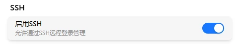

# SSH

FlexKVM 内置 SSH 服务器，支持通过 SSH 客户端远程登录设备进行带外管理（OOB Management）。

SSH 采用密码认证（不支持密钥），同一时间只允许一个会话连接。登录失败超过 3 次将自动断开连接，防止暴力破解。

## 前置条件

使用 SSH 登录前，请确保：

1. **已创建账户**：需要在 Web 界面首次访问时创建管理员账户（参见 [登录](../system/account/login.md)）
2. **SSH 服务已启用**：默认启用，可在设置中关闭
3. **网络已连接**：设备已通过以太网或 WiFi 连接到网络

## 启用 SSH

进入 **设置 → 系统**，可以看到 SSH 设置区块。点击开关即可开启或关闭 SSH 服务。



> 注意：SSH 服务默认启用，监听端口为 **22**。关闭后所有已连接的 SSH 会话将被断开。

## 连接设备

使用任意 SSH 客户端连接 FlexKVM 设备：

```bash
ssh <用户名>@<设备IP地址>
```

- **用户名**：FlexKVM 的账号名称
- **密码**：FlexKVM 的账号密码
- **端口**：22（默认）

> SSH 仅支持密码登录，不支持密钥登录。

**两步验证**：如果账号开启了 2FA，登录时会分两步：

1. 输入密码 → 密码正确后，提示输入 TOTP 验证码
2. 输入 6 位 TOTP 验证码（或 8 位备用码）→ 验证通过后进入管理界面

> 未开启 2FA 的账号只需输入密码即可登录。

连接成功后，会进入 FlexKVM 的 SSH 管理界面：

```
flexkvm-6jzdd SSH OOB Management
Version: 1.1
Type 'help' for available commands.

admin@flexkvm-6jzdd#
```

## 可用命令

输入 `help` 查看完整命令列表。常用命令速查：

| 命令 | 说明 | 示例 |
|------|------|------|
| `atx power short\|long` | 短按/长按电源键 | `atx power short` |
| `atx reset` | 短按复位键 | `atx reset` |
| `atx status` | 查看 ATX 及电源状态 | `atx status` |
| `network show` | 查看网络接口信息 | `network show eth` |
| `gpio status` | 查看 GPIO 引脚状态 | `gpio status a` |
| `gpio enable\|disable` | 启用/禁用 GPIO | `gpio enable a` |
| `gpio direction` | 设置引脚方向 | `gpio direction a out` |
| `gpio level` | 设置输出电平 | `gpio level a 1` |
| `ping` | 网络连通性测试 | `ping 192.168.1.1 4` |
| `system info` | 查看固件版本 | `system info` |
| `reset` | 恢复出厂（保留日志） | `reset` |
| `reset all` | 深度恢复（清除全部） | `reset all` |
| `exit` | 退出会话 | `exit` 或 `Ctrl+D` |

> ATX 命令需配合硬件模块，详见 [外设](../peripherals/atx/index.md)。GPIO 命令详见 [扩展 IO](../io/gpio.md)。

## 终端操作

SSH 终端支持以下键盘操作：

| 快捷键 | 功能 |
|:---:|------|
| `Tab` | 命令自动补全 |
| `↑` / `↓` | 浏览命令历史记录（最多 32 条） |
| `Ctrl+A` | 光标移动到行首 |
| `Ctrl+E` | 光标移动到行尾 |
| `Ctrl+K` | 删除光标到行尾的内容 |
| `Ctrl+U` | 删除光标到行首的内容 |
| `Ctrl+C` | 清空当前输入 |
| `Ctrl+D` | 空行时退出会话 |
| `Backspace` | 删除光标前一个字符 |

> 提示：命令历史最多保存 32 条记录，重复命令不会重复添加。

---

[:octicons-arrow-left-24: 返回用户指南](../index.md)
