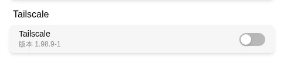
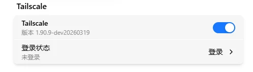
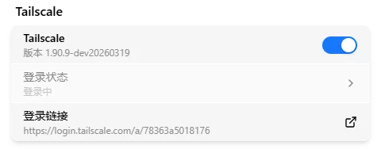
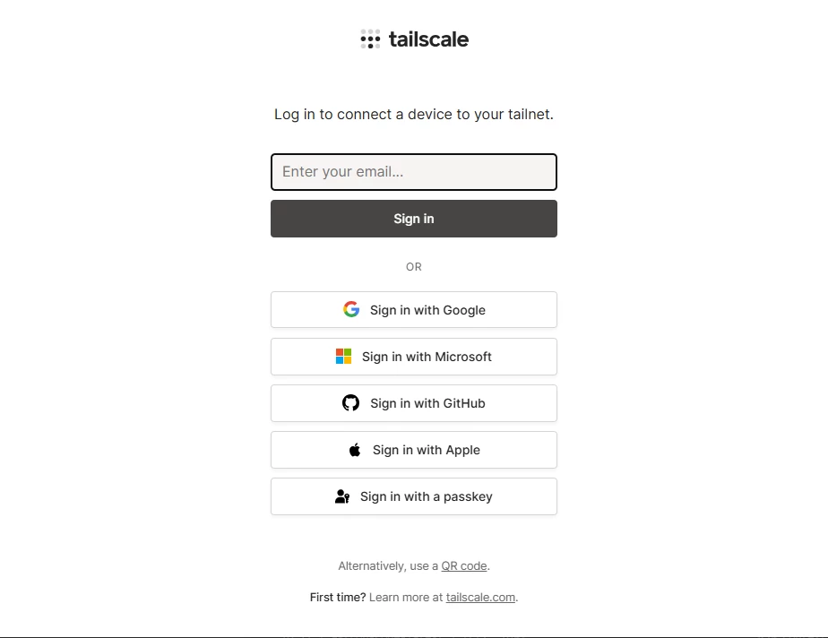
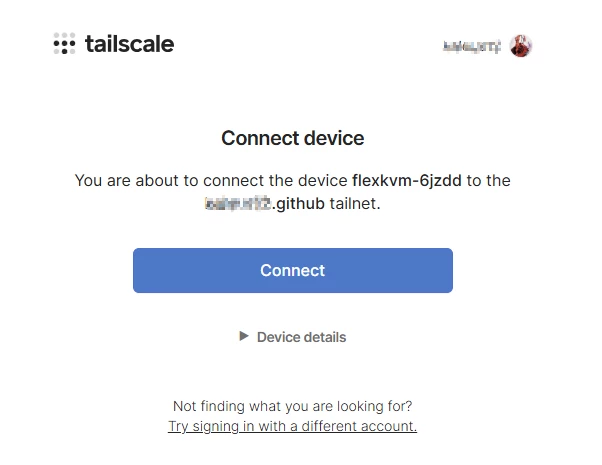
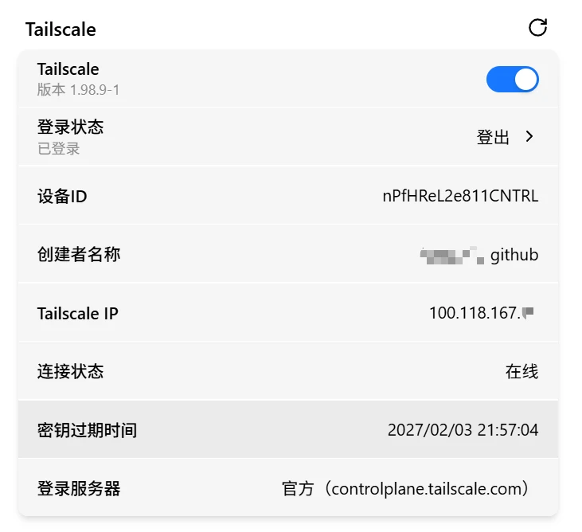

# Tailscale

Tailscale is a VPN mesh tool pre-installed in FlexKVM — join your devices into one encrypted virtual network. No public IP needed, no router port forwarding to configure. The free tier supports 100 devices.

> Before using, sign up for an account at [tailscale.com](https://tailscale.com).

Go to Web interface → Settings → **App Center**.

## Enable the Service

Toggle the switch to enable — takes effect immediately. Once enabled, the description text shows the Tailscale version.

## Login

Click the **Login Status** button to start:

Wait a few seconds for the login link:

Click the login link → browser opens Tailscale auth page → choose your sign-in method (Google / Microsoft / Apple / email):

After signing in, click **Connect** to authorize the device to join your Tailscale network:

> **Verify**: The page auto-redirects back to the management interface, showing the device has joined. You can close the page at any time during login — the process runs asynchronously in the background.

## Connection Info

After successful login, the interface shows:

| Info | Description |
|------|-------------|
| Device ID | Unique identifier of this node in the Tailscale network |
| Tailnet name | Current network name |
| Tailscale IP | Assigned IP (`100.x.x.x`) |
| Connection status | Online / Offline |
| Key expiry | Expiration date and time of the node key |

Click the refresh button to update connection status.

## Logout

After login, the button changes to **Logout**. Click Logout → the device is removed from the current Tailscale network and the Tailscale IP is released. To reconnect, just log in again — no waiting.

## Remote Access

After logging in to Tailscale, **install Tailscale on the device you want to access FlexKVM from and log into the same account**. Then:

- **Web interface**: `https://<Tailscale IP>` (e.g., `https://100.x.x.x`)
- **SSH**: `ssh <username>@<Tailscale IP>`

It's just like being on the same LAN — works through NAT and firewalls.

> For advanced features like ACL access control and device sharing, see the [Tailscale official documentation](https://tailscale.com/kb).

---

## Troubleshooting

| Symptom | Likely cause | Try this first |
|---------|-------------|----------------|
| Toggle grayed out | Tailscale not properly pre-installed | Contact technical support |
| Login page won't open | Network issue | Check if FlexKVM has internet access |
| Login says device already registered | Device is in another Tailnet | Remove the old device from Tailscale admin console and retry |
| Can't connect remotely | Control device missing Tailscale or wrong account | Install Tailscale on control device and log into the same account |

---

[:octicons-arrow-left-24: Back to User Guide](../index.md)
