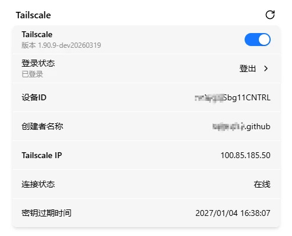

# Tailscale

Tailscale 是预装在 FlexKVM 里的 VPN 组网工具——把你的设备加入同一个加密虚拟网络，不需要公网 IP、不用配路由器端口转发。免费版支持 100 台设备。

> 使用前先去 [tailscale.com](https://tailscale.com) 注册一个账号。

进 Web 界面 → 设置 → **应用中心**。

## 启用服务

点开关即可启用，立即生效。启用后描述文字会显示 Tailscale 版本号。

## 登录

点**登录状态**按钮开始登录：

等待几秒钟获取登录链接：

点登录链接 → 浏览器打开 Tailscale 认证页 → 选你注册时的登录方式（Google / Microsoft / Apple / 邮箱）：

完成登录后点 **Connect**，允许设备加入你的 Tailscale 网络：

> **验证**：页面自动跳回管理界面，显示设备已加入。登录过程中可以随时关页面，后台异步执行。

## 连接信息

登录成功后界面显示：

| 信息 | 说明 |
|------|------|
| 设备 ID | Tailscale 网络中该节点的唯一标识 |
| Tailnet 名称 | 当前网络名称 |
| Tailscale IP | 分配的 IP（`100.x.x.x`） |
| 连接状态 | 在线 / 离线 |
| 密钥到期时间 | 节点密钥的到期日期和时间 |

点刷新按钮更新连接状态。

## 登出

登录成功后按钮变为**登出**。点登出 → 设备从当前 Tailscale 网络注销，Tailscale IP 被释放。需要重新连接时再登录即可，不用等。

## 远程访问

Tailscale 登录成功后，**在你要访问 FlexKVM 的设备上也装 Tailscale 并登录同一账号**。然后：

- **Web 界面**：`https://<Tailscale IP>`（如 `https://100.x.x.x`）
- **SSH**：`ssh <用户名>@<Tailscale IP>`

就像在同一个局域网里一样，能穿透 NAT 和防火墙。

> Tailscale 的 ACL 权限控制、设备共享等高级功能见 [Tailscale 官方文档](https://tailscale.com/kb)。

---

## 故障排查

| 现象 | 可能原因 | 先试这个 |
|------|----------|---------|
| 开关灰色不可用 | Tailscale 未正确预装 | 联系技术支持 |
| 登录页打不开 | 网络异常 | 检查 FlexKVM 是否联网 |
| 登录提示设备已注册 | 设备已在其他 Tailnet | 在 Tailscale 管理后台移除旧设备后重试 |
| 远程连不上 | 访问端没装 Tailscale 或没登同一账号 | 在访问端装 Tailscale 并登录同一账号 |

---

[:octicons-arrow-left-24: 返回用户指南](../index.md)
