# WiFi

Connect to WiFi for wireless networking. Supports 2.4GHz and 5GHz dual-band — 2.4G penetrates walls better and covers wider areas; 5G has lower latency, ideal for video. Works as mutual backup with [Ethernet](./eth.md) — each link has its own IP, either one can reach the management interface, and if one drops the other keeps working.

> When using Ethernet and WiFi together, place them on different subnets to avoid routing conflicts. For example, Ethernet on `192.168.1.x`, WiFi on `192.168.2.x`.

## Specifications

| Item | Details |
|:----:|---------|
| Wireless protocol | 802.11 a/b/g/n/ac/ax |
| Band | Dual-band 2.4GHz / 5GHz |
| Antenna | SMA male |
| Default state | Enabled |
| MAC address | See packaging box label |

## OLED Display

After WiFi connects, the "X" on the OLED network icon disappears and the second line shows the IP address. IP prefix is **W** (e.g., `W192.168.1.100`), W = Wireless.

While acquiring IP, the display shows **W Loading...**. If it takes more than 10s → check WiFi connection or router DHCP.

> When WiFi is disconnected, the network icon always has an "X". More OLED status info → [OLED Screen](../interaction/oled.md).

## Button Switch

Long-press **Button B** for about 6 seconds to quickly toggle between WiFi and [AP Mode](./ap.md):

| Current mode | Action | Result | OLED icon | Wait time |
|:------------:|:------:|:------:|:---------:|:---------:|
| WiFi mode | Long-press Button B ~6s, release when OLED shows hotspot icon | Turns off WiFi, turns on hotspot | 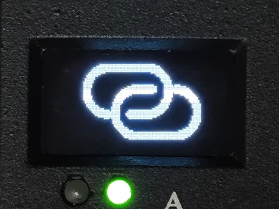{ width="80" } | ~10 seconds |
| Hotspot mode | Long-press Button B ~6s, release when OLED shows WiFi icon | Turns off hotspot, restores WiFi | 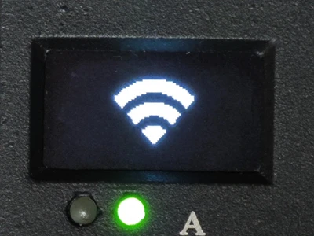{ width="80" } | 3~4 seconds |

> Button B toggles WiFi/hotspot. [Provisioning Mode](./provision.md) (Button A) is a **temporary** hotspot for first-time setup or recovery. They are different.

## Software Configuration

Go to Web interface → Settings → **Network**.

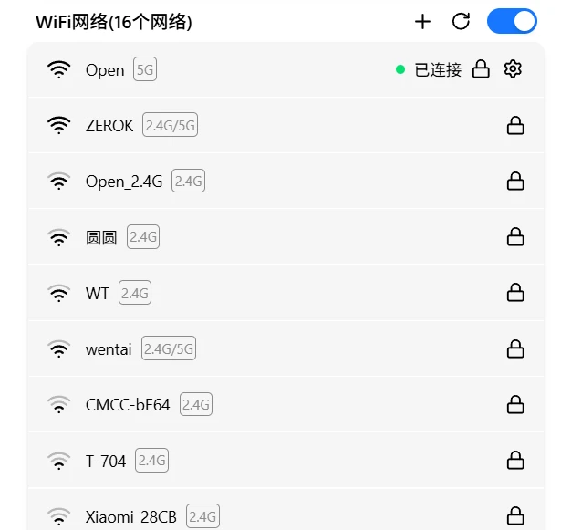

### Scan Networks

Click the refresh button to scan manually, or wait for the device to auto-scan every 40 seconds. The button rotates while scanning, and the list auto-updates when complete.

### Enable / Disable

Click the card's toggle on the right. Turning off WiFi disables the wireless interface. Saved networks and configurations are preserved.

> Turning off both WiFi and Ethernet means you can't access the device. Keep at least one enabled.

### Network Cards

Scanned WiFi networks are shown as a card list. Each card displays: SSID, signal strength (four bars), frequency band (2.4G / 5G / dual-band), security type, and status label.

Click a card to expand action buttons. Available actions vary by card state:

**Connected**

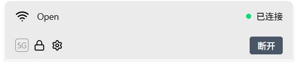

- **Disconnect**: Disconnect from the current network
- **Settings**: Open network configuration dialog (IP mode, DNS, MAC)

**Saved (not connected)**

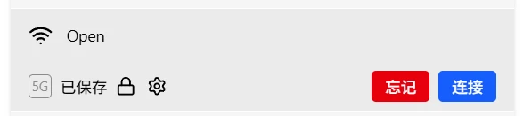

- **Connect**: Connect to this network
- **Forget**: Remove from saved list
- **Settings**: Open network configuration dialog

**Unsaved**

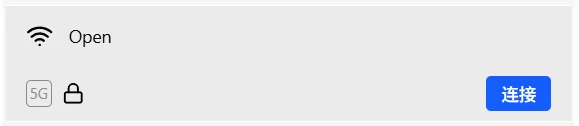

- **Connect**: Connect to this network

> Each saved network can have independent IP configuration — settings auto-switch when you change WiFi networks.

### Connect to a Network

Expand the target network card, then proceed by network type:

**Open network**: Expand the card → click Connect. No password needed.

**Encrypted network**: Expand the card → click Connect → enter password → confirm.

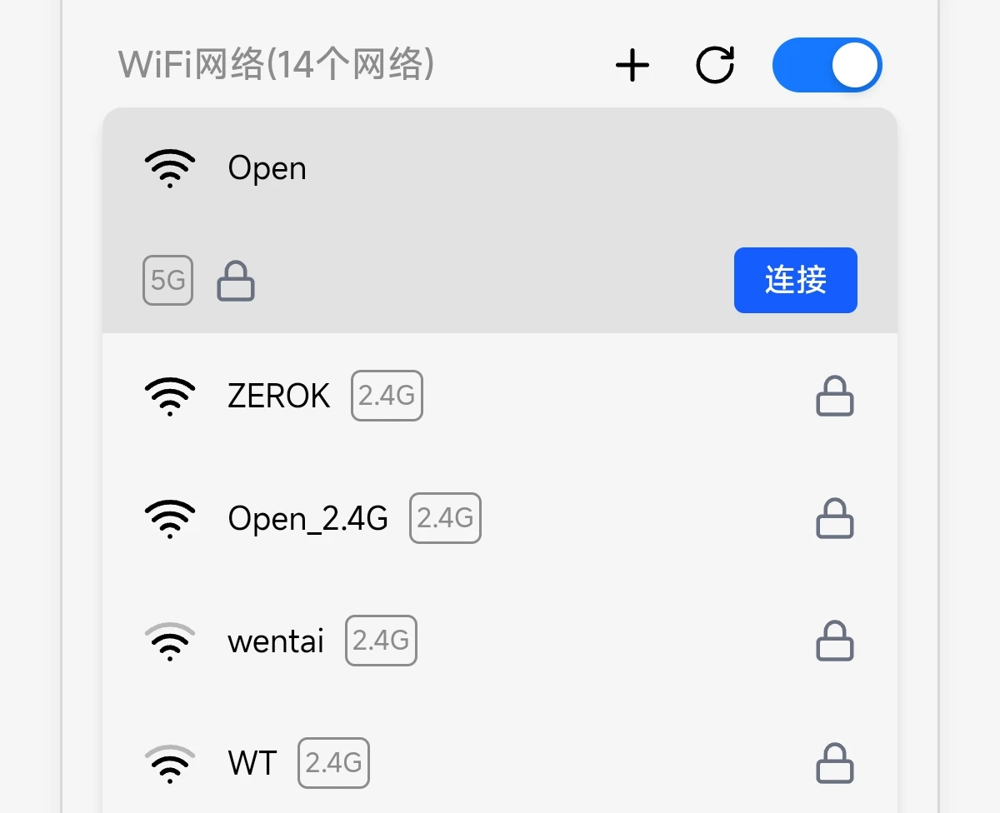

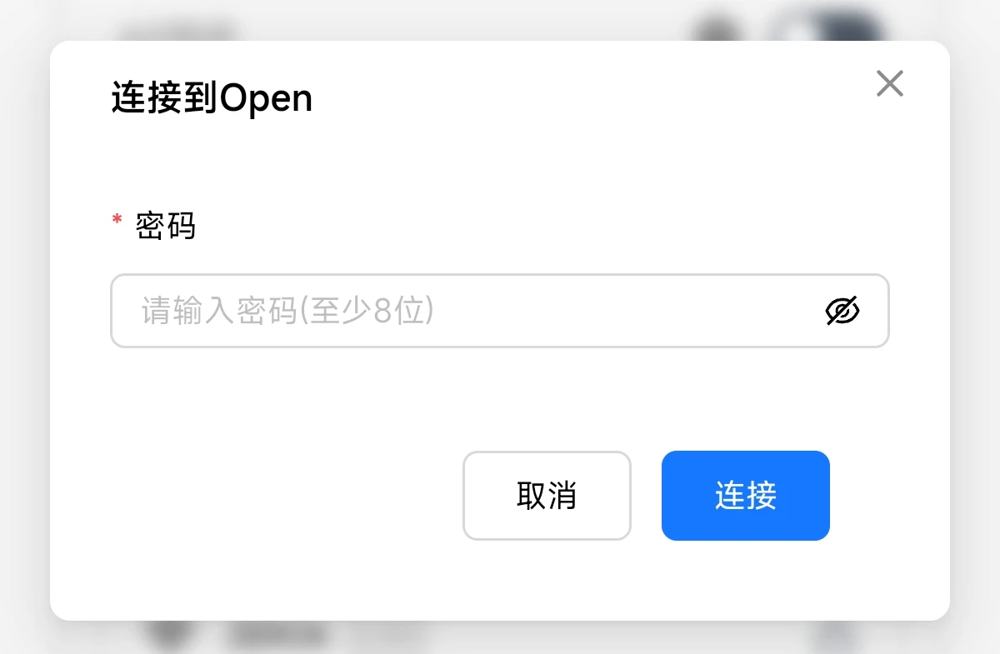

Connection status is displayed:

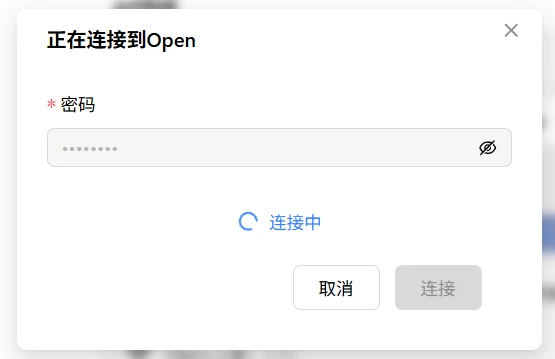

Connected:

> **Verify**: After connecting → the card shows a "Connected" label and IP address. Password and config are auto-saved for next boot.

**Manually add a network**

Click the **+** button at the top of the list, then fill in SSID, security type, and password:

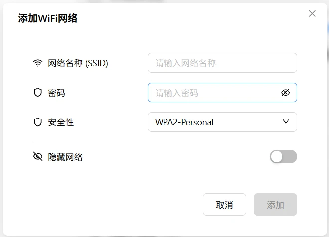

| Field | Description |
|-------|-------------|
| Network name (SSID) | WiFi name |
| Security type | Open / WPA / WPA2 / WPA3 |
| Password | Required for encrypted networks |

### Network Configuration

Click the **Settings** button on a saved network card to open the configuration dialog (three tabs):

**Details**

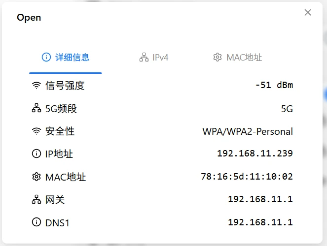

Read-only display of current network parameters: IP address, MAC address, subnet mask, gateway, DNS1–3.

### IPv4 Configuration

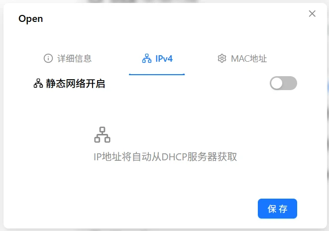

**DHCP (default)**: Router assigns IP, gateway, and DNS automatically.

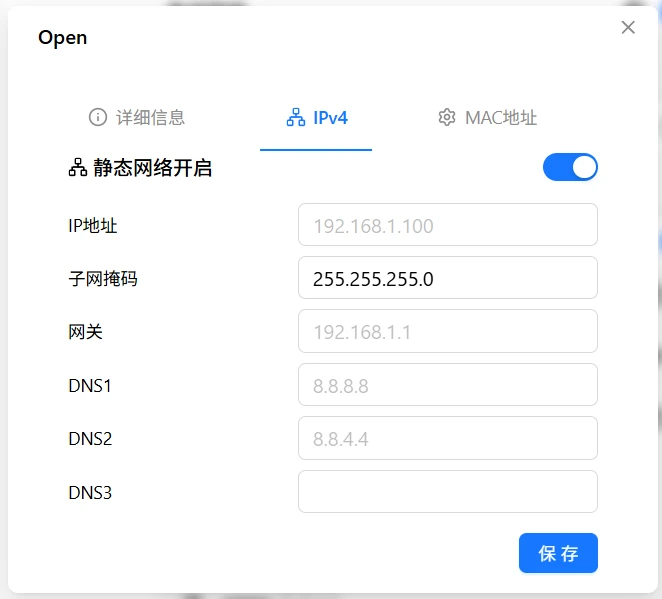

**Static IP**: Manually set fixed parameters.

| Field | Description | Required |
|-------|-------------|:--------:|
| IP address | e.g., `192.168.1.100` | Yes |
| Subnet mask | e.g., `255.255.255.0` | Yes |
| Gateway | e.g., `192.168.1.1` | Yes |
| DNS1 | Primary DNS | No |
| DNS2 | Secondary DNS | No |
| DNS3 | Tertiary DNS | No |

> When switching to static IP, make sure the parameters are compatible with the current network — otherwise you'll lose connectivity.

Click save — takes effect immediately.

### MAC Address

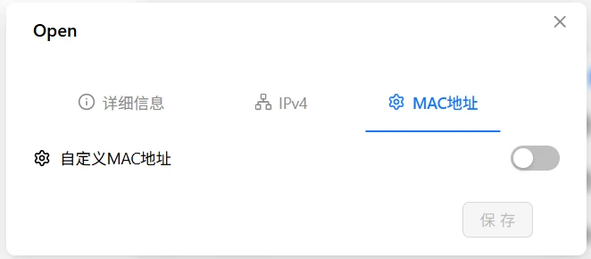

Default uses the factory MAC address (printed on the packaging box). You can also set a custom one:

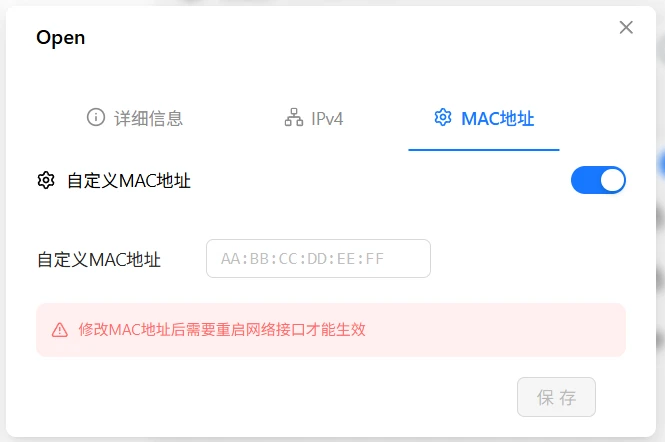

Format: `AA:BB:CC:DD:EE:FF` (six groups of hex, colon-separated).

> ⚠️ Changing the MAC takes effect immediately and may cause disconnection. Some routers refuse to recognize a new MAC. If you can't reconnect after changing it, use [Provisioning Mode](./provision.md) (long-press Button A 3–6s) to recover.

### Verification

| Check | How |
|-------|-----|
| OLED | Is the IP displayed? |
| Web interface | WiFi card shows IP address |
| Network test | Ping the IP from another device |

---

## Troubleshooting

| Symptom | Likely cause | Try this first |
|---------|-------------|----------------|
| Can't find network | WiFi disabled, antenna not installed | Check switch, ensure antenna is attached |
| Wrong password | Typo | Re-enter, check case and special characters |
| Connection timeout | Weak signal, router MAC filter | Move closer to router, check router settings |
| No IP after connecting | DHCP not responding | Try static IP, or check router DHCP |
| Frequent disconnects | Weak signal, interference | Switch to 5GHz or use wired instead |

### Signal Strength Recommendations

A stable connection requires at least **level 2 (two bars)**:

- **Level 3–4**: Stable, suitable for video
- **Level 2**: Basically usable, occasional lag
- **Level 1 or below**: Unstable, not recommended

Weak signal? Try: reposition the device, add a WiFi extender, or use wired Ethernet.

---

[:octicons-arrow-left-24: Back to User Guide](../index.md)
