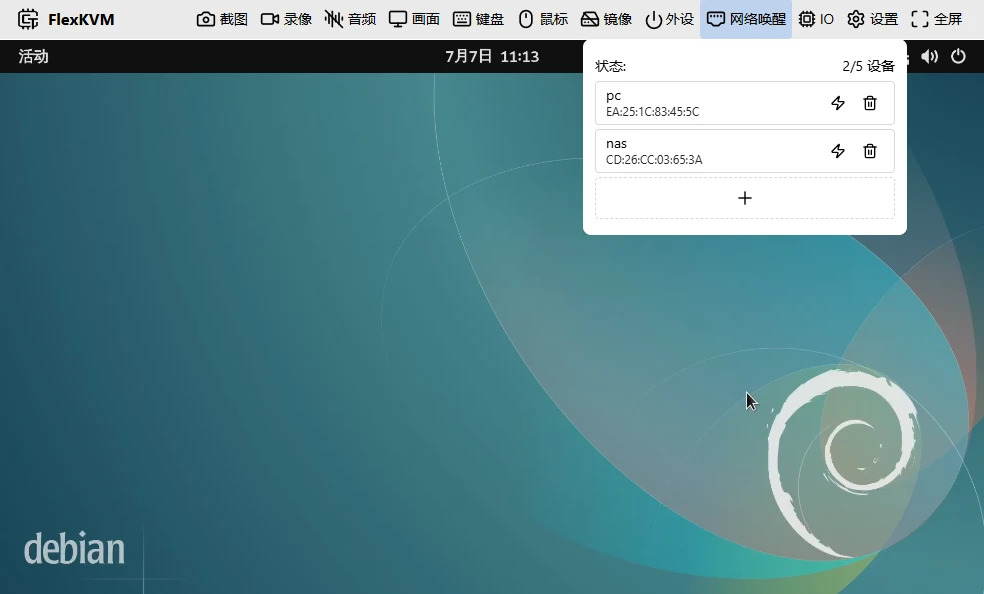
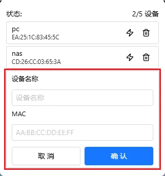

# 网络唤醒 (WoL)

填好被控设备的 MAC 地址，一键发送魔术包唤醒局域网内已关机的设备。FlexKVM 和目标设备必须在**同一个局域网**内。

## 前置条件

被唤醒的设备必须：

- 主板和 BIOS 支持并开启了 Wake-on-LAN
- **通过网线连接**（WiFi 不支持）
- 处于关机、休眠或睡眠状态（不能是完全断电）
- 与 FlexKVM 在同一局域网

### 开启 BIOS WoL

进被控设备 BIOS（开机按 Del / F2），在 **Power Management** 里找到以下选项：

| BIOS 选项 | 设为 |
|-----------|:---:|
| Wake on LAN / WOL | Enabled |
| PCIe Wake / Power On By PCI-E | Enabled |
| ErP / EuP Ready | **Disabled**（必须关） |

> 不同主板 BIOS 差异大，找不到就问主板厂商或翻说明书。

## WoL 入口

FlexKVM 顶栏点网口图标：

## 添加设备

1. 点 **+** 按钮
2. 填设备名称（只支持英文和数字，最长 32 字符，不能重复）
3. 填 MAC 地址（格式 `AA:BB:CC:DD:EE:FF`）
4. 确认

> 最多添加 5 台。

MAC 地址怎么查：

| 系统 | 命令 |
|------|------|
| Windows | `ipconfig /all`，找"物理地址" |
| Linux | `ip addr` 或 `ifconfig` |
| macOS | `ifconfig` |

## 唤醒设备

列表里点闪电图标 → 发送 Magic Packet → 设备唤醒。

> **验证**：唤醒成功会弹出提示。没反应？→ 确认设备插的网线（不是 WiFi）、BIOS 里 WoL 已开、MAC 填对了、和 FlexKVM 同一局域网。

## 删除设备

点垃圾桶图标从列表移除。

---

## 常见问题

**点了唤醒没反应？**

→ 三件事：① 设备插网线了吗？② BIOS 里 WoL 开了吗？③ MAC 地址填对了吗？

**能跨网络唤醒吗？**

→ 不能。FlexKVM 和目标设备必须在同一局域网。

---

[:octicons-arrow-left-24: 返回用户指南](../index.md)
