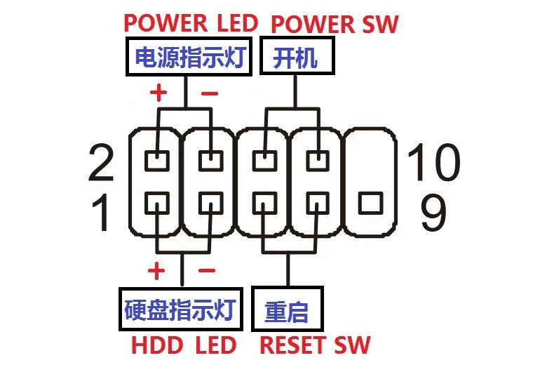
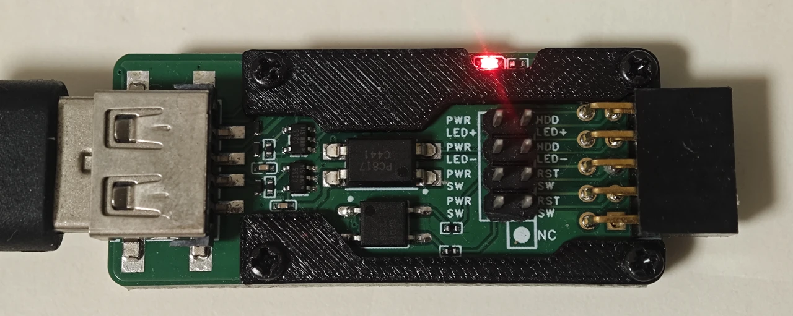
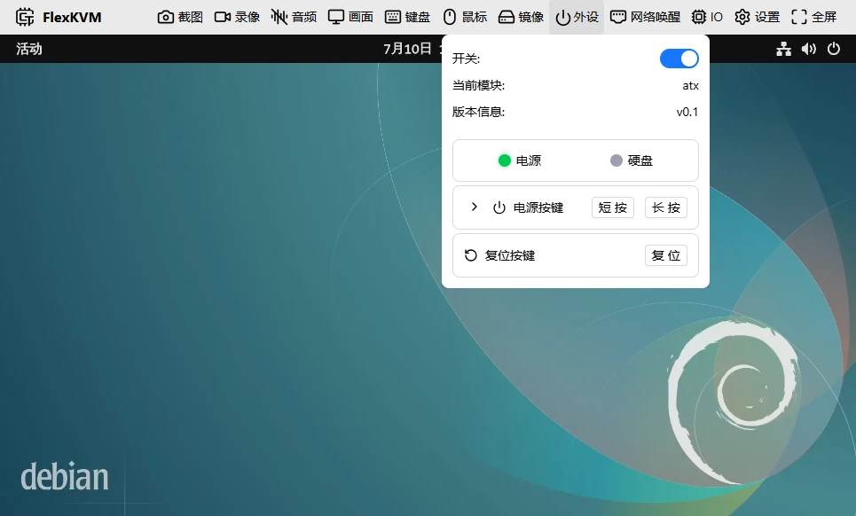
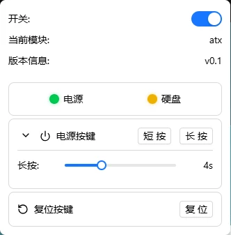

# ATX Power Control

After wiring the ATX controller, you can remotely control the target host's power — power on, shutdown, force power-off, reboot — just as if you were pressing the buttons on the case yourself.

---

## Before You Begin

| Item | Notes |
|------|-------|
| FlexKVM | Completed [Quick Start](../../quick_start/index.md) wiring and network setup |
| ATX controller | Included in the box, with ribbon cable |
| ATX Dupont wires | Included in the box (10 wires) |
| USB Type-C cable | Included in the box, for connecting to FlexKVM |
| Phillips-head screwdriver | For opening the case |

---

## Hardware Wiring

### Pin Definitions

Each wire on the ATX controller ribbon cable has a label. Connect them to the motherboard according to the table below:

| ATX Controller | Motherboard Header | Notes |
|:---------------|:-------------------|:------|
| PWR SW ×2 | POWER SW ×2 | Power switch, no polarity |
| RST SW ×2 | RESET SW ×2 | Reset switch, no polarity |
| PWR LED+ | POWER LED+ | Power LED positive |
| PWR LED- | POWER LED- | Power LED negative |
| HDD LED+ | HDD LED+ | HDD LED positive |
| HDD LED- | HDD LED- | HDD LED negative |

> Power and reset switches have no polarity — swapping them works fine. LEDs require correct polarity — if reversed, they won't light up.

### Locate the Motherboard Header

Open the case and find the **front panel header** — the row of pins behind the case's power and reset buttons. Usually located in the bottom-right corner of the motherboard, labeled `JFP1`, `F_PANEL`, or `PANEL`.

> Not sure? Check your motherboard manual's "Front Panel Connector" section, or search your motherboard model + `front panel pinout`.

### Wiring Principle

Each wire on the ATX controller ribbon cable has two connectors — a **male connector** (pin) for the case panel wire, and a **female connector** (socket) for the motherboard header or Dupont wire male end. The controller is inserted between the case panel and motherboard, allowing both pass-through of physical button signals and remote triggering by FlexKVM.

### Wiring Steps

> ⚠️ Ensure both the ATX controller and motherboard are powered off before wiring.

**Step 1: Connect Case Panel Wires to ATX Controller**

1. Unplug the case panel wires from the motherboard (pull the female connectors off the motherboard's male pins)
2. According to the [Pin Definitions table](#pin-definitions), plug the case panel wire's female connectors into the corresponding **male connectors** on the ATX controller ribbon cable

**Step 2: Connect ATX Controller to Motherboard** (choose one method)

**Method 1: Direct Connection (Recommended)** — Use when the ATX ribbon cable's female connector can plug directly into the motherboard. Align and insert — there's a keying design, so it won't fit if oriented incorrectly.

**Method 2: Use Dupont Wires** — Use when the female connector shape doesn't match. Plug the Dupont wire's female end into the motherboard header, and the male end into the ATX ribbon cable's female connector. No polarity required — just ensure a secure connection.

> Both methods work identically. Once connected, the ATX controller is inserted into the circuit.

### Connect to FlexKVM

Use a USB Type-C cable to connect the ATX controller to FlexKVM's **ATX port**.

> **Verification**: The ATX controller's power LED lights up, and the OLED status bar shows the ATX icon changing from "Disconnected" to "Connected".

### Extended Installation (Optional)

Optional accessories can mount the ATX controller inside the case: full-height USB bracket + USB extension cable. Install the bracket in a PCI slot → connect the extension cable's inner end to the bracket → connect the outer end to the ATX controller → FlexKVM connects externally to the bracket.

---

## Software Configuration

Click the **Peripherals** icon in the top bar.

| Icon | Meaning |
|:----:|---------|
|  | Not connected or not enabled |
|  | ATX connected, host powered on |
|  | ATX connected, host powered off |

### Enable

1. Click the Peripherals icon in the top bar
2. Toggle the switch in the top-right corner of the panel
3. When properly connected, the device name `atx` will appear

### Status Indicators

Two LEDs at the top of the panel directly connect to the motherboard:

| Indicator | Meaning |
|:----------|---------|
| 🟢 Power LED | Host is running |
| 🟡 HDD LED blinking | Disk read/write activity |

### Power Control

| What you want to do | Operation |
|:--------------------|:----------|
| Power on | Click power button → **short press** |
| Graceful shutdown | Click power button → **short press** (OS handles shutdown) |
| Force power-off | Click power button → **long press** (~4 seconds) |
| Reboot | Click reset button |

> ⚠️ Force power-off and reset may cause data loss. When the system is responsive, prefer short press for graceful shutdown.

Long-press duration is adjustable: click the expand arrow next to the power button → adjust the "Long-press shutdown" slider (1s~10s).

---

## FAQ

**Power button not responding?** → Check if Dupont wires are securely connected and if the motherboard header position is correct. In the peripherals panel, confirm the device name shows `atx`.

**Host powers on immediately after shutdown?** → BIOS has "Restore on AC Power Loss" enabled. Enter BIOS and disable this option.

**ATX not recognized?** → Re-plug the USB Type-C cable, confirm the ATX icon appears on OLED. If still not working, try a different USB port.

---

[:octicons-arrow-left-24: Back to User Guide](../index.md)