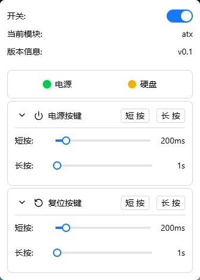

# ATX 电源控制

通过 ATX 硬件模块远程控制被控主机的电源——开机、关机、强制关机和重启，就像亲手按下机箱上的按钮一样。

外设接口还支持连接其他扩展模块（如 KVM 切换器，开发中）。

---

## 硬件接线

安装 ATX 硬件模块前，请准备好十字螺丝刀（如需打开机箱）。包装内附带 ATX 控制器（带排线）和杜邦线。

### 主板插针识别

在主板上找到前置面板插针区域（通常位于主板右下角）：

| 插针 | 常见标识 | 用途 |
|------|----------|------|
| 电源开关 | PWR_SW / PWRBTN | 控制电源 |
| 复位开关 | RST_SW / RESET | 控制复位 |
| 接地 | GND | 公共地（部分主板需要） |

> 具体位置请参考主板说明书中的"前置面板接口"章节。

### 连接步骤

**1. 连接 ATX 控制器**：将 ATX 控制器的排线插入 FlexKVM 的 ATX 控制接口（USB Type-C 口）。

**2. 连接主板**：用杜邦线连接 ATX 控制器和主板插针。

| ATX 控制器 | 主板插针 |
|------------|----------|
| PWR SW | PWR_SW |
| RST SW | RST_SW |
| GND | GND（可选） |

- 杜邦线通常不分正负
- 可以和机箱原有的开关线并联，互不影响
- 建议断电时接线

> :warning: 接线错误可能导致无法开机或误触发复位，请仔细核对插针标识。

### 验证

FlexKVM 通电启动后，打开 Web 界面的外设菜单，如果设备名显示 `atx`，说明连接成功。

---

## 使用方法

### 外设按键

菜单栏中外设按键图标反映当前连接状态：

| 图标 | 含义 |
|------|------|
|  | 外设未连接或未启用 |
|  | ATX 已连接，被控主机已开机 |
|  | ATX 已连接，被控主机已关机 |

### 打开 ATX 控制

1. 在菜单栏点击**外设图标**（插头图标）
2. 开启**开关**启用外设功能
3. 如果 ATX 模块连接正常，外设图标会变成电源图标

### 状态灯

启用 ATX 后，菜单顶部会显示两个指示灯：

| 指示灯 | 颜色 | 含义 |
|--------|------|------|
| 电源灯（Power） | 🟢 绿色 | 被控主机正在运行 |
| 硬盘灯（HDD） | 🟡 黄色闪烁 | 被控主机硬盘有读写活动 |

> 两个灯实时反映被控主机的电源灯和硬盘灯状态。

### 电源按键

控制被控主机的电源开关，分为短按和长按：

| 操作 | 效果 | 默认时长 |
|------|------|:---:|
| 短按 | 正常开机 / 正常关机 | 200ms |
| 长按 | 强制断电关机 | 2 秒 |

展开后可调整按键时长：

| 参数 | 范围 | 步进 | 单位 |
|------|:---:|:---:|:---:|
| 短按 | 100～1000 | 100 | 毫秒 |
| 长按 | 1～10 | 1 | 秒 |

### 复位按键

控制被控主机的复位（重启）：

| 操作 | 效果 | 默认时长 |
|------|------|:---:|
| 短按 | 正常重启 | 200ms |
| 长按 | 强制复位 | 2 秒 |

展开后可调整时长，参数范围与电源按键相同。如果短按无效，可以逐步增加时长——不同主板的响应时间有差异。

### 常用操作速查

| 目的 | 操作 |
|------|------|
| 开机 | 点击电源键 → **短按** |
| 正常关机 | 点击电源键 → **短按**（由系统响应关机信号） |
| 强制关机 | 点击电源键 → **长按**（约 2 秒） |
| 重启 | 点击复位键 → **短按** |

> :warning: 强制关机和强制复位可能导致未保存的数据丢失。只要系统还有响应，优先用短按正常关机。

---

## 常见问题

**点击开机没反应？**
→ 检查杜邦线是否接牢、主板插针位置是否正确。展开外设菜单看设备名是否显示 `atx`。

**关机后马上又开机了？**
→ 部分主板的 BIOS 中开启了"断电后自动开机"（Restore on AC Power Loss）。进入 BIOS 关闭此选项即可。

**ATX 控制器不识别？**
→ 重新插拔 ATX 控制器的 Type-C 排线，确认 OLED 上显示 ATX 图标。
