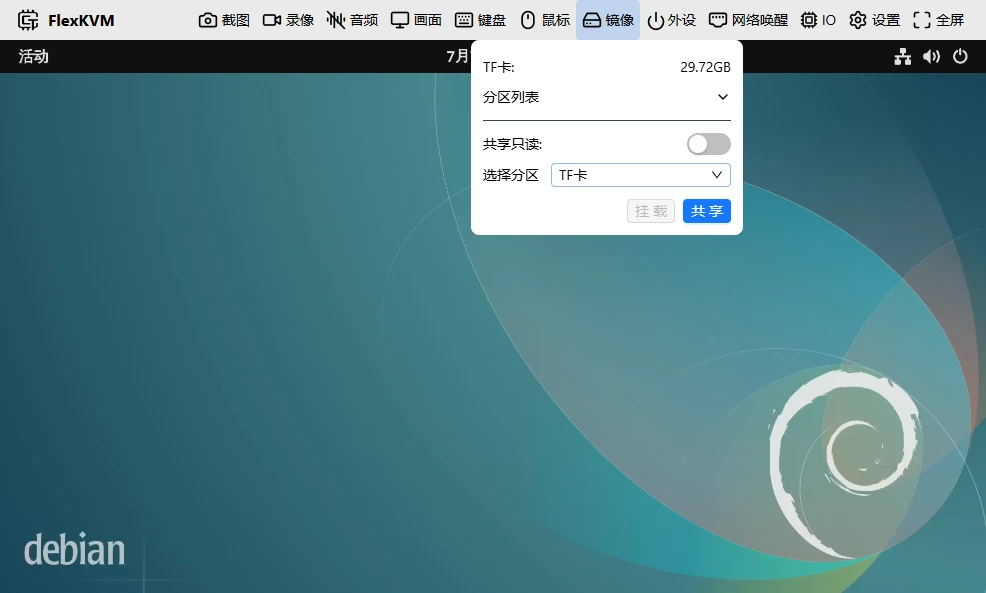
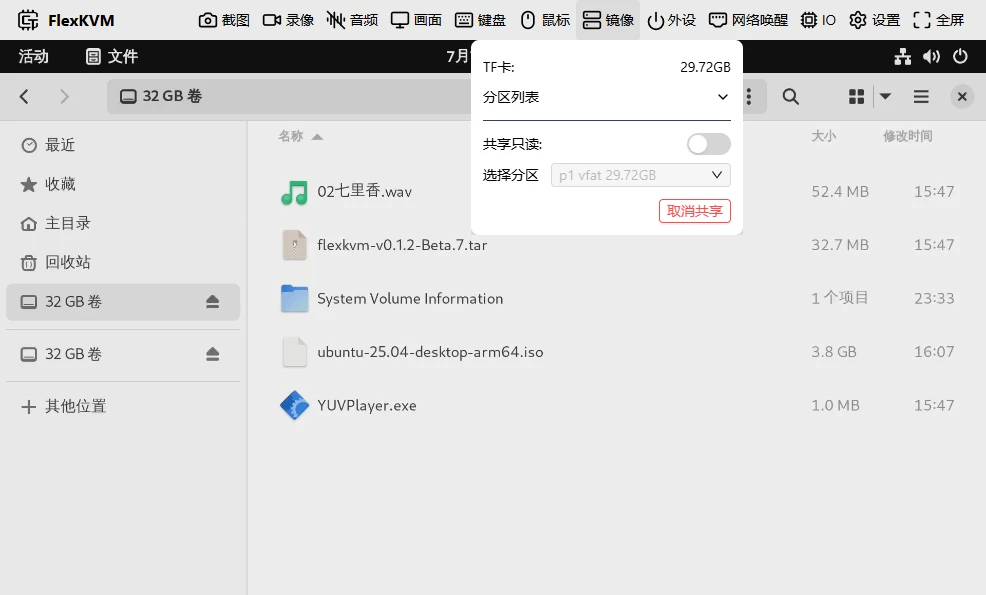

# 存储管理

FlexKVM 通过 TF 卡（MicroSD）扩展本地存储，支持文件管理、虚拟光驱和 USB 导出。最常用的两个场景：把 ISO 镜像共享为虚拟光驱给主机重装系统、在 TF 卡和主机之间传文件。

## TF 卡要求

| 项目 | 要求 |
|------|------|
| 卡类型 | MicroSD（TF）卡 |
| 文件系统 | FAT32 / exFAT / ext4 / NTFS（exFAT 推荐，无 4GB 限制） |

## 安装

TF 卡槽在设备侧面，电源灯下方。金属触点朝向电源灯，推进去听到咔嗒声就行。

> **验证**：插好后 OLED 存储图标显示已连接。没变化？重新插拔试试，或检查卡是否正常。

## 镜像菜单

顶栏点镜像图标打开管理界面。

| 图标 | 含义 |
|------|------|
|  | TF 卡已插入，空闲 |
|  | TF 卡没插 |
|  | 文件上传中 |
|  | 文件下载中 |
|  | 正通过 USB 共享给主机 / 导出镜像中 |

四种用法：

### 整盘共享

把整张 TF 卡作为 U 盘共享给主机，主机能看所有分区。

选中 TF 卡 → 点**共享**。

> 开启只读后主机只能读不能写。

### 分区共享

只共享 TF 卡的某个分区，其他分区主机看不到。

选目标分区 → 点**共享**。

### 分区挂载

挂载分区后可以在 FlexKVM 上浏览和管理文件。

选分区 → 点**挂载** → 出现文件列表、分区大小、上传/卸载按钮。

> 有些分区格式可能不兼容挂载。失败就换 exFAT。

### 单文件共享

先挂载分区 → 勾选一个 `.img` 或 `.iso` 文件 → 点**共享文件**。主机会把它识别为虚拟光驱。

> 支持大于 4GB 的文件，但格式必须是 `.img` 或 `.iso`。

### 安全移除

| 当前状态 | 怎么做 |
|---------|------|
| 单文件共享中 | 取消共享 → 卸载分区 → 拔卡 |
| 整盘/分区共享中 | 取消共享 → 拔卡 |
| 已挂载但没共享 | 卸载分区 → 拔卡 |
| 插着但没操作 | 直接拔 |

---

## 常见问题

**TF 卡没反应？** → 检查文件系统。FAT32 和 exFAT 兼容性最好。

**共享的光驱主机不认？** → 确认文件是 `.img` 或 `.iso`。其他格式不能作为光驱共享。

**上传断了？** → 刷新页面重传。暂不支持断点续传。

**系统装到一半失败了？** → 安装过程中是不是开关过鼠标、键盘或音频？这些操作会让虚拟光驱短暂断开。

---

[:octicons-arrow-left-24: 返回用户指南](../index.md)
