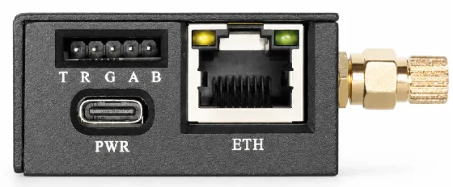
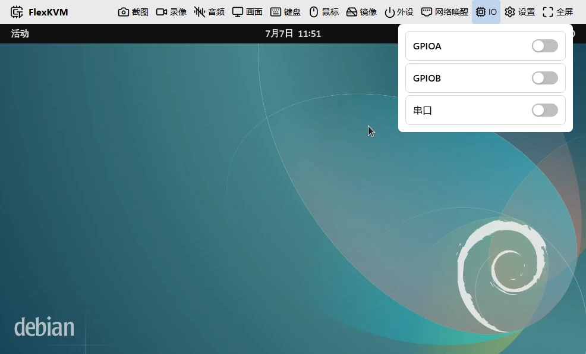
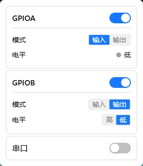

# GPIO Control

FlexKVM provides two independent GPIO pins for connecting external hardware — switches, sensors, relays, etc. — for input detection or output control.

> ⚠️ Pin voltage is **3.3V**. Do not connect 5V or higher-voltage devices — this will damage the device.

> For industrial control, custom hardware integration, and other specialized scenarios. Regular users typically don't need this.

## Before You Begin

| You need | Notes |
|----------|-------|
| FlexKVM | Completed [Quick Start](../../quick_start/index.md) wiring and network setup |
| 2.54mm Dupont wires (female) | For connecting to GPIO pins |
| External device | Switches, sensors, relays, etc. — must support **3.3V** logic level |

## Pinout

Two independent GPIO pins with letter labels:



| Silkscreen | Pin | Description |
|:----------:|:---:|-------------|
| G | GND | Ground — common ground with external device |
| A | GPIOA | General-purpose I/O, independently configurable |
| B | GPIOB | General-purpose I/O, independently configurable |

## Wiring Examples

### Reading a Switch (Input Mode)

```
GPIOA ──┬── Button one end
        │
GND ────┴── Button other end
```

Button pressed → GPIOA reads low; released → high (internal pull-up by default).

### Controlling an LED (Output Mode)

```
GPIOB ────→ Current-limiting resistor ────→ LED anode (long leg)
GND ──────────────────────────────────────→ LED cathode (short leg)
```

> The LED needs a **220Ω ~ 1kΩ** current-limiting resistor in series, otherwise the LED or GPIO may be damaged.

## Software Configuration

Top bar → click chip icon → IO menu → **GPIO Control**.



All pins are **disabled** by default (input mode, not monitoring). You need to enable them manually.

### Enable a Pin



Each pin card has a toggle. When enabled, the pin enters input mode and starts monitoring the level.

### Input Mode

The pin level is determined by the external device — the interface reflects it in real time:

- 🟢 Green = High (3.3V)
- ⚫ Gray = Low (0V)

> In input mode, you **cannot** manually set the level. External changes auto-update in the interface.

### Output Mode

Click the mode toggle button → manually control via "High"/"Low" buttons:

- High → pin outputs 3.3V
- Low → pin outputs 0V

> Switch back to input mode when you need to read external signals.

---

## FAQ

**No voltage on output?** → Confirm the pin is enabled and the mode is "Output". Enabling alone keeps it in input state.

**Reading wrong level?** → Check wiring and confirm **common ground** (GND connected) with the device.

**Interface doesn't update after wiring?** → Make sure the pin is enabled. Disabled pins don't monitor level changes.

---

[:octicons-arrow-left-24: Back to User Guide](../index.md)
