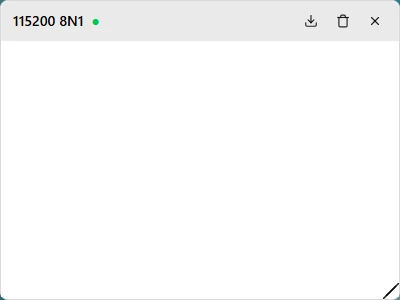

# UART Serial Terminal

Interact with target devices (routers, embedded development boards, switches) via serial console.

> For embedded debugging, industrial control, and other specialized scenarios. Regular users typically don't need this.

## Before You Begin

| You need | Notes |
|----------|-------|
| FlexKVM | Completed [Quick Start](../../quick_start/index.md) wiring and network setup |
| 2.54mm Dupont wires (female) | At least 3 |
| Target device | Supports serial communication; parameters (baud rate, etc.) must be confirmed in advance |

## Pinout

FlexKVM's UART interface is a 3-pin header with letter labels beside each pin:


| Silkscreen | Pin | Description |
|:----------:|:---:|-------------|
| T | TXD | Data transmit → connect to target device **RX** |
| R | RXD | Data receive → connect to target device **TX** |
| G | GND | Ground — common ground with target device |

> UART cross-connect: FlexKVM TXD → target device RXD, FlexKVM RXD → target device TXD, GND interconnected. Only these three wires are needed.

## Wiring

```
FlexKVM                 Target Device
  TXD ───────────────→ RXD
  RXD ←─────────────── TXD
  GND ──────────────── GND
```

## Software Configuration

Top bar → click chip icon → IO menu → **UART Serial Terminal**.


### Communication Parameters

Set parameters after enabling UART. **Parameters must match the target device exactly**, otherwise you'll get garbled output or no communication:

| Parameter | Default | Common values |
|-----------|:-------:|---------------|
| Baud rate | 115200 | 9600, 19200, 38400, 57600, 115200 |
| Data bits | 8 | 5/6/7/8 |
| Stop bits | 1 | 1/2 |
| Parity | None | None/Odd/Even |

> The default **115200 8N1** is the most common configuration for serial devices.

### Start & Disconnect

Set parameters → click Start → a terminal window opens for direct interaction with the device.



Terminal layout: top-left shows current serial configuration (e.g., `115200 8N1`), status indicator next to baud rate (🟢 connected / 🔴 disconnected), right side has export log / clear / disconnect buttons.

> Parameters can't be changed while connected. Disconnect first if you need to change them.

---

## FAQ

**Garbled output?** → Parameters don't match the target device — baud rate mismatch is the most common cause. Verify the device's parameters and reconfigure.

**Can't connect?** → Confirm the target device's serial port is enabled and the wiring is correct (TXD→RXD, RXD←TXD, GND interconnected).

**No response to commands?** → Confirm the target device is in a state that accepts commands. Some devices only respond to serial input during specific phases.

---

[:octicons-arrow-left-24: Back to User Guide](../index.md)
