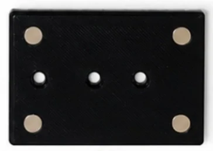
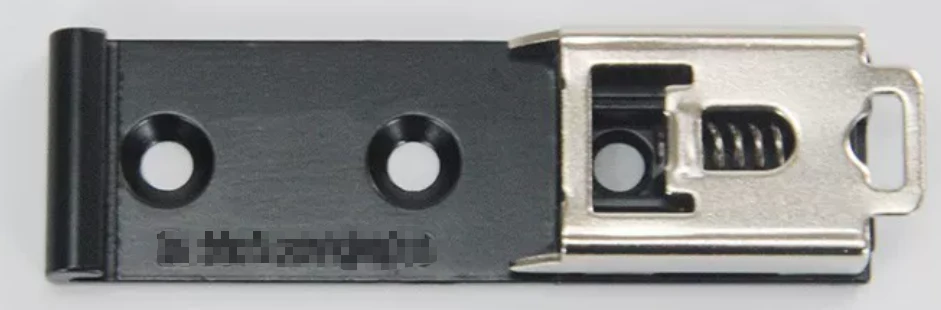

# Accessories & Expansion

## PoE Power Expansion

> FlexKVM supports 100M Ethernet and 5V Type-C power input. It does not natively support PoE.

You can use an external PoE splitter module to add PoE support. The splitter isolates PoE power from the network connection.

## Backplate Expansion

FlexKVM's backplate is designed to be replaceable. The backplate and the main body are secured by screws, supporting multiple backplate types:

- Magnetic backplate
- 35mm DIN rail clip

> You can also DIY your own backplate to suit specific use cases.

User-contributed DIY backplate designs:

- None yet

### Magnetic Backplate

> The magnetic backplate is included free with the base bundle.

The magnetic backplate is 3D-printed with four N52 magnets. With the magnetic backplate installed, FlexKVM attaches to any metal surface — such as server cases and metal cabinets — for quick mounting and portability.

### 35mm DIN Rail Clip

> This accessory must be purchased separately or as part of a bundle.

The 35mm DIN rail clip snaps onto standard 35mm DIN rails (C45).

---

[:octicons-arrow-left-24: Back to User Guide](../index.md)
