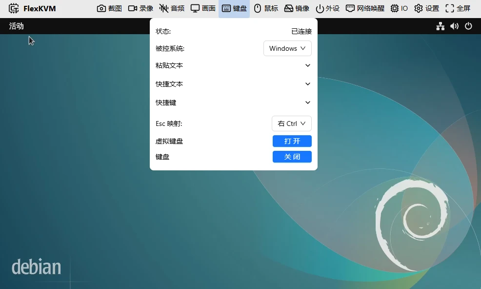
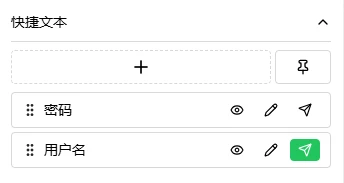
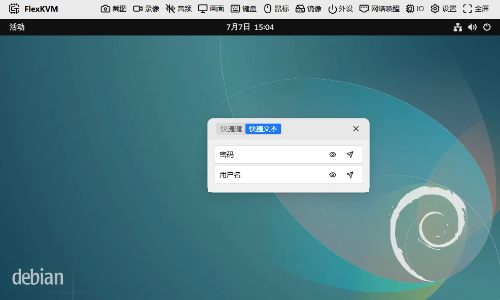
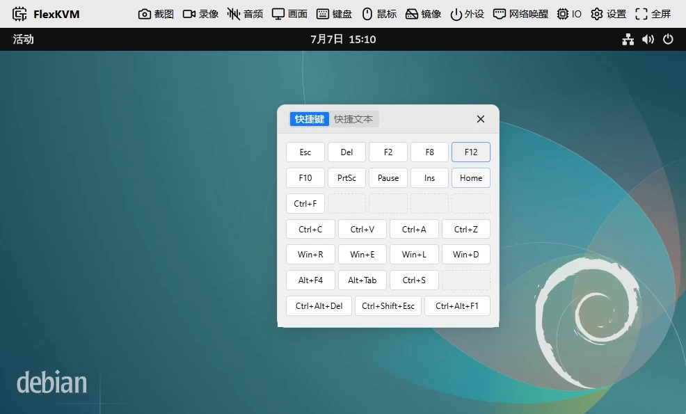
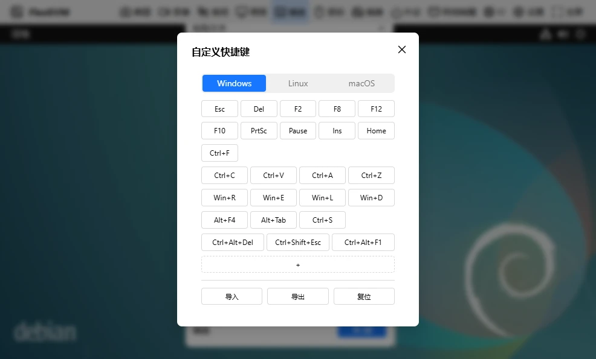

# Keyboard

Send text, shortcuts, and key combinations to the target host. FlexKVM emulates a standard USB keyboard, compatible with all operating systems.

## Keyboard Status

The keyboard icon in the top bar reflects state:

| Icon | Meaning |
|------|---------|
|  | Connected |
|  | Not connected or disabled |

## Keyboard Menu

Click the keyboard icon to open the menu.

### Status

| Status | Description |
|--------|-------------|
| Connected | Normal input |
| Not connected | Connection lost — re-plug USB or refresh the page |
| Disabled | Manually turned off — click Enable to restore |

### Target OS

Tell FlexKVM what OS the target host is running — shortcut keys and virtual keyboard layout adjust accordingly. Default: **Windows**. Also available: Linux, macOS.

### Paste Text

Expand to type or paste text, then click send to the target host. You can click cancel while sending is in progress.

> ASCII characters only (letters, numbers, symbols). Chinese characters are not supported. Max 4096 characters. Paste speed is ~20 chars/sec.

- **Skip non-ASCII characters**: When enabled, auto-filters Chinese and other non-ASCII characters. When disabled, encountering them triggers an error.
- **Add to Quick Text**: Save the current text for one-click sending later.

### Quick Text

Store frequently used text (passwords, commands, templates) and send with one click.

**Add**: Click **+** → enter a name (max 32 chars) and content (max 4096 chars). Maximum 10 entries.

**Use**: Each entry supports preview (eye icon), edit (pencil), send, and cancel. Drag to reorder. Click the pin button to make it a floating window — drag it wherever convenient.

### Shortcuts

Common shortcuts sent with one click. Layout auto-adjusts based on the "Target OS" setting.

- **Gear icon**: Customize shortcuts
- **Pin icon**: Open/close floating window

**Custom shortcuts**: Click gear → dialog has three sections — top: select OS, middle: shortcut list (click **+** to add), bottom: import/export/reset.

Click a shortcut in the list to modify it:

- **Name**: Max 32 chars; if blank, the shortcut content is displayed
- **Shortcut**: Two ways to add: **Record** (click Start Recording, then press keys) or **Manual** (select keys to add/remove)

### Virtual Keyboard

Opens a virtual keyboard overlay on the display — click with your mouse to type. Layout auto-adjusts based on the "Target OS" setting. Compact layout when the window is narrow. Drag the title bar to move.

**Modifier keys** (Ctrl, Alt, Shift, Win) are toggle-style — click once to hold (turns dark), click again to release (turns light). Multiple modifiers can be held simultaneously.

Example: Click **Ctrl** (dark) → click **A** → sends Ctrl+A → Ctrl stays held for more combos → click **Ctrl** again (light, released).

**Regular keys**: Press to hold, release to let go.

> When closing the virtual keyboard or switching pages, all held keys are automatically released — no stuck keys.

### Esc Mapping

In fullscreen or relative mouse mode, `Esc` is captured by the browser. Esc mapping lets you use another key instead:

| Your OS | Mapped to |
|---------|-----------|
| Windows / Linux | Right Ctrl |
| macOS | Right Option |

Options: Right Ctrl, Right Option, Pause, or Disabled.

### Disable / Enable

When status is "Connected", click "Disable" → changes to "Disabled". Click "Enable" to restore.

> Toggling keyboard causes a brief USB disconnect/reconnect — mouse, disk mount, and audio will also briefly drop and recover.

---

## FAQ

**Paste text does nothing?** → Check if it contains Chinese characters. Paste text supports ASCII only.

**Shortcuts not working?** → Verify the "Target OS" setting is correct.

---

[:octicons-arrow-left-24: Back to User Guide](../index.md)
