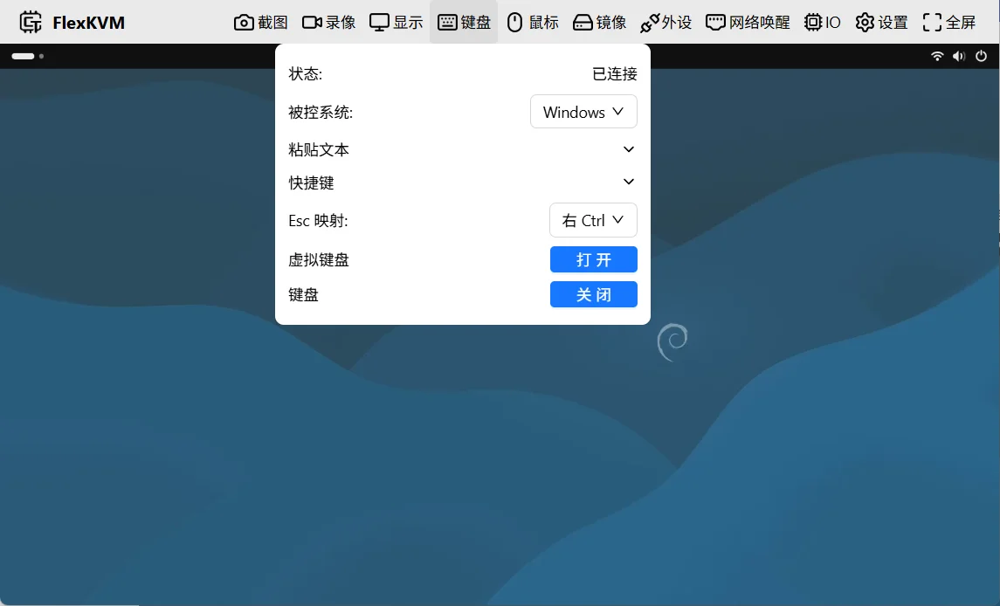
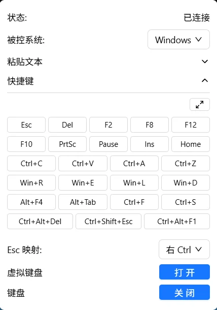
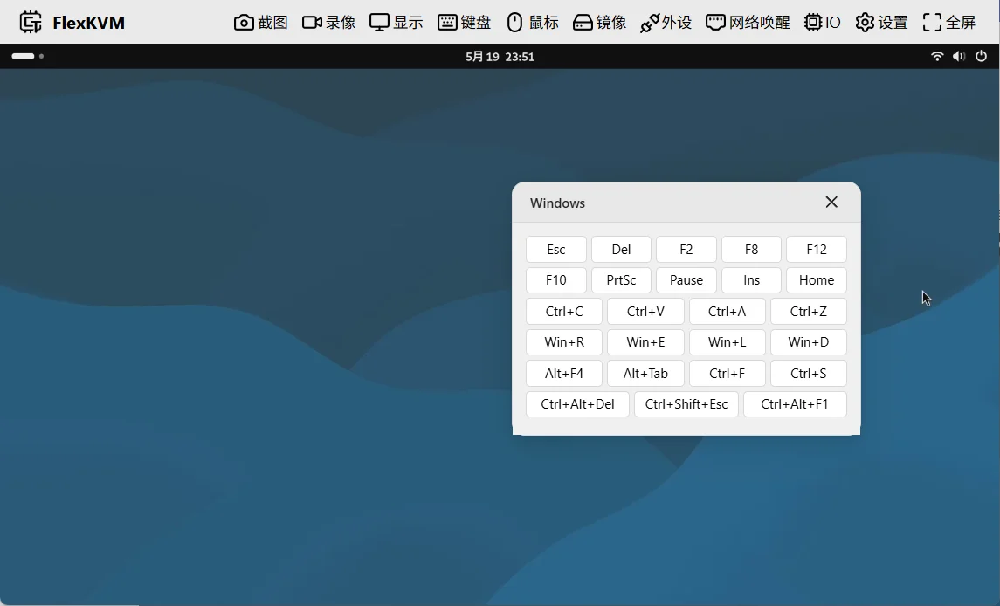
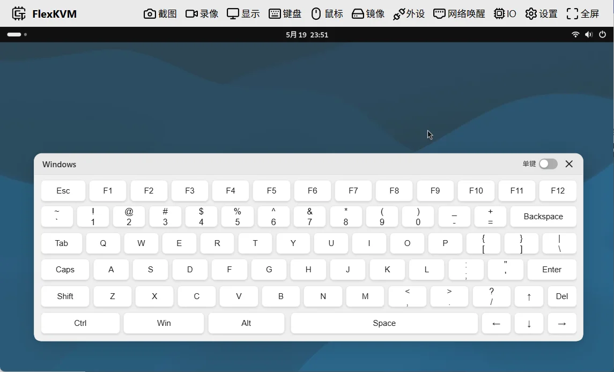

# 键盘

菜单栏中的键盘按键，图标为键盘样式，表示键盘正常运行。

## 键盘按键

键盘按键图标根据当前状态变化，分为已连接和未连接两种。

## 键盘菜单

点击菜单栏中的键盘按键，弹出键盘菜单：

菜单包含以下选项：

- 状态
- 粘贴文本
- 快捷键
- Esc 映射
- 被控系统
- 虚拟键盘
- 关闭&开启

### 状态

显示当前键盘状态：

| 状态 | 说明 |
|------|------|
| 已连接 | 键盘已成功连接，可正常使用 |
| 未连接 | 键盘未连接到被控主机 |
| 未使能 | 键盘已被手动关闭，需点击"开启"重新启用 |

### 被控系统

配置键盘和快捷键模式，不同系统对应不同的悬浮键盘和快捷键布局。

默认为 **Windows**，可根据被控主机系统选择：

- **Windows**
- **Linux**
- **MacOS**

### 粘贴文本

默认收起，点击展开：

在输入框中输入文本，点击粘贴按钮发送到被控主机。

> 仅支持 ASCII 字符，不支持中文。

### 快捷键

默认收起，点击展开：

快捷键布局根据"被控系统"设置自动切换。

功能区包含两部分：

- 上方按钮：开启/关闭快捷键悬浮窗
- 下方按钮：快捷键，点击直接发送到被控主机

快捷键悬浮窗：

- 标题栏显示当前快捷键对应的系统
- 按住标题栏可拖动悬浮窗
- 点击关闭按钮关闭悬浮窗

### 虚拟键盘

点击后在画面中弹出虚拟键盘：

虚拟键盘支持两种模式：

- 单键
- 组合键

#### 单键

按下任意按键直接发送。例如：

- 按下 `A` → 发送 A
- 按下 `Ctrl` → 发送 Ctrl
- 按下 `Ctrl` + `A` → 发送 Ctrl+A

#### 组合键

以下按键为修饰键：

- **Ctrl**
- **Alt**
- **Shift**
- **Win**

修饰键可组合使用：

- 点击修饰键，颜色变深，表示已标记（此时不会发送）
- 再次点击修饰键，颜色变浅，取消标记
- 点击非修饰键时，同时发送已标记的修饰键 + 该按键

例如：

- 点击 **Ctrl**（变深色）→ 点击 **A** → 发送 **Ctrl+A**
- 点击 **Ctrl**（变深色）→ 点击 **Shift**（变深色）→ 点击 **A** → 发送 **Ctrl+Shift+A**

### Esc 映射

浏览器限制下，相对模式和全屏模式中 `Esc` 键用于退出模式，无法发送给远程主机。Esc 映射将此按键映射到其他键。

默认根据浏览器主机系统自动映射：

- Windows / Linux → **Right Ctrl**
- macOS → **Right Option**

也可手动选择：

- **Right Ctrl**
- **Right Option**
- **Pause**
- **禁用**

### 关闭&开启

- 键盘状态为**已连接**或**未连接**时，点击关闭，状态变为**未使能**
- 键盘状态为**未使能**时，点击开启，状态恢复为**已连接**或**未连接**
