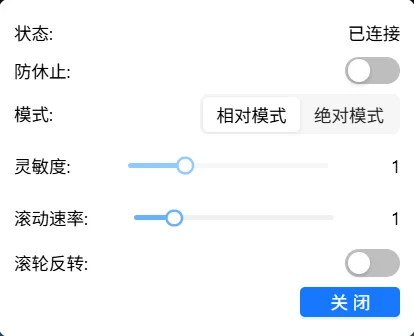

# Mouse

Control the target host's mouse pointer. Supports absolute and relative modes, with adjustable sensitivity and scroll direction.

## Mouse Status

The mouse icon in the top bar reflects state:

| Icon | Meaning |
|------|---------|
|  | Connected |
|  | Not connected or disabled |

## Mouse Menu

Click the mouse icon to open the menu.

### Status

| Status | Description |
|--------|-------------|
| Connected | Normal control |
| Not connected | Connection lost — re-plug USB or refresh the page |
| Disabled | Manually turned off — click Enable to restore |

### Anti-Idle

When enabled, the mouse micro-moves periodically to prevent the host from going to sleep due to inactivity. Continues working whether the browser tab is active or not. Turn it off if not needed.

### Mode

**Absolute mode (default)**: Where you click on the display, that's where the host cursor goes.

- ✅ Precise positioning, no click-to-focus needed
- ✅ Unaffected by mouse DPI
- ❌ Single monitor only
- ❌ Some games may be incompatible

**Hide cursor**: When enabled, your local cursor auto-hides when hovering over the remote display — avoids showing two pointers.

**Relative mode**: Move the host cursor like you're using a local computer.

- ✅ Multi-monitor support
- ✅ Compatible with games and apps requiring raw mouse input
- ❌ Must click the display first to enter control
- ❌ Precision affected by mouse DPI

How to use: Click the remote display to enter control (browser requests pointer lock) → move mouse → press `Esc` to exit.

> In non-fullscreen relative mode, `Esc` is captured. Need to send `Esc` to the host? → [Esc Mapping](./keyboard.en.md#esc-mapping).
> In fullscreen relative mode, `Esc` works normally; a long press will exit fullscreen. Press `F11` to re-enter fullscreen.

**Sensitivity** (relative mode only): Adjustable range 0.2–3.0, step 0.2. 1.0 = normal speed.

**Scroll speed**: Adjustable range 0.5–3.0, step 0.5. 1.0 = normal speed.

**Scroll reverse**: When enabled, scroll direction is inverted.

### Disable / Enable

Click "Disable" → status changes to disabled. Click "Enable" to restore.

> Toggling mouse causes a brief USB disconnect/reconnect — keyboard, disk mount, and audio will also briefly drop and recover.

---

## FAQ

**Can't escape relative mode?** → Press `Esc` to exit.

**Absolute mode position is off?** → Check if the host has multiple monitors. Absolute mode only works with a single display.

---

[:octicons-arrow-left-24: Back to User Guide](../index.md)
