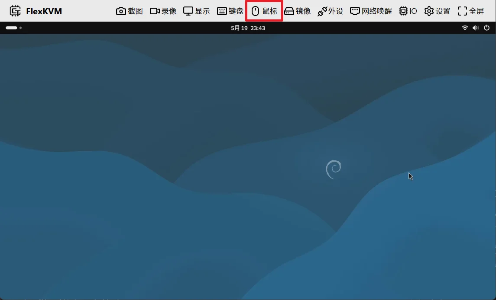
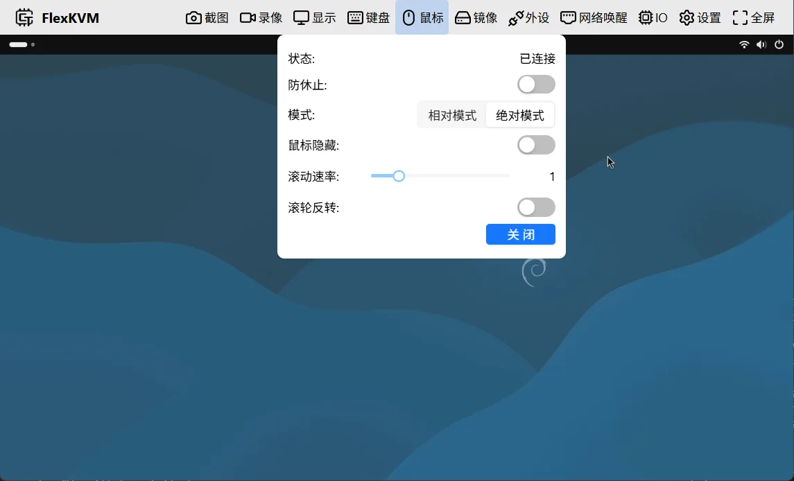

# 鼠标

菜单栏中的鼠标按键，图标为鼠标样式，表示鼠标正常运行。

## 鼠标按键

鼠标按键图标根据当前状态变化，分为已连接和未连接两种。

## 鼠标菜单

点击菜单栏中的鼠标按键，弹出鼠标菜单：

菜单包含以下选项：

- 状态
- 防休止
- 模式
- 滚动速率
- 滚动反转
- 关闭&开启

### 状态

显示当前鼠标状态：

| 状态 | 说明 |
|------|------|
| 已连接 | 鼠标已成功连接，可正常使用 |
| 未连接 | 鼠标未连接到被控主机 |
| 未使能 | 鼠标已被手动关闭，需点击"开启"重新启用 |

### 防休止

启用后，鼠标每隔 2 分钟自动微移一次，防止被控主机进入休眠。

> 此功能在网页打开或关闭时均会执行。如不需要，建议关闭。

### 模式

支持两种鼠标模式：

- 相对模式
- 绝对模式

#### 绝对模式

将画面坐标映射到被控主机，鼠标在画面中的位置直接对应被控主机的鼠标位置。

优点：

- 移动精准，指哪打哪
- 不受鼠标 DPI 影响
- 无需点击画面即可直接控制

缺点：

- 仅适合单屏幕使用，多屏幕环境下被控主机鼠标与画面鼠标不同步
- 部分游戏检测鼠标移动不一致，可能断开连接

**鼠标隐藏**

启用后，鼠标移入非菜单栏区域时自动隐藏，避免远程画面中出现两个鼠标指针。

#### 相对模式

需要点击远程画面进入控制，鼠标移动映射到被控主机。

- 点击远程画面进入相对模式，鼠标移动控制被控主机
- 按 `Esc` 键退出相对模式
- 再次点击远程画面可重新进入

> **鼠标锁定**：进入相对模式后，浏览器请求锁定鼠标指针。锁定后鼠标限制在浏览器窗口内移动，按 `Esc` 退出。这是浏览器的安全机制。

优点：

- 支持多屏幕，被控主机鼠标与画面同步
- 兼容 FPS 游戏等需要原始鼠标输入的应用

缺点：

- 需要点击画面进入控制，操作多一步
- 精准度受鼠标 DPI 影响

**灵敏度**

在相对模式中调节鼠标灵敏度：

- 0.2：移动速度为原来的五分之一
- 1.0：原始速度
- 2.0：两倍速度

调节范围 0.2 ~ 3.0，步进 0.2。

> 相对模式下 `Esc` 键被占用。可在键盘菜单中设置 Esc 映射，参见 [Esc 映射](./keyboard.md#esc映射)，默认为 `RightCtrl`。

### 滚动速率

调节鼠标滚轮速度：

- 0.5：滚动速度为原来的一半
- 1.0：原始速度
- 2.0：两倍速度

调节范围 0.5 ~ 3.0，步进 0.5。

### 滚动反转

启用后鼠标滚动方向反转：向上滚动变为向下，向下滚动变为向上。

### 关闭&开启

- 鼠标状态为**已连接**或**未连接**时，点击关闭，状态变为**未使能**
- 鼠标状态为**未使能**时，点击开启，状态恢复为**已连接**或**未连接**
