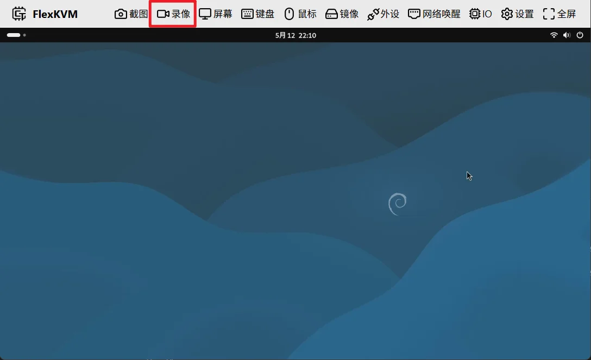
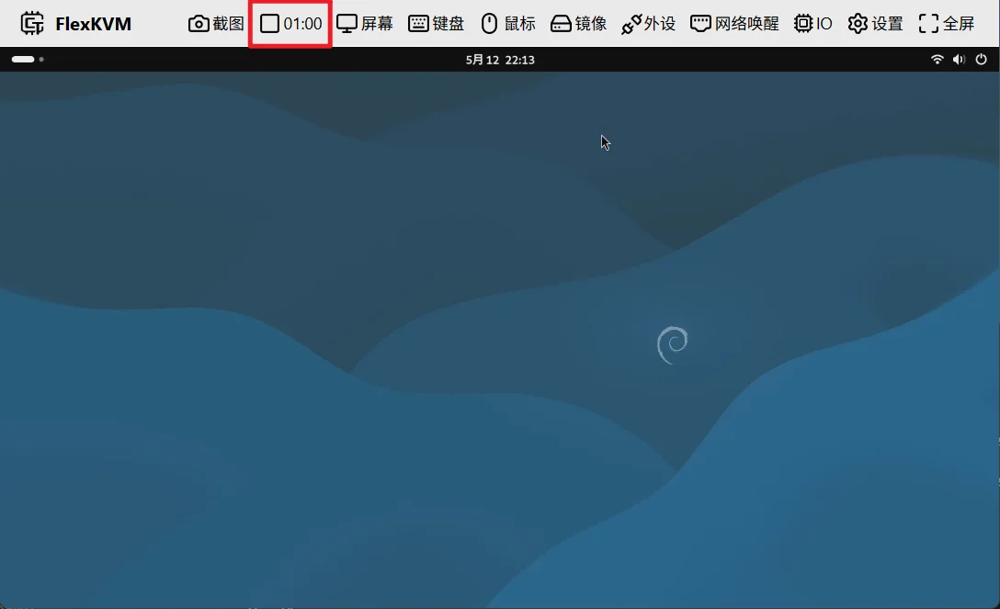

# 录像

点击主页面的录像按钮后，原来录像的图标和按键就会变成录制指示器，右边会显示当前录制的时间，如下图所示

点击录制指示器可以停止录像，停止录像后，会将录像文件保存到浏览器的下载目录中，文件的命名格式如下：flexkvm-recording-YYYY-MM-DDTHH-MM-SS.mp4

- YYYY-MM-DD：年-月-日
- HH-MM-SS：时-分-秒
- .mp4：文件格式

例如：flexkvm-recording-2026-05-12T21-44-20.mp4 表示在2026年5月12日21点44分20秒录制的录像文件

> 注意: 录制过程需要手动停止，否则会一直录制下去，直到浏览器关闭或者刷新页面

## 录制格式说明

FlexKVM 会根据浏览器支持情况自动选择最佳录制格式：

| 优先级 | 格式 | 编码 | 说明 |
|--------|------|------|------|
| 1 | MP4 | H.264 | 最佳兼容性，适用于大多数播放器 |
| 2 | WebM | VP9 | Firefox 浏览器首选 |
| 3 | WebM | VP8 | 兼容性备选 |

**录制参数：**

- 帧率：30fps
- 码率：H.264 为 2.5Mbps，VP9/VP8 为 4Mbps

**注意事项：**

- 录制使用浏览器本地时间，非 UTC 时间
- 若远程主机休眠或 HDMI 断开，录制会继续并显示"画面丢失"或者"主机休眠中"的提示
- 录制文件保存在浏览器的默认下载目录
