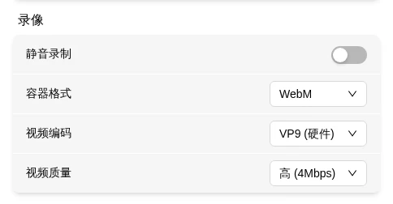

# Recording

Record the remote display as a video file — useful for documenting operations or keeping evidence.

## How to Record

Use the recording icon in the top bar:

| Icon | State |
|------|-------|
|  | Idle, click to start |
|  | Recording, click to stop |

**Start**: Click the record button → "Recording started" toast appears. The button turns into a timer (e.g., `05:23`).

**Stop**: Click the timer → "Recording saved" toast → video auto-saves to your browser's download directory.

> Recording doesn't stop automatically — you must click Stop manually. Closing the browser or refreshing the page also stops it. If the video stream disconnects unexpectedly, recording stops automatically (no notification).

## File Naming

`flexkvm-recording-YYYY-MM-DDTHH-MM-SS.{extension}`

e.g., `flexkvm-recording-2026-05-12T21-44-20.mp4`

## Recording Settings

Adjust in Settings → System → **Recording Settings**.

### Mute Recording

When enabled, the video contains no audio.

### Video Format

| Format | When to use |
|--------|-------------|
| WebM (VP9+Opus) | Default, good quality |
| WebM (VP8+Opus) | Legacy device compatibility |
| MP4 (H.264) | Best compatibility — plays on most media players |

### Video Quality

| Quality | Bitrate | When to use |
|---------|:-------:|-------------|
| Low | 1 Mbps | Smallest file possible |
| Medium | 2 Mbps | Daily recording |
| High | 4 Mbps | More detail |
| Ultra | 8 Mbps | Best quality |

---

**No audio in recording?** → Check if mute recording is enabled, and whether the host has audio output.

**File won't play?** → Switch to MP4 (H.264) for best compatibility.

**Laggy or dropped frames?** → Lower the resolution or quality in [Remote Display](screen.md) to reduce encoding load.

> Do not switch quality or EDID during recording — the recorded video may glitch or become corrupted. Recording doesn't stop when the host sleeps or HDMI disconnects — the display shows the corresponding message instead.

---

[:octicons-arrow-left-24: Back to User Guide](../index.md)
