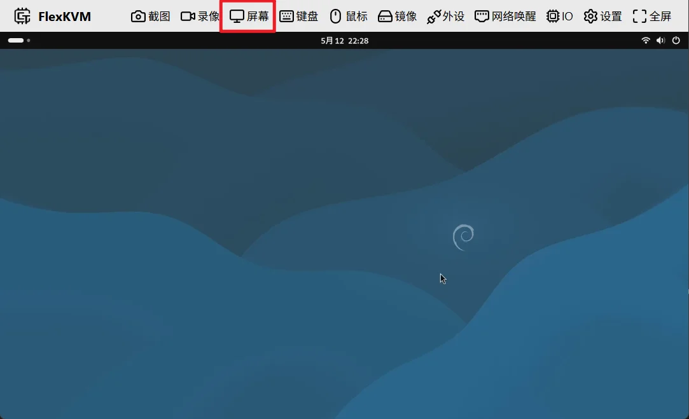
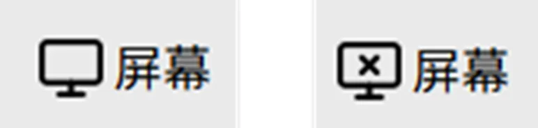
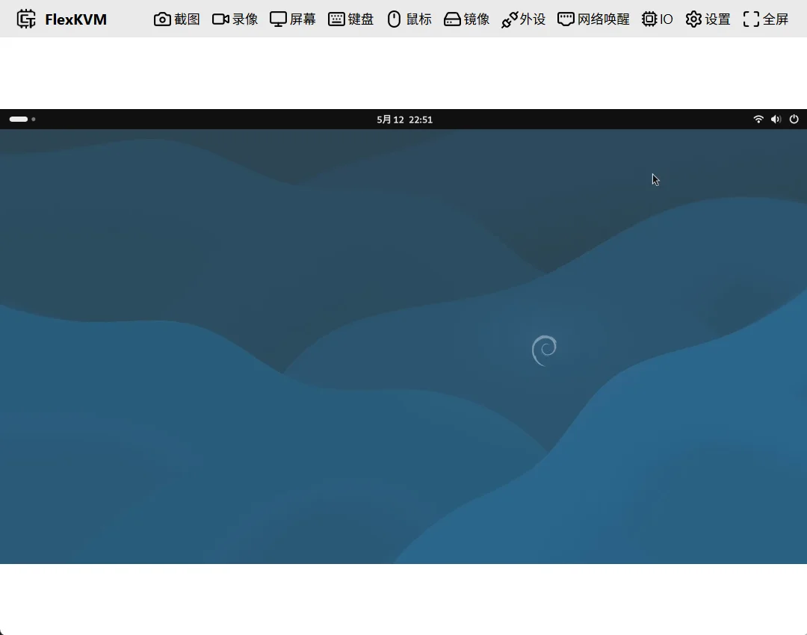
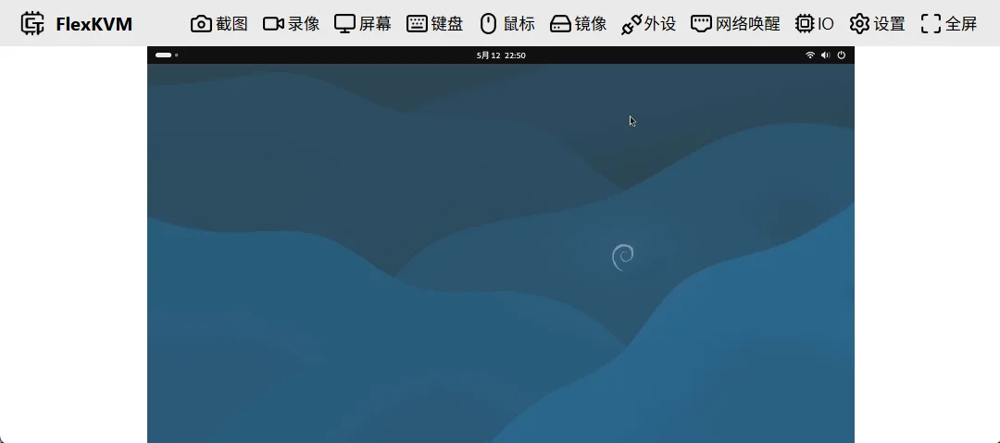
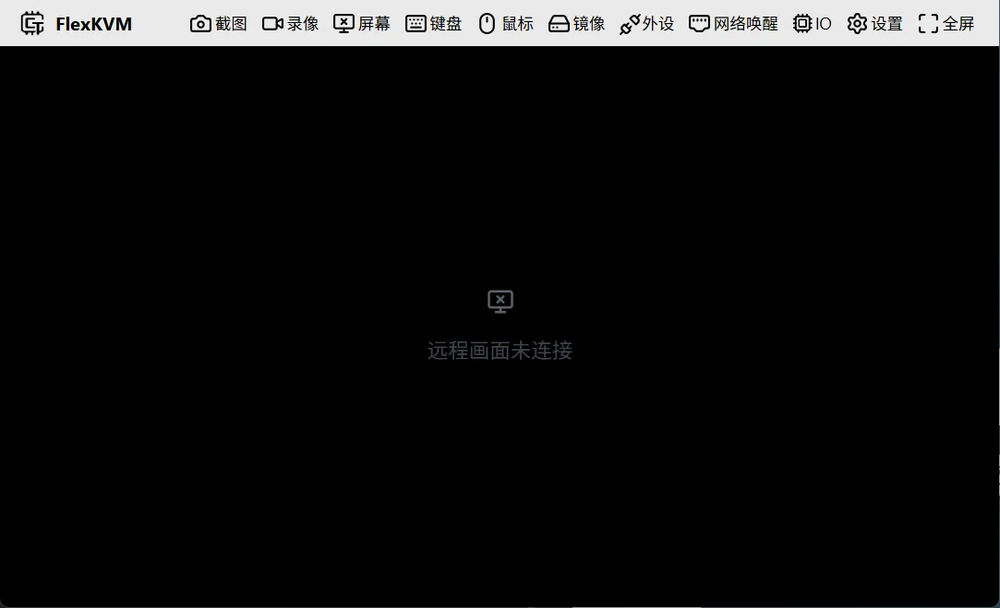
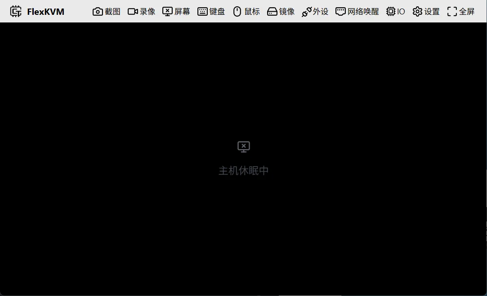
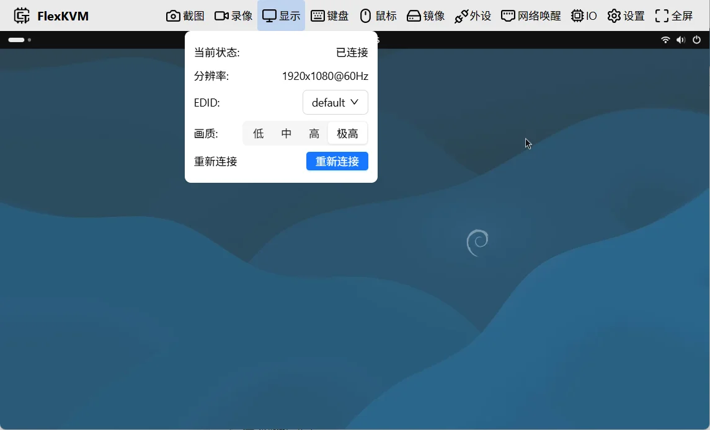
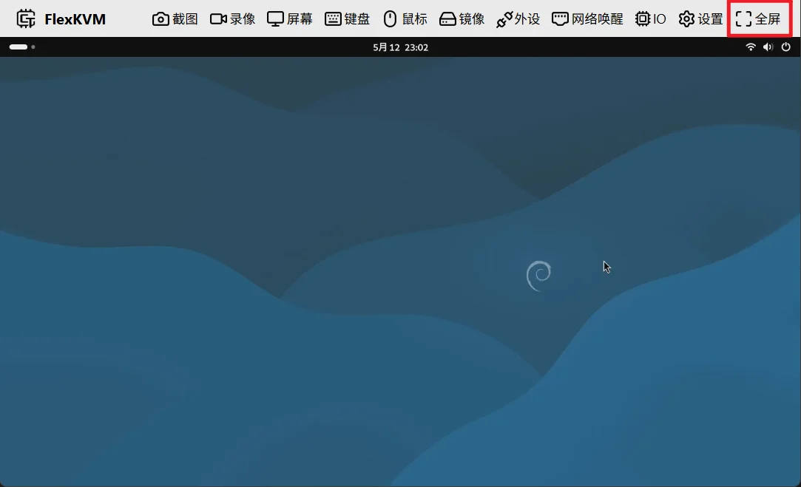
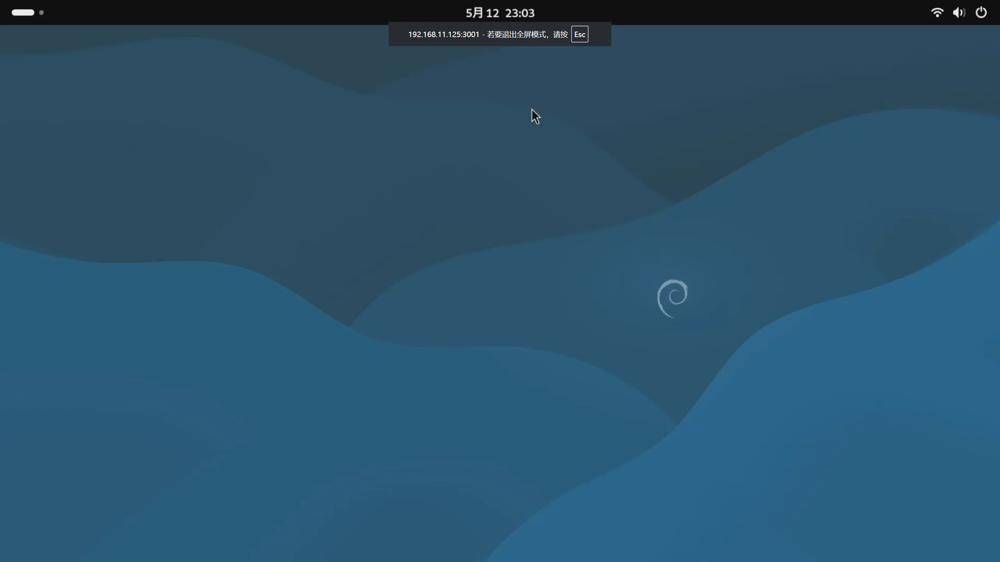

# 显示

- 上图的红色框框的位置为屏幕按键，左边的图标为一个显示器的图标，当前图标表示为显示连接成功。
- 在连接成功的情况下，菜单栏下方的画面会显示远程连接的画面，上图的画面即为远程主机的画面（debian系统的桌面）。

## 屏幕按键

屏幕按键的图标会根据显示状态的变化而变化，会有连接成功和连接失败两种状态。

如上图所示，左边的图标表示为显示连接成功，右边的图标表示为显示连接失败。

> 提示：当hdmi没有接入或者是远程主机进入休眠状态时，会显示连接失败。

## 远程画面

远程画面位于菜单栏下方，远程画面的大小会根据窗口的大小而改变，会出现下图的两种情况，这属于正常的。

- 当HDMI没有接入时，远程画面会显示一个提示信息，提示信息为“远程画面未连接”，如下图所示：

- 当远程主机进入休眠状态或者hdmi连接信号丢失时，远程画面会显示一个提示信息，提示信息为“主机休眠中或者主机信号丢失”，如下图所示：

## 屏幕菜单

在菜单栏中，点击屏幕按键，会弹出屏幕菜单，如下图所示：

可以看到，屏幕菜单中包含了以下选项：

- 当前状态
- 分辨率
- EDID
- 码率控制模式
- 画质
- 重新连接

### 当前状态

显示当前显示连接的状态，有三种状态：

- 已连接
- 信号丢失
- 未连接

> 提示：当主机休眠会显示信号丢失

### 分辨率

显示当前连接的分辨率

- **1920x1080@60Hz**表示分辨率为1920x1080，刷新率为60Hz。
- **-1x-1@-1fps**表示分辨率未知，一般为hdmi没有接入或者远程主机进入休眠状态时显示。

### EDID

这个是一个选择器用来切换flexkvm的edid，会预设了两个edid，分别为

- **default**
- **1080p**

如下图所示：

> 用户可以在设置中添加自己的edid配置，详情请参考[edid配置](../../guide/advance/edid.md)，配置之后下拉选择会多出"custom"选项

**default**为默认的edid配置，拥有非常丰富的分辨率组合，如下表格：

| 分辨率 | 刷新率 |
| :---: | :---: |
| 1920x1080 | 60Hz |
| 1920x1080 | 50Hz |
| 1920x1080 | 30Hz |
| 1920x1080 | 25Hz |
| 1280x720 | 120z |
| 1280x720 | 60Hz |
| 1280x720 | 50Hz |
| 1280x720 | 30Hz |
| 1280x720 | 25Hz |
| 1024x768 | 60Hz |
| 800x600 | 60Hz |
| 640x480 | 60Hz |

### 码率控制模式

码率控制模式有两种："VBR"和"CBR"，默认为"VBR"

- **VBR**表示变码率，码率会根据画面变化而变化，画面变化大时，码率会增大，画面变化小时，码率会减小。
- **CBR**表示定码率，码率会根据设置的值而变化，设置的值越大，码率越大，设置的值越小，码率越小。

### 画质

画质分为四档：

| 画质 | 码率 | 画面质量 |
|------|------|----------|
| 低 | 最低 | 最差 |
| 中 | 中等 | 中等 |
| 高 | 高 | 好 |
| 极高 | 最高 | 最好 |

> 提示：用户可以根据自己的网络环境选择合适的画质，画质越高，码率越大，画面质量越好。

### 重新连接

重新连接会断开当前连接，重新连接远程画面，如果遇到画面突然卡住，可以尝试重新连接。

## 全屏

全屏的快捷按键：**F11**，通过快捷键可以快速进入全屏模式和退出全屏模式。

全屏按键位于菜单栏的最右侧，点击全屏按钮，会全屏显示远程画面，如下图所示：

进入全屏模式之后可以使用esc键或者F11可以退出全屏模式。

> 注意：因为浏览器的限制，当处于全屏模式时，esc键会无法发送给远程主机，因此，在键盘菜单栏中可以设置esc键的映射，将esc键映射到其他键上，请参照[Esc 映射](./keyboard.md#esc映射)中的说明，默认为 ``RightCtrl``。
