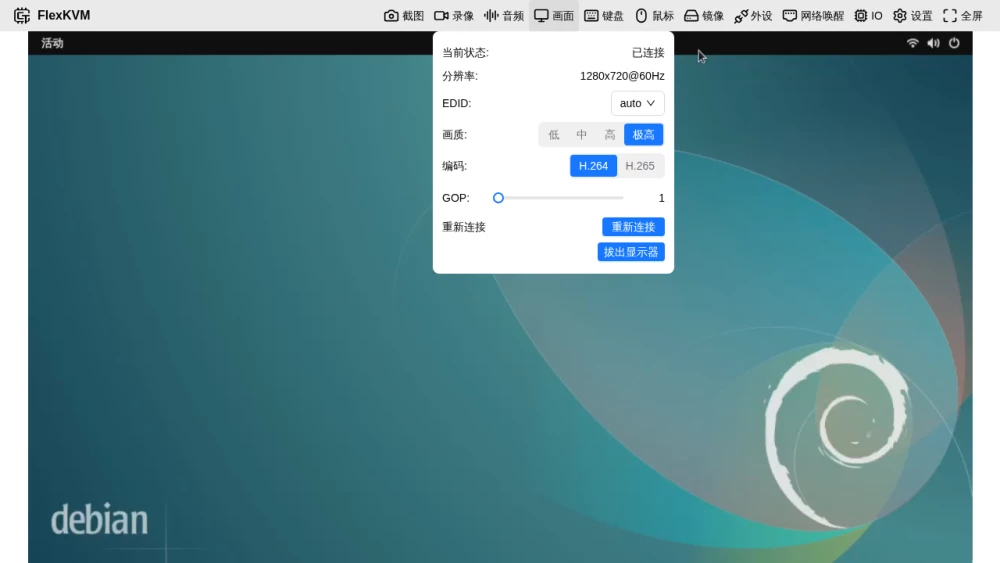
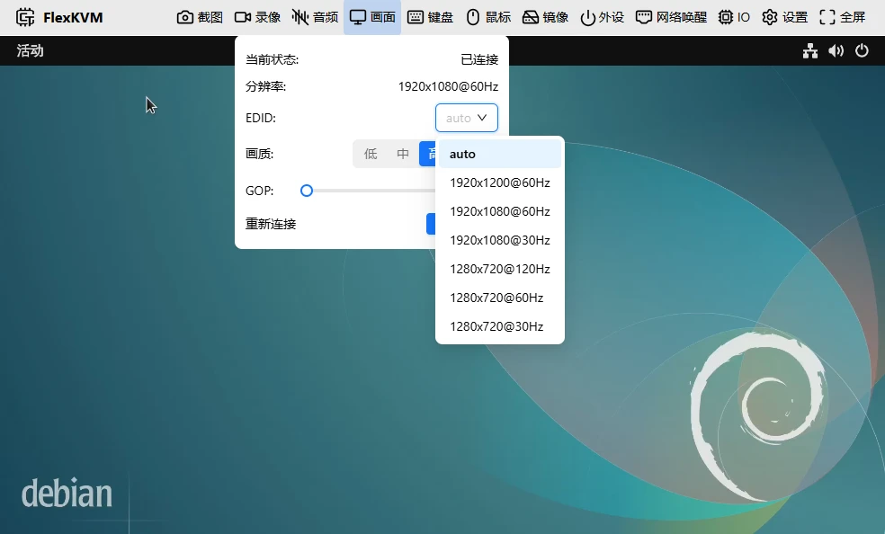
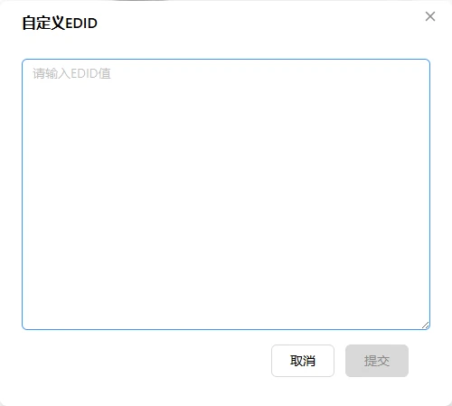

# 远程画面

查看被控主机的画面，调分辨率、画质和 EDID。画面走 HDMI 捕获，BIOS、蓝屏、安全模式都能看见——不依赖操作系统。

## 画面状态

顶栏画面图标反映当前状态：

| 图标 | 含义 |
|------|------|
|  | 正常显示 |
|  | 主机休眠 / 信号丢失 |
|  | 未连接 |

## 远程画面

菜单栏下方即远程画面。画面随窗口自动缩放，比例不一致时两侧或上下出现黑边——黑边区域不能操作鼠标。

画面异常时显示提示：

| 提示 | 原因 |
|------|------|
| "远程画面未连接" | HDMI 没插或被控主机关机 |
| "主机休眠中" | 主机休眠或 HDMI 信号中断 |

### 触控屏手势

触控设备上视频画面区域支持以下手势，全部映射为远程鼠标操作（视频区域默认的缩放/滚动等浏览器手势已禁用）：

| 手势 | 操作 |
|------|------|
| 单指轻点 | 鼠标左键点击 |
| 单指快速双击（400ms 内两次） | 鼠标双击 |
| 单指长按不动（约 1.2 秒） | 鼠标右键 |
| 单指按住（约 0.5 秒）后移动 | 左键按下并移动（拖拽） |
| 双指上下滑动 | 滚轮滚动（速度跟随鼠标滚动设置） |

> 按住后立即滑动视为纯光标移动（浏览），不会触发拖拽或右键。

## 画面菜单

点顶栏画面图标弹出菜单。



### 当前状态与分辨率

| 状态 | 含义 |
|------|------|
| 已连接 | 正常 |
| 信号丢失 | 主机休眠或 HDMI 断开 |
| 未连接 | 从未建立过连接 |

分辨率格式 `宽x高@刷新率Hz`（如 `1920x1080@60Hz`）。显示 `0x0@0Hz` 表示当前获取不到。

### EDID

EDID 告诉被控主机"我是什么样的显示器"——支持什么分辨率、刷新率。下拉列表列出所有可用配置：



**auto（多分辨率，默认）**：告诉主机"我能支持多种分辨率"，灵活性最好，最高 1920x1200@60Hz。

**固定分辨率**：锁定单一分辨率：

| EDID | 说明 |
|------|------|
| 1920x1200@60Hz | 1920×1200 |
| 1920x1080@60Hz | 1920×1080 |
| 1920x1080@30Hz | 1920×1080 |
| 1280x720@120Hz | 1280×720 |
| 1280x720@60Hz | 1280×720 |
| 1280x720@30Hz | 1280×720 |

> 什么时候用固定分辨率？主机在 auto 模式下选了不理想的分辨率，或者需要强制某个特定分辨率时。

**自定义 EDID**：上传自定义 EDID 后列表出现 **custom** 选项。切换 EDID 后视频流自动重连。

### 画质

四档，越高越清晰，带宽消耗也越大：

| 画质 | 适用场景 | 预估带宽 |
|------|----------|----------|
| 低 | 网络慢 | ~256 Kbps |
| 中 | 日常操作 | ~2 Mbps |
| 高 | 需要看清细节 | ~4 Mbps |
| 极高 | 最佳画质 | ~8 Mbps |

> 带宽仅供参考，实际受画面内容影响。卡顿就降画质。

### GOP

控制画面响应速度和带宽消耗的平衡。范围 1~10。

| 设置 | 效果 |
|------|------|
| 较小（1~3） | 响应快，带宽大 |
| 较大（7~10） | 带宽小，响应慢，画面丢失恢复慢 |

> 不确定就保持默认 1。

### 重新连接

断开当前视频连接再重建。画面卡顿或花屏时试试。

## 自定义 EDID

在设置 → **系统** → EDID 配置。


点"自定义 EDID"，输入 HEX 格式的 EDID 数据：



| 规则 | 说明 |
|------|------|
| 编码 | 十六进制（HEX），每两字符一个字节 |
| 大小 | 128 字节的整数倍（1~6 block） |
| 上限 | 不超过 768 字节 |
| 文件头 | 必须以 `00 FF FF FF FF FF FF 00` 开头 |
| 校验 | 每个 128 字节 block 校验和必须为 0 |

```
格式示意（前 16 字节，共需 128 字节）:
00 FF FF FF FF FF FF 00 0E 94 66 66 88 88 88 88
（不能直接使用，请粘贴完整 EDID 数据）
```

> 获取 EDID：Linux 用 `cat /sys/class/drm/card0-HDMI-A-1/edid | xxd -p`，Windows 用 MonitorInfoView 等工具，或从显示器厂商获取。

## 全屏

点顶栏最右侧全屏按钮或按 `F11` 进入全屏。按 `Esc` 或再按 `F11` 退出。


---

## 常见问题

**画面卡顿或延迟大？** → 降画质，或点重新连接。

**画面显示"信号丢失"？** → 检查主机是否休眠、HDMI 线是否松动。

**分辨率不对？** → 切换 EDID，或在主机上手动调分辨率。

---

[:octicons-arrow-left-24: 返回用户指南](../index.md)
