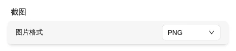
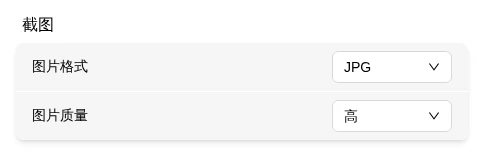

# Screenshot

Save the current remote display as an image — useful for documenting critical screens.

> Where: **Screenshot** in the menu bar; format and quality under Settings → Capture → Screenshot

## How to Capture

Click the **Screenshot** icon.

| Icon | Status |
|------|--------|
|  | Click to capture a screenshot |

> **Verification**: A successful screenshot triggers a "Screenshot captured" toast notification at the top. The file auto-saves to your browser's download directory. If there's no display signal, the screenshot fails.

## File Naming

`flexkvm-screenshot-YYYY-MM-DDTHH-MM-SS.{extension}`

e.g., `flexkvm-screenshot-2026-05-12T21-44-20.png`

## Format & Quality

Adjust in Settings → Capture → **Screenshot**.

### Format

| Option | Description |
|--------|-------------|
| PNG | Lossless, best quality, larger file |
| JPG | Lossy, smaller file |

### Image Quality

Only affects JPG:

| Option | Description |
|--------|-------------|
| Low | Smallest file |
| Medium | Daily use |
| High | More detail |
| Best | Maximum quality |

> PNG is always maximum quality — this setting doesn't affect it.

---

**Screenshot not working?** → Check if your browser is blocking downloads.

**Blurry image?** → Screenshot resolution matches the remote display. For sharper screenshots, increase the [remote display](screen.md) resolution first.

---

[:octicons-arrow-left-24: Back to User Guide](../index.md)
