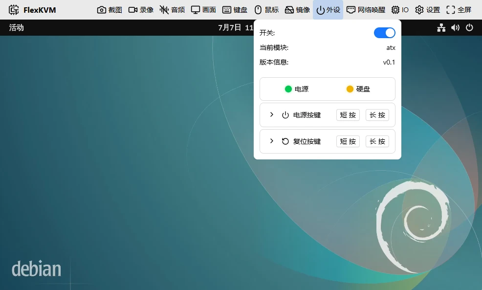

# 远程开关机

人在外面，被控设备关机了，或者需要远程重启——接好 ATX 控制器和配置好网络唤醒，你在任何地方都能控制设备的电源状态。

## 前置条件

| 你需要             | 说明                                       |
| -------------------- | -------------------------------------------- |
| FlexKVM 已正常联网 | 参考[快速入门](../../quick_start/index.md) |
| ATX 控制器         | 包装内附带，用于远程开关机和重启           |
| ATX 杜邦线         | 包装内附带，连接主板电源插针               |
| 十字螺丝刀         | 打开机箱用（如果主板插针位置不便操作）     |

> 如果只想远程唤醒（WoL），不需要 ATX 控制器，被控设备需有线联网且 BIOS 已开启 WoL 选项。

---

## 步骤 1：安装 ATX 控制器

### 1.1 找到主板电源插针

打开机箱，在主板上找到前置面板插针区（通常位于主板右下角，标识为 `JFP1`、`F_PANEL` 或 `PANEL`）：

| 插针     | 主板常见标识                  | 用途                |
| ---------- | ------------------------------- | --------------------- |
| 电源开关 | `PWR_SW`、`PWRBTN`、`PWRBTN#` | 短接 = 按一下电源键 |
| 复位开关 | `RST_SW`、`RESET`、`RST#`     | 短接 = 按一下复位键 |

> 不确定插针位置？查主板说明书"前置面板接口"章节，或搜索主板型号 + `front panel pinout`。

### 1.2 连接杜邦线

用杜邦线将 ATX 控制器的两个通道连接到主板对应插针：

- 通道 1 接 **电源开关** 插针
- 通道 2 接 **复位开关** 插针

杜邦线不分正负极，插上即可。

### 1.3 连接控制器到 FlexKVM

将 ATX 控制器的 Type-C 排线插入 FlexKVM 的 **ATX 控制接口**。OLED 上会显示 ATX 已连接的图标。

---

## 步骤 2：通过工具栏控制电源

在 FlexKVM 桌面界面顶部的工具栏中，点击 **外设** 图标：

| 操作 | 点击         | 效果                          |
| ------ | -------------- | ------------------------------- |
| 开机 | 电源按钮     | 短接 PWR_SW，被控设备开机     |
| 关机 | 长按电源按钮 | 长按 PWR_SW 约 4 秒，强制关机 |
| 复位 | 复位按钮     | 短接 RST_SW，被控设备重启     |

> 被控设备未开机时，短按电源按钮即可开机。设备已开机时，建议通过操作系统正常关机，ATX 强制关机仅在系统无响应时使用。

---

## 步骤 3：配置网络唤醒 (WoL)

ATX 控制的是物理开关，WoL 则是通过网络数据包唤醒设备。两者配合可以实现完整的远程电源管理：

- **关机状态**：用 WoL 唤醒
- **开机状态**：用 ATX 开关机或重启
- **系统卡死**：用 ATX 强制关机，再用 WoL 唤醒

### 3.1 在 BIOS 中开启 WoL

进入被控设备的 BIOS 设置，找到并开启以下选项（不同主板名称略有差异）：

| BIOS 选项常见名称      | 设置为                          |
| ------------------------ | --------------------------------- |
| Wake on LAN / WOL      | Enabled                         |
| PCIe Wake / PCI-E Wake | Enabled                         |
| Power On By PCI-E      | Enabled                         |
| ErP / EuP Ready        | Disabled（关闭后 WoL 才能工作） |

> 大多数主板在 **Advanced → Power Management** 或 **Advanced → Onboard Devices** 中。

保存 BIOS 设置并正常关机后，网口灯应保持亮或闪烁，表示 WoL 功能已生效。

### 3.2 添加 WoL 设备

在 FlexKVM 工具栏中点击 **网络唤醒** 图标，添加被控设备：

1. 点击 **添加设备**
2. 填写设备名称（如 `OfficePC`，仅支持英文字母和数字）和 MAC 地址（如 `AA:BB:CC:DD:EE:FF`）
3. 确认保存

被控设备的 MAC 地址可以在 Windows 的 `ipconfig /all` 或 Linux 的 `ip addr` 中查看。

### 3.3 远程唤醒

在 WoL 设备列表中点击目标设备旁的唤醒按钮，FlexKVM 会发送 Magic Packet 唤醒它。

> WoL 只对有**有线网口**的设备有效。WiFi 连接的设备不支持 WoL。

---

## 常见问题

| 问题             | 可能原因                    | 解决                                         |
| ------------------ | ----------------------------- | ---------------------------------------------- |
| 点击开机后无反应 | 杜邦线未接牢或插错插针      | 重新检查主板插针位置和接线                   |
| WoL 唤不醒       | BIOS 未开启、关机后网口灯灭 | 进入 BIOS 确认 WoL 已开启，检查 ErP 是否关闭 |
| ATX 控制器不识别 | 排线未插紧                  | 重新插拔 ATX 控制器的 Type-C 排线            |

详细的接线和配置说明见 [外设](../peripherals/atx/index.md) 和 [网络唤醒 (WoL)](../network/wol.md)。
