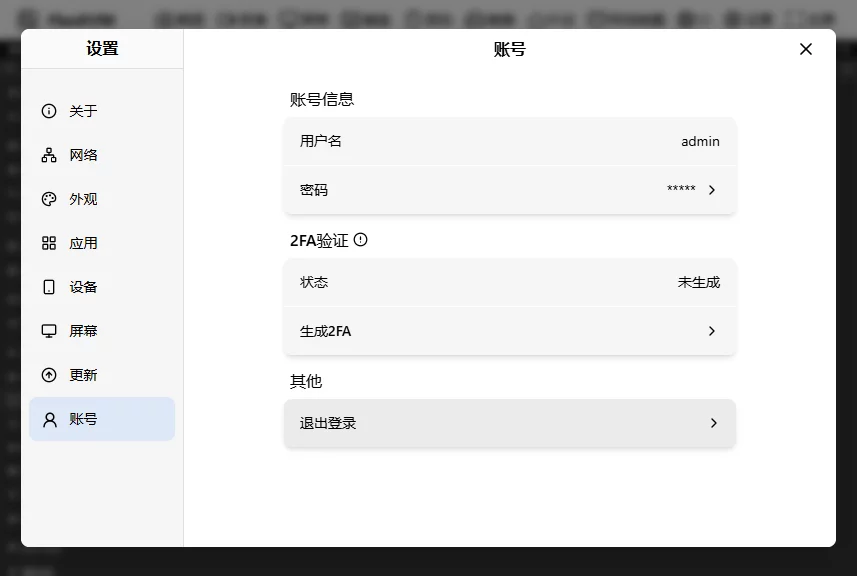
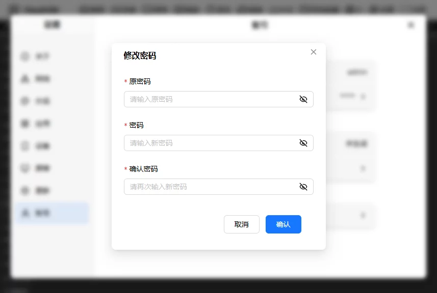
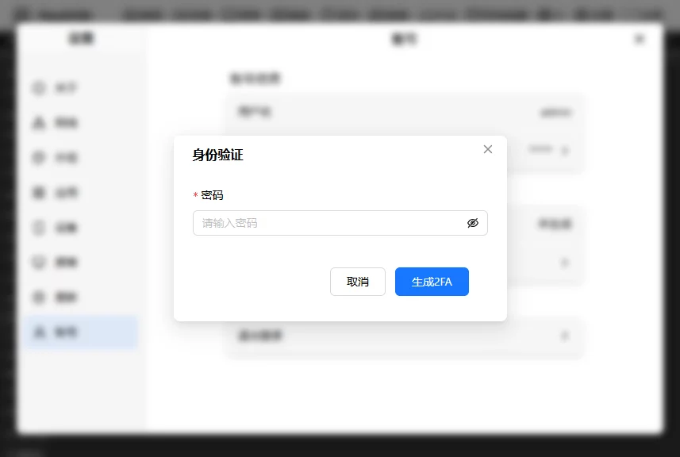
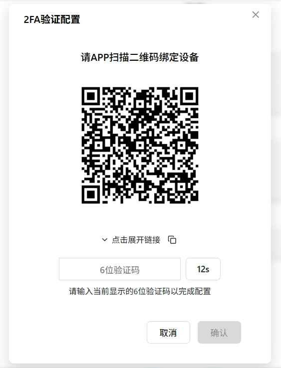
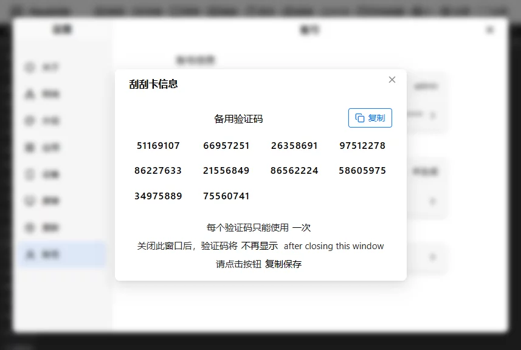
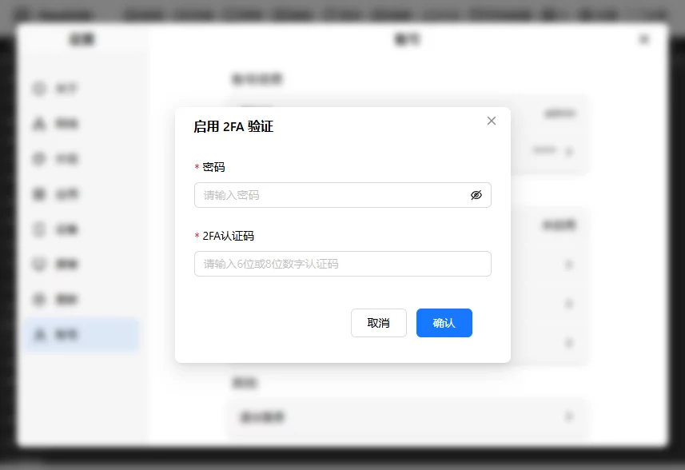
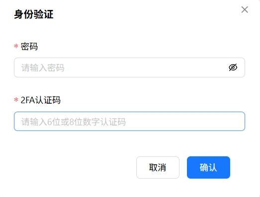

# 账号管理

管理 FlexKVM 登录账号——改密码、开关 2FA、管理备用码。

进设置 → 账号。

## 账号信息

显示当前登录用户名（如 `admin`）。

**修改密码**：点密码卡片 → 输入原密码、新密码、确认新密码 → 确认。

> 密码 ≥ 8 位，可用字母、数字和特殊字符。开了 2FA 还要输入 2FA 验证码。

## 2FA 验证

双因素认证——除了密码还要输入动态验证码，大幅增强安全性。

### 状态

显示当前 2FA 状态：已开启 / 未开启。

### 生成 2FA

输入密码 → 点"生成 2FA" → 弹出二维码：

1. 手机验证器（Google Authenticator / Microsoft Authenticator）扫码
2. 应用显示 6 位数字验证码
3. 输入验证码 → 确认

验证成功后弹出 10 个 8 位备用码：

- 每个备用码**仅可用一次**，用完自动失效
- 未用的继续有效（用了第 1 个，第 2-10 个还能用）
- 10 个都用完需要重新生成

> ⚠️ 备用码是手机丢失或验证器不可用时的**唯一**紧急登录方式。存密码管理器或打印纸质备份。

### 开启/关闭 2FA

输入密码和 2FA 验证码 → 确认。

### 重新生成 2FA / 生成备用码

需要验证身份：输入密码和 2FA 验证码。生成新的密钥或备用码后，旧的立即失效。

---

[:octicons-arrow-left-24: 返回用户指南](../../index.md)
