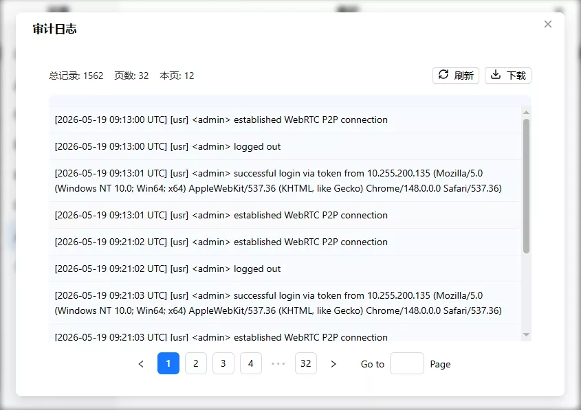

# 审计日志

审计日志记录系统中的重要操作——谁在什么时候做了什么。分为系统事件和用户操作事件，用于追溯操作历史和排查问题。

进设置 → 维护。

点"审计日志"弹出窗口：

## 日志分类

- **系统事件** `[sys]`：网络配置变更、OTA 升级、恢复出厂、SSH 认证失败等
- **用户事件** `[usr]`：登录/登出、账号管理、USB 控制、视频设置、网络配置、系统重启等

格式：`[YYYY-MM-DD HH:MM:SS UTC] [sys|usr] 日志内容`

## 查看日志

每页 50 条，支持翻页。窗口顶部显示总记录数、总页数和当前页条数。点刷新获取最新。

## 下载日志

点下载 → 选保存目录 → 进度条到 100% 且校验通过 → 保存到所选目录。

文件名：`audit-log-{ISO时间戳}.log`，如 `audit-log-2026-05-19T09-33-10.log`

---

[:octicons-arrow-left-24: 返回用户指南](../index.md)
