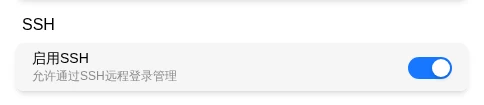

# SSH

FlexKVM has a built-in SSH server for remote command-line device management — Out-of-Band Management (OOB). Uses password authentication; only one session at a time.

> After more than 3 failed attempts, the connection is automatically disconnected with a brief delay before retry is allowed — this prevents brute force attacks.

## Before You Begin

- Admin account created in the Web interface (→ [Login](./account/login.md))
- SSH service enabled (enabled by default)
- Device has network access

## Enable / Disable

Go to Settings → System → SSH Settings.



Toggle the switch. Listens on port 22 by default. Disabling disconnects all active sessions.

## Connect

```bash
ssh <username>@<device-IP>
```

Port 22 (default). Windows includes OpenSSH — works directly in PowerShell or CMD.

- **Username**: FlexKVM account name
- **Password**: FlexKVM account password
- **Key-based login not supported**

**2FA enabled?** Login is two-step: enter password first → after password is verified, enter the 6-digit TOTP code (or 8-digit backup code) → access granted. Without 2FA, only password is needed.

After connecting, you'll see the management interface:

```
flexkvm-6jzdd SSH OOB Management
Version: 1.1
Type 'help' for available commands.

admin@flexkvm-6jzdd#
```

## Available Commands

Type `help` for the full list. Quick reference:

### ATX Power Control

| Command | Description |
|---------|-------------|
| `atx power short\|long` | Short/long press power button |
| `atx reset` | Short press reset button |
| `atx status` | View ATX and power status |

### GPIO Control

| Command | Description |
|---------|-------------|
| `gpio status` | View pin status |
| `gpio enable\|disable` | Enable/disable |
| `gpio direction` | Set direction (in/out) |
| `gpio level` | Set output level (0/1) |

### Network Tools

| Command | Description |
|---------|-------------|
| `network show` | View network interface info |
| `ping` | Connectivity test |

### System Management

| Command | Description |
|---------|-------------|
| `system info` | View firmware version |
| `reset` | Factory reset (keep logs) |
| `reset all` | Full reset (clear all) |
| `exit` | Exit session |

## Terminal Shortcuts

| Shortcut | Function |
|:--------:|----------|
| `Tab` | Command completion |
| `↑` / `↓` | Command history (max 32 entries) |
| `Ctrl+A` / `Ctrl+E` | Beginning/end of line |
| `Ctrl+K` / `Ctrl+U` | Delete to end/beginning of line |
| `Ctrl+C` | Clear current input |
| `Ctrl+D` | Exit when line is empty |

---

## Troubleshooting

| Symptom | Likely cause | Try this first |
|---------|-------------|----------------|
| `Connection refused` | SSH service not enabled | Check SSH toggle in Settings → System |
| `Connection timed out` | Wrong IP or network unreachable | Verify IP matches OLED, try pinging |
| `Permission denied` | Wrong username or password | Use the same credentials as the Web interface; check case |
| Disconnected immediately after login | Another SSH session is active | Close the other session or wait for timeout |
| Disconnected after wrong password | Exceeded 3 failed attempts | Reconnect — the limit resets |

---

[:octicons-arrow-left-24: Back to User Guide](../index.md)
