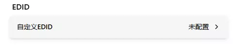
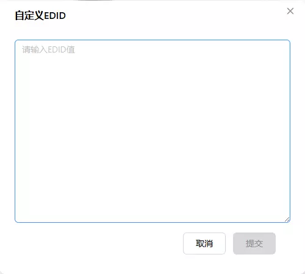

# EDID 配置

EDID 用于向被控主机报告显示器的能力信息，包括支持的分辨率、刷新率等。被控主机根据 EDID 来决定输出什么画面。

FlexKVM 内置了一个多分辨率 EDID 和多个固定分辨率 EDID，同时支持上传自定义 EDID。

## 预设 EDID 列表

系统内置以下 EDID 配置：

| EDID | 类型 | 说明 |
|------|------|------|
| auto | 多分辨率 | 默认配置，最多可支持约十种分辨率组合，灵活性最好 |
| 1920x1200@60Hz | 固定分辨率 | 锁定 1920×1200，60Hz |
| 1920x1080@60Hz | 固定分辨率 | 锁定 1920×1080，60Hz |
| 1920x1080@30Hz | 固定分辨率 | 锁定 1920×1080，30Hz |
| 1280x720@120Hz | 固定分辨率 | 锁定 1280×720，120Hz |
| 1280x720@60Hz | 固定分辨率 | 锁定 1280×720，60Hz |
| 1280x720@30Hz | 固定分辨率 | 锁定 1280×720，30Hz |

## EDID 切换

在菜单栏中点击屏幕按键，弹出屏幕菜单后点击 EDID 选择器即可切换，如下图所示：


如果用户上传了自定义 EDID，列表中会额外出现 **custom** 选项。

> 提示：切换 EDID 后会自动重新连接视频流，无需手动操作。

## 自定义 EDID

进入 **设置 → 系统**，可以看到 EDID 配置区块



### 添加自定义 EDID

点击"自定义 EDID"按钮，会弹出 EDID 编辑框：



在编辑框中输入 EDID 原始数据（十六进制 HEX 格式），点击确认即可提交。

> 注意：EDID 数据需要符合以下格式要求：
> - 十六进制格式（HEX），每两个字符表示一个字节
> - 数据大小必须是 128 字节的整数倍（1~6 个 block）
> - 最大不超过 768 字节
> - 必须以 `00 FF FF FF FF FF FF 00` 开头
> - 每个 128 字节 block 的校验和必须为 0

提交成功后，EDID 列表中会出现 `custom` 选项，在屏幕菜单中选择即可应用。

### 示例格式

```
00 FF FF FF FF FF FF 00 0E 94 66 66 88 88 88 88
...
```

> 提示：在 Linux 系统上可以使用 `cat /sys/class/drm/card0-HDMI-A-1/edid | xxd -p` 命令获取当前显示器的 EDID 数据。在 Windows 上可以使用第三方工具提取。
