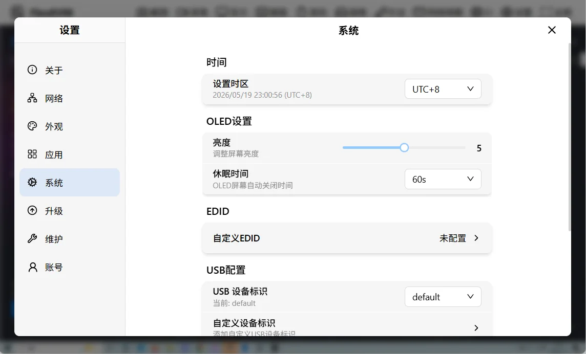
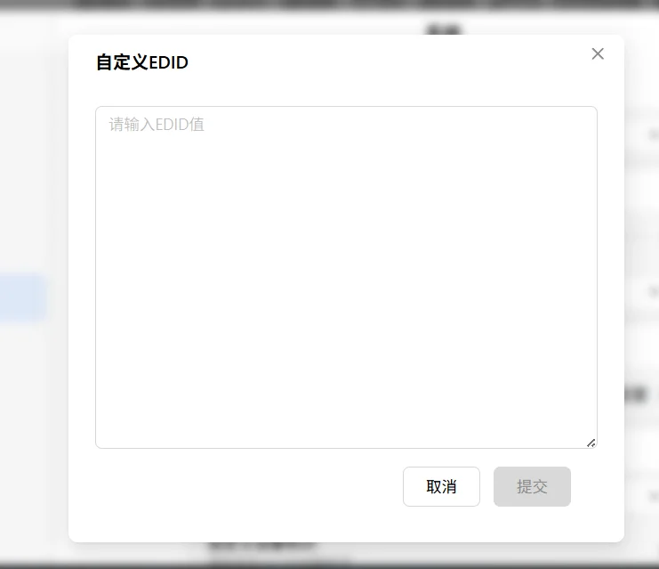

# EDID 配置

EDID（Extended Display Identification Data）用于向被控主机报告显示器的能力信息，包括支持的分辨率、刷新率等。

FlexKVM 预设了两个 EDID 配置：**default** 和 **1080p**，同时支持用户上传自定义 EDID。

## EDID 切换

在菜单栏中点击屏幕按键，弹出屏幕菜单后点击 EDID 选择器即可切换，如下图所示：


可选 EDID 列表：

| EDID | 说明 |
|------|------|
| default | 默认配置，支持多种分辨率组合 |
| 1080p | 固定 1920x1080@60Hz |

如果用户上传了自定义 EDID，列表中会额外出现 **custom** 选项。

> 提示：切换 EDID 后会自动重新连接视频流，无需手动操作。

## default 分辨率列表

`default` EDID 支持以下分辨率组合：

| 分辨率 | 刷新率 |
|:---:|:---:|
| 1920x1080 | 60Hz |
| 1920x1080 | 50Hz |
| 1920x1080 | 30Hz |
| 1920x1080 | 25Hz |
| 1280x720 | 120Hz |
| 1280x720 | 60Hz |
| 1280x720 | 50Hz |
| 1280x720 | 30Hz |
| 1280x720 | 25Hz |
| 1024x768 | 60Hz |
| 800x600 | 60Hz |
| 640x480 | 60Hz |

## 自定义 EDID

进入"设置" → "高级功能"，可以看到 EDID 配置区块：



### 添加自定义 EDID

点击"自定义 EDID"按钮，会弹出 EDID 编辑框：



在编辑框中输入 EDID 原始数据（十六进制 HEX 格式），点击确认即可提交。

> 注意：EDID 数据需要符合以下格式要求：
> - 十六进制格式（HEX），每两个字符表示一个字节
> - 数据大小必须是 128 字节的整数倍（1~6 个 block）
> - 最大不超过 768 字节
> - 必须以 `00 FF FF FF FF FF FF 00` 开头
> - 每个 128 字节 block 的校验和必须为 0

提交成功后，EDID 列表中会出现 `custom` 选项，在屏幕菜单中选择即可应用。

### 示例格式

```
00 FF FF FF FF FF FF 00 0E 94 66 66 88 88 88 88
...
```

> 提示：在 Linux 系统上可以使用 `cat /sys/class/drm/card0-HDMI-A-1/edid | xxd -p` 命令获取当前显示器的 EDID 数据。在 Windows 上可以使用第三方工具提取。
