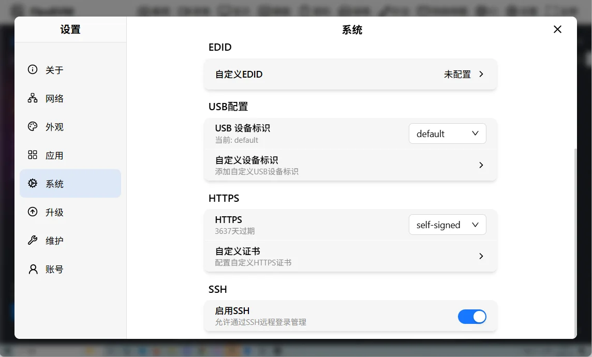
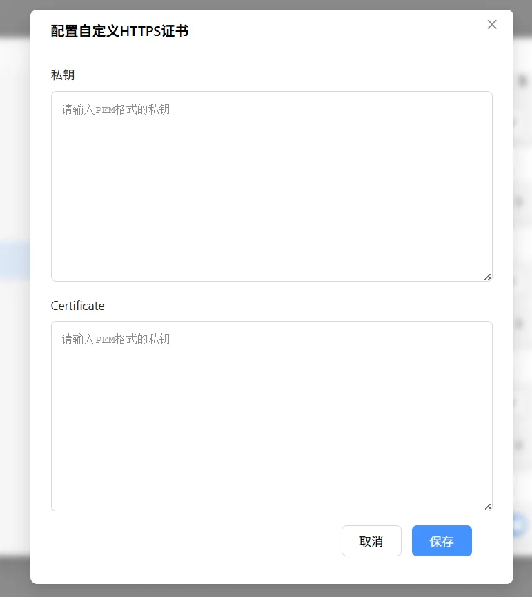

# HTTPS 配置

FlexKVM 支持 HTTPS 加密访问，提供自签名证书和自定义证书两种模式。

进入 **设置 → 系统**，找到 HTTPS 配置区块。

## 证书模式

| 模式 | 说明 |
|------|------|
| 自签名证书 | 系统自动生成，默认启用 |
| 自定义证书 | 用户上传的 CA 签名证书，上传后才出现此选项 |

下拉列表会显示当前证书的剩余有效时间。

### 自签名证书

系统首次启动时自动生成，能保证通信加密，但浏览器会提示"不安全"。如需去除警告，请上传 CA 签名的自定义证书。

证书到期前系统会自动续期。

### 自定义证书

点击"配置自定义 HTTPS 证书"按钮，上传证书文件：

| 字段 | 说明 |
|------|------|
| 私钥 (Private Key) | PEM 格式的 RSA 或 EC 私钥 |
| 证书 (Certificate) | PEM 格式的 X.509 证书 |

> 系统会验证证书和私钥是否匹配，验证通过后立即生效。自定义证书到期后将自动回退到自签名证书。

## 端口

| 协议 | 默认端口 |
|:---:|:---:|
| HTTP | 80 |
| HTTPS | 443 |

> HTTP 访问会自动重定向到 HTTPS。
