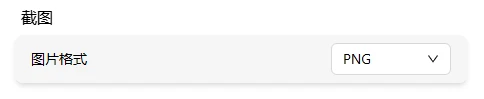
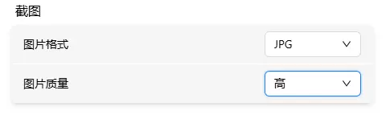

# 截图设置

设置截图的默认格式和画质。截图功能的使用方法见 [截图](../../toolbar/screenshot.md)。

进入 **设置 → 系统**，找到截图设置区块。

## 格式

| 选项 | 说明 |
|------|------|
| PNG | 无损压缩，画质最好，文件较大 |
| JPG | 有损压缩，文件较小 |

## 画质

仅对 JPG 格式生效：

| 选项 | 说明 |
|------|------|
| 低 | 文件最小 |
| 中 | 日常使用 |
| 高 | 画面细节较多 |
| 最佳 | 最高画质 |

> PNG 格式始终为最高画质，不受此设置影响。
