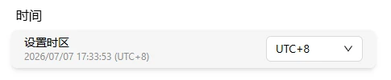

# 时间设置

设置 FlexKVM 的时区，确保设备时间和所在地区一致。

进入 **设置 → 系统**，找到时间设置区块。



## 设置时区

通过下拉选择器可以设置设备的时区，支持 **UTC-12** 至 **UTC+14** 之间所有整点时区。

| 参数 | 说明 |
|:---:|------|
| 可选范围 | UTC-12 ~ UTC+14 |
| 默认值 | UTC+8（北京时间） |
| 生效方式 | 选择后即时生效 |

选择器下方会显示当前设备时间，每秒自动刷新：

```
2026/07/01 14:30:00 (UTC+8)
```

> 系统时间通过 NTP 自动同步，无需手动设置时间。只需根据所在地选择正确的时区即可。
