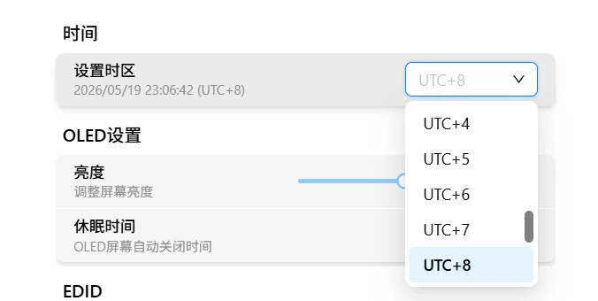

# 时间设置

进入"设置" → "高级功能"，可以看到时间设置区块，如下图所示：


## 设置时区

通过下拉选择器可以设置设备的时区，支持 **UTC-12** 至 **UTC+14** 之间所有整点时区。

| 参数 | 说明 |
|:---:|------|
| 可选范围 | UTC-12 ~ UTC+14 |
| 默认值 | UTC+8 |
| 生效方式 | 实时生效 |



设置时区后，选择器下方的描述文字会显示当前时间，每秒自动刷新：

```
2025/05/19 14:30:00 (UTC+8)
```

> 提示：系统时间通过 NTP 自动同步，无需手动设置时间。仅需根据所在地区选择正确的时区即可。
